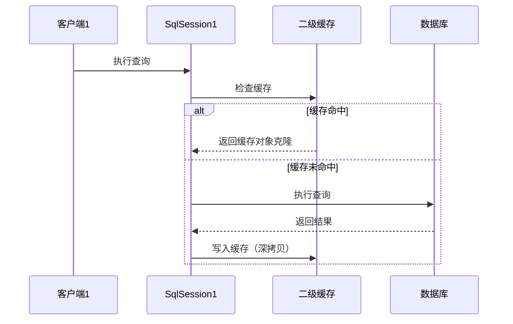

# MyBatis


## 1、什么是MyBatis?

- Mybatis是一款优秀的持久层框架，它内部封装了JDBC，开发时只需要关注SQL语句本身，免除了几乎所有的 JDBC 代码以及设置参数和获取结果集的工作，不需要花费精力去处理加载驱动、创建连接、创建statement等繁杂的过程。

- MyBatis 可以通过简单的 XML 或注解来配置和映射原始类型、接口和 Java POJO（Plain Old Java Objects，普通老式 Java 对象）为数据库中的记录。


## 2、MyBatis的优点和缺点

**优点：**

- 基于SQL语句编程，相当灵活，不会对应用程序或者数据库的现有设计造成任何影响，SQL写在XML里，解除sql与程序代码的耦合，便于统一管理；提供XML标签，支持编写动态SQL语句，并可重用。

- 与JDBC相比，减少了50%以上的代码量，消除了JDBC大量冗余的代码，不需要手动开关连接
- 与各种数据库兼容
- 能够与Spring很好的集成

**缺点：**

- SQL语句的编写工作量较大，尤其当字段多、关联表多时，对开发人员编写SQL语句的功底有一定要求。
- `SQL语句依赖于数据库，导致数据库移植性差，不能随意更换数据库`。

这两个都不怎么能算缺点，GPT查一下吧


## 3、#{}和${}的区别是什么？ 

- #{}是预编译处理，${}是字符串替换**（拼接）**。

- #可以防止sql注入，$不可以
- ${}是危险的


## 4、动态SQL

9个标签

if 、choose (when, otherwise)

trim (where, set)、foreach

SQL片段 `<sql></sql>`

```xml
<select id="findUsers" resultType="User">
    SELECT * FROM users
    WHERE 1=1
    <if test="username != null">
        AND username = #{username}
    </if>
    <choose> #类似java中的switch
       <when test="userType == 'admin'">
           AND role = 'admin'
       </when>
       <when test="userType == 'guest'">
           AND role = 'guest'
       </when>
       <otherwise>
           AND role = 'user'
       </otherwise>
    </choose>
    
    .. id IN 
    <foreach item="id" collection="ids" open="(" separator="," close=")">
        #{id}
    </foreach>
</select>
```

- `<set>`标签用于动态生成 `UPDATE` 语句的 `SET` 部分，自动去除多余的逗号。

  ```xml
  <update id="updateUser">
      UPDATE users
      <set>
          <if test="username != null">username = #{username},</if>
          <if test="age != null">age = #{age},</if>
      </set>
      WHERE id = #{id}
  </update>
  ```

- **`<collection>`**，它用于处理嵌套的查询结果。通常与一对多的关系查询结合使用，尤其是当查询结果中包含了一个集合属性时，比如查询一个用户及其所有订单，或者一个班级及其所有学生。

  ```java
  public class User {
      private Integer userId;
      private String username;
      private List<Order> orders;  // 一对多的关系，用户有多个订单
  }
  
  public class Order {
      private Integer orderId;
      private String orderNumber;
  }
  ```
  

sql对应的resultMap

```xml
  <resultMap id="userOrderResultMap" type="User">
      <id property="id" column="userId"/>
      <result property="username" column="username"/>
      <!-- 使用 <collection> 映射用户的订单列表 -->
      <collection property="orders" ofType="Order">
          <id property="id" column="orderId"/>
          <result property="orderNumber" column="order_number"/>
      </collection>
  </resultMap>
```

这个实际帮助特别大，主要非常的省事。

- `<association>`与`<collection>`相似，只是一对一。

  **实体类：**

  ```java
  public class User {
      private int id;
      private String name;
      private Address address;  // 关联的 Address 对象
  }
  
  public class Address {
      private int id;
      private String street;
      private String city;
  }
  ```

  **Mapper XML 配置：**

  你可以在 `UserMapper.xml` 中使用 `<association>` 来映射 `User` 类的 `address` 属性到 `Address` 类。

  ```xml
  <resultMap id="userResultMap" type="User">
      <id property="id" column="id"/>
      <result property="name" column="name"/>
      <!-- 使用 <association> 映射关联的 Address 对象 -->
      <association property="address" javaType="Address" column="address_id" select="selectAddressById"/>
  </resultMap>
  
  <!-- 查询 User 的 SQL -->
  <select id="selectUser" resultMap="userResultMap">
      SELECT id, name, address_id FROM user WHERE id = #{id}
  </select>
  
  <!-- 查询 Address 的 SQL -->
  <select id="selectAddressById" resultType="Address">
      SELECT id, street, city FROM address WHERE id = #{id}
  </select>
  ```


**两个组合使用**

```java
public class User {
    private int id;
    private String name;
    private Address address;  // 一对一关系
    private List<Order> orders;  // 一对多关系
}

public class Address {
    private int id;
    private String street;
    private String city;
}

public class Order {
    private int id;
    private int userId;
    private double amount;
}
```

```xml
<resultMap id="userResultMap" type="User">
    <id property="id" column="id"/>
    <result property="name" column="name"/>
    
    <!-- 映射 Address（一对一关系） -->
    <association property="address" javaType="Address" column="address_id" select="selectAddressById"/>
    <!-- 映射 Orders（一对多关系） -->
    <collection property="orders" javaType="Order" ofType="Order" column="id" select="selectOrdersByUserId"/>
</resultMap>

<!-- 查询 User -->
<select id="selectUser" resultMap="userResultMap">
    SELECT id, name, address_id FROM user WHERE id = #{id}
</select>

<!-- 查询 Address -->
<select id="selectAddressById" resultType="Address">
    SELECT id, street, city FROM address WHERE id = #{id}
</select>
<!-- 查询 Orders -->
<select id="selectOrdersByUserId" resultType="Order">
    SELECT id, user_id, amount FROM order WHERE user_id = #{userId}
</select>
```


### Xml映射文件中，除了常见的select|insert|updae|delete标 签之外，还有哪些标签？

加上以上的几个


## 5、Mybatis缓存

### 一级缓存

本地缓存

- **作用域**：`SqlSession` 级别，默认开启。
  
  - 同一个会话（数据库连接）中执行的查询会被缓存。
  - 若执行相同的SQL和参数，直接从缓存返回结果，避免重复查询数据库。
  
- **生命周期**：

  - 随`SqlSession`的创建而创建，随其关闭或清空（`.clearCache()`）而销毁。
  - 执行**增删改操作**（INSERT/UPDATE/DELETE）或调用`commit()`时，缓存会被清空（避免脏读）。

- **特点**：

  - **自动生效**，无需额外配置。

  - **线程隔离**，仅对当前会话有效，不同会话间缓存不共享。

  - 适用于单次请求内的重复查询优化。

    **示例**：

    ```xml
    <select id="findUserById" resultType="User">
        SELECT * FROM users WHERE id = #{id}
    </select>
    ```

    在同一个 `SqlSession` 中，如果多次查询相同的 `id`，MyBatis 会直接从缓存中返回结果，而不会再次查询数据库。

==重点==：

在非spring的情况下可行，因为想要使用上mapper的过程是这样的

- **原始 MyBatis**：需要手动创建 `SqlSessionFactory` → 打开 `SqlSession` → 获取 `Mapper` → 操作 → 关闭会话

  ```java
  try (SqlSession session = sqlSessionFactory.openSession()) {
      UserMapper mapper = session.getMapper(UserMapper.class);
      mapper.getUser(1); // 第一次查询，执行 SQL
      mapper.getUser(1); // 第二次查询，命中一级缓存（日志无 SQL）
  }
  ```

  实际上：

  ```java
  userMapper.getUser(1); // 方法1：实际使用 SqlSession1
  userMapper.getUser(1); // 方法2：使用另一个 SqlSession2（一级缓存失效）
  ```

  宛如形同虚设

  **Spring 的 SqlSession 管理策略**

  | 场景                          | SqlSession 获取方式                                      | 一级缓存是否有效 |
  | :---------------------------- | :------------------------------------------------------- | :--------------- |
  | **无事务**                    | 每次 Mapper 方法调用都从 `SqlSessionTemplate` 获取新会话 | ❌ 无效           |
  | **有事务** (`@Transactional`) | 在整个事务期间复用同一个 SqlSession                      | ✔️ 有效           |


### 二级缓存

- **作用域**：`Mapper`（Namespace）级别，需手动开启。
  - 跨`SqlSession`共享缓存数据，多个会话可访问同一Mapper的缓存。

- **生命周期**：
  - 与应用程序生命周期一致，缓存数据在`SqlSession`关闭或提交后**才被存入**。
  - 执行增删改操作时，缓存会被清空（需配置`flushCache`策略）。
- **配置与集成**：
  - **启用方式**：在Mapper XML中添加 `<cache/>` 标签，支持自定义参数（如`eviction`策略、`flushInterval`等）。
  - **序列化要求**：缓存对象需实现`Serializable`接口（若使用默认缓存）。
  - **扩展性**：支持集成第三方缓存（如Ehcache、Redis），通过`type`属性指定实现类。
- **特点**：
  - **显式配置**，需权衡数据实时性与性能。
  - 存在**并发风险**，需考虑缓存一致性（如通过读写锁、事务提交后更新等机制）。
  - 适用于**读多写少**、数据实时性要求不高的场景。

- **查询顺序**：优先查询一级缓存 → 若无，查询二级缓存 → 若无，访问数据库。

- **工作原理**：当你执行查询时，如果查询的数据在二级缓存中，则 MyBatis 会直接从缓存中获取数据，而不去访问数据库。二级缓存主要用于跨 `SqlSession` 重用数据。（就是缓存的数据供其他sql使用？）

- 清空时机：二级缓存的清空时机比一级缓存更灵活，通常在以下情况下被清空：

  - 执行了增、删、改等写操作时。
  - `SqlSession` 被关闭时，二级缓存中存储的数据会自动刷新。




#### 配置二级缓存：

1. **启用二级缓存**：在 MyBatis 配置文件中启用二级缓存。

   ```xml
   <settings>
       <setting name="cacheEnabled" value="true"/>
   </settings>
   ```

2. **为每个 Mapper 启用缓存**： 在每个 `Mapper` 文件中配置缓存：

   ```xml
   <mapper namespace="com.example.mapper.UserMapper">
       <cache/>
       <select id="findUserById" resultType="User">
           SELECT * FROM users WHERE id = #{id}
       </select>
   </mapper>
   ```

   这里的 `<cache/>` 标签启用了该 `Mapper` 的二级缓存。


### 4. **一级缓存和二级缓存的区别**

| 特性             | 一级缓存                             | 二级缓存                                 |
| ---------------- | ------------------------------------ | ---------------------------------------- |
| **作用范围**     | 仅限于单个 `SqlSession`              | 跨 `SqlSession`，即跨多个会话共享缓存    |
| **是否启用**     | 默认启用                             | 默认禁用，需要配置启用                   |
| **缓存生命周期** | 随 `SqlSession` 生命周期而存在       | 随 `SqlSessionFactory` 生命周期而存在    |
| **存储位置**     | 存储在 `SqlSession` 内存中           | 存储在外部缓存中（如文件、内存、数据库） |
| **清空时机**     | 关闭 `SqlSession` 或执行写操作时清空 | 执行写操作或手动刷新时清空               |

### 5. **缓存的最佳实践**

- **尽量避免在频繁修改数据的场景中使用缓存**，例如对于涉及大量数据更新、插入、删除的操作，缓存的效果较差，可能会导致缓存不一致的问题。
- **使用二级缓存时要注意缓存一致性问题**，在有写操作时，确保相关缓存及时失效，避免读取到过时数据。
- **为缓存设置合适的过期时间**，避免缓存数据过时。
- **注意事项**
  - **脏数据问题**：频繁增删改的场景中，缓存频繁失效可能降低性能。
  - **分布式环境**：默认二级缓存不适用于集群，需结合Redis等分布式缓存实现共享。
  - **事务隔离性**：二级缓存在事务提交前不可见，需结合业务场景设计。

### 总结：

- **一级缓存** 是 MyBatis 的默认缓存机制，作用范围是单个 `SqlSession`。
- **二级缓存** 需要手动启用，作用范围是跨多个 `SqlSession`。
- 使用缓存时要小心缓存一致性和过期策略，避免产生脏数据或缓存不一致的问题。


### 其中部分知识点

在 MyBatis 中，`SqlSession` 代表了与数据库的一个会话。通常，你会在一个方法中创建一个 `SqlSession`，然后通过这个 `SqlSession` 去访问不同的 `Mapper` 接口。例如，假设你有多个不同的 `Mapper` 接口（比如 `UserMapper` 和 `OrderMapper`），你可以使用同一个 `SqlSession` 来执行它们的数据库操作。


**怎么理解Mybatis的一二级缓存？**

“MyBatis的一二级缓存主要用于优化数据库查询性能。一级缓存是SqlSession级别的，默认开启，同一个会话内重复查询会直接返回缓存结果，但执行增删改操作或会话关闭后失效。二级缓存是Mapper级别的，需要手动配置，跨会话共享，常用于读多写少的场景，但需注意数据一致性和序列化问题。两者协同工作时，查询顺序是一级→二级→数据库，且二级缓存通常依赖第三方库实现扩展和分布式支持。”


## 6、Mybatis如何进行分页

SQL：limit

或者RowBounds


## 7、如何执行批量插入？ 

- 数据量较大（例如上万条）

  ```xml
  <insert id="insertUser" parameterType="User">
      INSERT INTO user (name, age)
      VALUES (#{name}, #{age})
  </insert>
  ```

  ```java
  SqlSession sqlSession = sqlSessionFactory.openSession(ExecutorType.BATCH);
  try {
      UserMapper mapper = sqlSession.getMapper(UserMapper.class);
      for (User user : userList) {
          mapper.insertUser(user);
      }
      sqlSession.commit(); // 一次性提交所有操作
  } finally {
      sqlSession.close();
  }
  ```

  

- 数据量较小（例如几百到几千条），数据库支持单条INSERT语句插入多行数据。

  ```java
  List<User> userList = new ArrayList<>();
  // 添加多个User对象到userList
  userMapper.batchInsert(userList);
  ```

  ```java
  <insert id="batchInsert" parameterType="java.util.List">
      INSERT INTO user (name, age)
      VALUES
      <foreach collection="list" item="user" separator=",">
          (#{user.name}, #{user.age})
      </foreach>
  </insert>
  ```

  

## 8、Mybatis是否支持延迟加载(懒加载)？如果支持，它的实现原理是什么？ 

ResultMap中的assosiation和collection标签具有延迟加载的功能

### 8.1. **MyBatis 中的延迟加载**

MyBatis 的延迟加载支持分为 **两种模式**：

- **懒加载（Lazy Loading）**：通过懒加载，MyBatis 会延迟加载某些对象的属性，直到你访问这些属性时才从数据库中查询数据。
- **懒加载集合**：对于关联的集合属性（如 `List` 或 `Set`），MyBatis 可以在访问集合时延迟加载其元素。

### 8.2. **延迟加载的实现原理**

MyBatis 中的延迟加载主要是通过 **代理模式** 实现的。以下是它的实现原理：

- **代理对象**：MyBatis 会为需要延迟加载的属性或对象生成代理对象。当你访问这个代理对象的属性或方法时，代理会触发实际的数据库查询，加载相关的数据。
- **SqlSession 的配置**：在 MyBatis 配置文件中，可以通过设置 `lazyLoadingEnabled` 来启用或禁用延迟加载。

#### 延迟加载的配置：

你可以在 MyBatis 的 `mybatis-config.xml` 中通过以下配置来启用延迟加载：

```xml
<settings>
  <!-- 启用延迟加载 -->
  <setting name="lazyLoadingEnabled" value="true"/>
  
  <!-- 配置延迟加载的程度，true 表示所有关联属性都使用懒加载 -->
  <setting name="aggressiveLazyLoading" value="false"/>
</settings>
```

#### 关键配置项：

- **lazyLoadingEnabled**：启用或禁用延迟加载功能，默认为 `false`。如果启用，MyBatis 会创建代理对象。
- **aggressiveLazyLoading**：决定是否对所有的关联属性都启用懒加载。默认为 `false`，表示只有在明确指定懒加载的情况下，才会延迟加载；如果设置为 `true`，则所有关联属性都会启用懒加载。

### 8.3. **延迟加载的工作流程**

当延迟加载开启时，MyBatis 会为映射的对象创建代理（通常是使用 `CGLIB` 或 `JDK` 动态代理），代理对象会拦截对属性或方法的访问请求。当你访问懒加载的属性时，代理对象会触发实际的数据库查询，从而加载数据。

#### 举个例子：

假设你有一个 `User` 类，它有一个关联的 `Order` 类：

```java
public class User {
    private Integer id;
    private String username;
    private List<Order> orders;  // 这个属性将会被懒加载
}

public class Order {
    private Integer id;
    private Integer userId;
    private String product;
}
```

对应的映射文件 `UserMapper.xml` 可能会是这样的：

```xml
<resultMap id="userResultMap" type="User">
    <id property="id" column="id"/>
    <result property="username" column="username"/>
    <association property="orders" column="user_id" javaType="List" select="selectOrdersByUserId"/>
</resultMap>

<select id="selectOrdersByUserId" resultType="Order">
    SELECT * FROM orders WHERE user_id = #{userId}
</select>
```

#### 延迟加载工作过程：

1. 当你查询 `User` 时，`orders` 属性不会立即加载。
2. 当你访问 `user.getOrders()` 时，代理对象会拦截这个方法调用，并触发 `selectOrdersByUserId` 查询，加载相关的 `Order` 数据。

### 8.4. **懒加载和急加载的区别**

- **懒加载（Lazy Loading）**：只有在访问关联属性时，MyBatis 才会执行 SQL 查询。例如，查询 `User` 数据时，不会立即查询 `orders` 数据，只有当你访问 `user.getOrders()` 时，才会查询 `Order` 表。
- **急加载（Eager Loading）**：在查询主对象时，会同时加载所有的关联属性。例如，在查询 `User` 时，`orders` 数据会被立即加载。

你可以通过 `fetchType` 属性来控制是否使用懒加载：

```xml
<association property="orders" fetchType="lazy" javaType="List" select="selectOrdersByUserId"/>
```

`fetchType` 的默认值是 `eager`，表示急加载。如果设置为 `lazy`，则会启用懒加载。

### 8.5. **延迟加载的优缺点**

**优点：**

- **减少不必要的数据库查询**：如果关联的属性并不是每次都需要，懒加载可以避免不必要的 SQL 查询，提高性能。
- **提高响应速度**：初始查询时，不会加载所有的关联数据，减少了数据库访问的开销。

 **缺点：**

- **潜在的 N+1 查询问题**：如果懒加载的关联属性被频繁访问，可能会导致多个数据库查询，尤其是集合属性的懒加载，可能会造成 N+1 查询问题，即查询一次主对象时，随后又会执行多次查询来加载关联的集合。

  **解决方法**：可以使用 `@One` 或 `@Many` 的 `fetchType` 配置为 `EAGER`，或者使用 `join fetch` 或 `select` 语句进行批量加载。

- **性能开销**：每次访问懒加载的属性时，都会执行一次查询，这可能导致性能开销。


当然了，不光是Mybatis，几乎所有的包括Hibernate，支持延迟加载的原理都是一样的。 


## 9、MyBatis实现一对一有几种方式?具体怎么操作的？

有联合查询和嵌套查询

- 联合查询是几个表联合查询，只查询一次，通过在resultMap里面配置association 节点配置一对一的类就可以完成
- 嵌套查询是先查一个表，根据这个表里面的结果的外键id，去再另外一个表里面查询数据，也是通过 association配置，但另外一个表的查询通过select属性配置。 


## 10、Mybatis是如何将sql执行结果封装为目标对象并返回的？都有哪些映射形式？

1. 使用标签，逐一定义数据库列名和对象属性名之间的映射关系。
2. 使用sql列的别名功能，将列的别名书写为对象属性名。 有了列名与属性名的映射关系后，Mybatis通过反射创建对象，同时使用反射给对象的属性逐一赋值并 返回，那些找不到映射关系的属性，是无法完成赋值的。 


