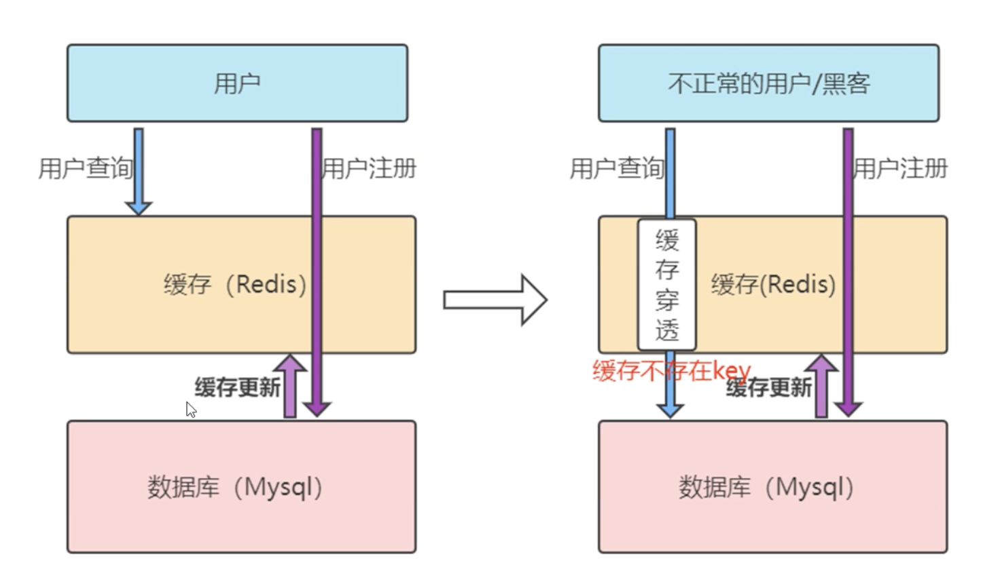
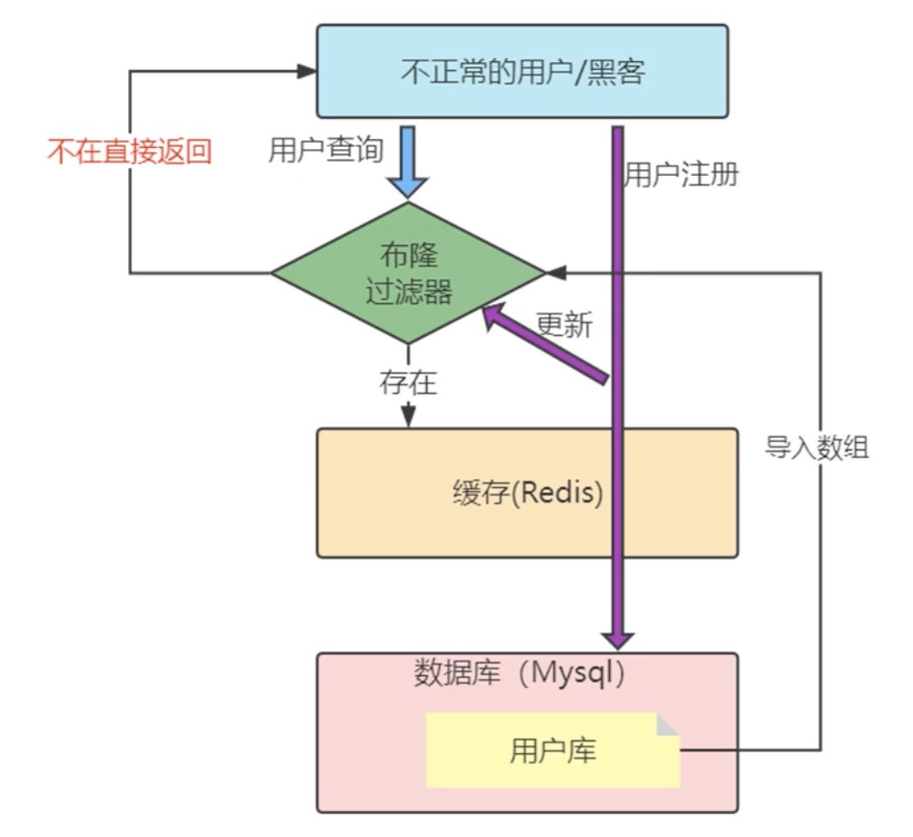

# Redis入门与应用

## Redis的技术全景

Redis一个开源的基于键值对（Key-Value）NoSQL数据库。使用ANSI C语言编写、支持网络、基于内存但支持持久化。性能优秀，并提供多种语言的API。

我们要首先理解一点，我们把Redis称为KV数据库，键值对数据库，那就可以把Redis内部的存储视为存在着一个巨大的Map，对Map的操作无非就是get和put，然后通过key操作这个key所对应的value，而这个value的类型可以多种多样，也就是Redis为我们提供的那些数据结构，比如字符串（String）、哈希(Hash)等等。

Redis就这么简单吗？这些年李老师的经历，我发现，很多技术人都有一个误区，那就是，只关注零散的技术点，没有建立起一套完整的知识框架，缺乏系统观，但是系统观其实是至关重要的。从某种程度上说，在解决问题时，拥有了系统观，就意味着你能有依据、有章法地定位和解决问题。

那么，如何高效地形成系统观呢？本质上就是，Redis 的知识都包括什么呢？简单来说，就是“两大维度，三大主线”


### 两大维度

两大维度：应用维度、底层原理维度

我们知道，缓存和集群是Redis 的两大广泛的应用场景。同时Redis 丰富的数据模型，就导致它有很多零碎的应用场景，很多很杂。而且，还有一些问题隐藏得比较深，只有特定的业务场景下（比如亿级访问压力场景）才会出现，所以同时还必须精通Redis的数据结构。

**Redis应用场景**

1.缓存

缓存机制几乎在所有的大型网站都有使用，合理地使用缓存不仅可以加快数据的访问速度，而且能够有效地降低后端数据源的压力。Redis提供了键值过期时间设置,并且也提供了灵活控制最大内存和内存溢出后的淘汰策略。可以这么说,一个合理的缓存设计能够为一个网站的稳定保驾护航。

一般MySQL数据库写的并发是600/s，读的2000/s,对于大型互联网项目的百万并发，根本扛不住，Redis的官方显示Redis能够单台达到10W+/s的并发。

2.排行榜系统

排行榜系统几乎存在于所有的网站，例如按照热度排名的排行榜，按照发布时间的排行榜，按照各种复杂维度计算出的排行榜，Redis提供了列表和有序集合数据结构，合理地使用这些数据结构可以很方便地构建各种排行榜系统。

3.计数器应用

计数器在网站中的作用至关重要，例如视频网站有播放数、电商网站有浏览数，为了保证数据的实时性，每一次播放和浏览都要做加1的操作，如果并发量很大对于传统关系型数据的性能是一种挑战。Redis天然支持计数功能而且计数的性能也非常好,可以说是计数器系统的重要选择。

4.社交网络

赞/踩、粉丝、共同好友/喜好、推送、下拉刷新等是社交网站的必备功能，由于社交网站访问量通常比较大,而且传统的关系型数据不太适合保存这种类型的数据，Redis提供的数据结构可以相对比较容易地实现这些功能。

5.消息队列系统

消息队列系统可以说是一个大型网站的必备基础组件，因为其具有业务解耦、非实时业务削峰等特性。Redis提供了发布订阅功能和阻塞队列的功能，虽然和专业的消息队列比还不够足够强大,但是对于一般的消息队列功能基本可以满足。这个是Redis的作者参考了Kafka做的拓展。

### 三大主线

三大主线：高性能、高可靠和高可扩展

高性能：包括线程模型、数据结构、持久化、网络框架；
高可靠：包括主从复制、哨兵机制；
高可扩：包括数据分片、负载均衡。

因为Redis的应用场景非常多，不同的公司有不同的玩法，但如何不掌握三高这条主线的话，你会遇到以下问题：

1、数据结构的复杂度、跨 CPU 核的访问会导致CPU飙升的问题

2、主从同步和 AOF 的内存竞争，这些会导致内存问题

3、在 SSD 上做快照的性能抖动，这些会导致存储持久化的问题

4、多实例时的异常网络丢包的问题

## Redis的版本选择与安装

在Redis的版本计划中，版本号第二位为奇数，为非稳定版本，如2.7、2.9、3.1；版本号第二为偶数，为稳定版本如2.6、2.8、3.0；一般来说当前奇数版本是下一个稳定版本的开发版本，如2.9是3.0的开发版本。

同时Redis的安装也非常简单，到Redis的官网（[Download | Redis](https://redis.io/download/)），下载对应的版本，简单几个命令安装即可。


### **Redis的linux安装**

```
wget https://download.redis.io/releases/redis-6.2.7.tar.gz
tar xzf redis-6.2.7.tar.gz
cd redis-6.2.7/
make
```


安装后源码和执行目录会混在一起，为了方便，我做了一次install

```
make install PREFIX=/home/lijin/redis/redis
```


因为Redis的安装一般来说对于系统依赖很少，只依赖了Linux系统基本的类库，所以安装很少出问题

**安装常见问题**

如果执行make命令报错：cc 未找到命令，原因是虚拟机系统中缺少gcc，执行下面命令安装gcc：

```
yum -y install gcc automake autoconf libtool make
```

如果执行make命令报错：致命错误:jemalloc/jemalloc.h: 没有那个文件或目录，则需要在make指定分配器为libc。执行下面命令即可正常编译：

```
make MALLOC=libc
```

### Redis的启动

Redis编译完成后，会生成几个可执行文件，这些文件各有各的作用，我们现在先简单了解下，后面的课程会陆续说到和使用这些可执行文件。


一般来说redis-server和redis-cli这些平时用得最多。

Redis有三种方法启动Redis:默认配置、带参数启动、配置文件启动。

#### 默认配置

使用Redis的默认配置来启动，在bin目录下直接输入 ./redis-server


可以看到直接使用redis-server启动Redis后，会打印出一些日志，通过日志可以看到一些信息：

当前的Redis版本的是64位的6.2.7，默认端口是6379。Redis建议要使用配置文件来启动。

**因为直接启动无法自定义配置，所以这种方式是不会在生产环境中使用的。**

#### 带参数启动

redis-server加上要修改配置名和值(可以是多对)，没有设置的配置将使用默认配置，例如：如果要用6380作为端口启动Redis，那么可以执行:

./redis-server --port 6380


这种方式一般我们也用得比较少。

#### 配置文件启动

配置文件是我们启动的最多的模式，配置文件安装目录中有


复制过来


改一下权限


通过配置文件来启动

```
./redis-server ../conf/redis.conf
```

注意：这里对配置文件使用了相对路径，绝对路径也是可以的。

同时配置文件的方式可以方便我们改端口，改配置，增加密码等。


打开注释，设置为自己的密码，重启即可

### 操作

Redis服务启动完成后，就可以使用redis-cli连接和操作Redis服务。redis-cli可以使用两种方式连接Redis服务器。

1、单次操作

用redis-cli -hip {host} -p{port} {command}就可以直接得到命令的返回结果，例如:

那么下一次要操作redis，还需要再通过redis-cli。


2、命令行操作


通过redis-cli -h (host}-p {port}的方式连接到Redis服务，之后所有的操作都是通过控制台进行，例如:


我们没有写-h参数，那么默认连接127.0.0.1;如果不写-p，那么默认6379端口，也就是说如果-h和-p都没写就是连接127.0.0.1:6379这个 Redis实例。

### 停止

Redis提供了shutdown命令来停止Redis服务，例如我们目前已经启动的Redis服务，可以执行:

```
./redis-cli -p 6379 shutdown
```

redis服务端将会显示：


除了可以通过shutdown命令关闭Redis服务以外，还可以通过kill进程号的方式关闭掉Redis，但是强烈不建议使用kill -9强制杀死Redis服务，不但不会做持久化操作，还会造成缓冲区等资源不能被优雅关闭，极端情况会造成AOF和复制丢失数据的情况。如果是集群，还容易丢失数据。

同样还可以在命令行中执行shutdown指令


shutdown还有一个参数,代表是否在关闭Redis前，生成持久化文件，缺省是save，生成持久化文件，如果是nosave则不生成持久化文件

## Redis全局命令

对于键值数据库而言，基本的数据模型是 key-value 模型

Redis 支持的 value 类型包括了 String、哈希表、列表、集合等，而Memcached支持的 value 类型仅为 String 类型，所以Redis 能够在实际业务场景中得到广泛的应用，就是得益于支持多样化类型的 value。

Redis里面有16个库，但是Redis的分库功能没啥意义（默认就是0号库，尤其是集群操作的时候），我们一般都是默认使用0号库进行操作。

在了解Rediskey-value 模型之前，Redis的有一些全局命令，需要我们提前了解。

### 1、键空间探查

#### 1.1 keys命令

```shell
KEYS pattern  # 支持*、?等通配符  keys * ｜ keys L*
```

- **风险警示**：O(n)时间复杂度，百万级Key可能导致服务阻塞
- **替代方案**：生产环境使用`SCAN`命令进行渐进式遍历

查看所有键(支持通配符)：

```shell
127.0.0.1:6379> keys *
1) "Lijin"
2) "user:bevan:1"
127.0.0.1:6379> keys L * 
1) "Lijin"
127.0.0.1:6379> keys J*
(empty array)
127.0.0.1:6379> KEYS user:*   # 查找user开头的键
1) "user:bevan:1"
```

但是这个命令请慎用，因为keys命令要把所有的key-value对全部拉出去，如果生产环境的键值对特别多的话，会对Redis的性能有很大的影响，推荐使用dbsize。

keys命令会遍历所有键，所以它的时间复杂度是o(n)，当Redis保存了大量键时线上环境`禁止使用keys命令`。

#### 1.2 dbsize命令

```shell
127.0.0.1:6379> dbsize #返回当前库键总数
(integer) 2
```

- **高效原理**：直接读取内存计数器，O(1)时间复杂度

#### 1.3 exists

检查键是否存在，存在返回1，不存在返回0。

```shell
127.0.0.1:6379> EXISTS li
(integer) 1
127.0.0.1:6379> EXISTS ma
(integer) 0
```

#### 1.4 del

删除键，无论值是什么数据结构类型,del命令都可以将其删除。返回删除键个数，删除不存在键返回0。同时del命令可以支持删除多个键。

```shell
127.0.0.1:6379> del key [key ...] # 支持批量删除
127.0.0.1:6379> del li
(integer) 1
127.0.0.1:6379> del li
(integer) 0
127.0.0.1:6379> DEL user:1001 cart:2023  # 批量删除
(integer) 2
```


### 2、生命周期管理

##### 过期时间控制组

| 命令               | 单位   | 说明                     |
| :----------------- | :----- | :----------------------- |
| `EXPIRE key N`     | 秒     | N秒后过期                |
| `EXPIREAT key TS`  | 秒级TS | 到达指定`时间戳`后过期   |
| `PEXPIRE key N`    | 毫秒   | N毫秒后过期              |
| `PEXPIREAT key TS` | 毫秒TS | 到达毫秒级`时间戳`后过期 |

**`TTL/PTTL`**命令

```shell
TTL key    # 秒级剩余时间
PTTL key   # 毫秒级精度
```

- **返回值说明**：
  - ≥0：剩余存活时间
  - -1：永不过期
  - -2：键不存在


**在使用Redis相关过期命令时,需要注意以下几点。**

1. 如果expire key 的键不存在,返回结果为0:

2. 如果过期时间为负值,键会立即被删除，和使用del命令一样:

3) **persist**命令可以将键的过期时间清除:

```shell
127.0.0.1:6379> EXPIRE lijin 99
(integer) 1
127.0.0.1:6379> persist lijin
(integer) 1
127.0.0.1:6379> ttl lijin
(integer) -1
```

4. 对于字符串类型键，`SET`操作会清除已有过期时间，这个问题很容易在开发中被忽视。

```shell
127.0.0.1:6379> set lijin 666
OK
127.0.0.1:6379> EXPIRE lijin 99
(integer) 1
127.0.0.1:6379> ttl lijin
(integer) 95
127.0.0.1:6379> set lijin
(integer) OK
127.0.0.1:6379> ttl lijin
(integer) -1
127.0.0.1:6379> ttl lijin
(integer) -1
```

5. Redis不支持二级数据结构(例如哈希、列表)内部元素的过期功能，不能对二级数据结构做过期时间设置。


### 3、元数据操作

#### 3.1 type

```shell
127.0.0.1:6379> type lijin
string
```

- **返回类型**：string/hash/list/set/zset等，键不存在返回none

#### 3.2 randomkey

随机返回一个键，这个很简单，请自行实验。

```shell
127.0.0.1:6379> randomkey
"lijin"
127.0.0.1:6379> randomkey
"msb"
127.0.0.1:6379> randomkey
"lijin"
127.0.0.1:6379> randomkey
"lijin"
```

- **应用场景**：调试抽样、内存分析

#### 3.3 rename

键重命名

- 但是要注意，如果在rename之前,新键已经存在，那么它的值也将被覆盖。

```shell
127.0.0.1:6379> set lijin1 111
OK
127.0.0.1:6379> set lijin2 222
OK
127.0.0.1:6379> rename lijin1 lijin2
"111"
```

为了防止被强行rename，Redis提供了`renamenx`命令，确保只有newKey不存在时候才被覆盖。

```shell
127.0.0.1:6379> set lijin1 111
OK
127.0.0.1:6379> set lijin2 222
OK
127.0.0.1:6379> renamenx lijin1 lijin2
(integer) 0
127.0.0.1:6379> get lijin1
"111"
127.0.0.1:6379> get lijin2
"222"
```

从上面我们可以看出，由于重命名键期间会执行命令删除旧的键，如果键对应的值比较大，会存在阻塞Redis的可能性。

### 4、键名的生产实践

Redis没有命令空间，而且也没有对键名有强制要求。但设计合理的键名，有利于防止键冲突和项目的可维护性

推荐`业务域:实体类型:ID[:属性]` 层级结构作为键名(也可以是_\-)。

例如MySQL 的数据库名为mall，用户表名为order，那么对应的键可以用：

1. "mall:order:1"
2. "mall:order:1:name"来表示，如果当前Redis 只被一个业务使用，甚至可以去掉“order:”。

```shell
127.0.0.1:6379> set mall:order:1 10086
OK
127.0.0.1:6379> set mall:order:1:name 110
OK
127.0.0.1:6379> keys *
1) "msb"
2) "lijin2"
3) "mall:order:1"
4) "mall:order:1:name"
5) "lijin1"
6) "lijin"
```

在能描述键含义的前提下`适当减少`键的长度，从而减少由于键过长的内存浪费。


## Redis常用数据结构

Redis提供了一些数据结构供我们往Redis中存取数据，最常用的的有5种，`字符串（String）、哈希(Hash)、列表（list）、集合（set）、有序集合（ZSET）`。

### 1、字符串（String）

> 字符串类型是Redis最基础的数据结构。首先键都是字符串类型，而且其他几种数据结构都是在字符串类型基础上构建的，所以字符串类型能为其他四种数据结构的学习奠定基础。
>
> 字符串类型的值实际可以是：
>
> - 字符串(简单的字符串、复杂的字符串(例如JSON、XML))
> - 数字(整数、浮点数)，
> - 二进制(图片、音频、视频)，但是值最大不能超过512MB。
>
> （虽然Redis是C写的，C里面有字符串&#x3c;本质使用char数组来实现>，但是处于种种考虑，Redis还是自己实现了字符串类型）

#### 操作命令

##### set 设置值

```shell
127.0.0.1:6379> set key value [EX seconds|PX milliseconds|EXAT timestamp|PXAT milliseconds-timestamp|KEEPTTL] [NX|XX] [GET]
```

- set命令有几个选项:

  1. ex/px  seconds/milliseconds: 为键设置秒级/毫秒级过期时间。

     ```shell
     127.0.0.1:6379> set ex-hello redis ex 10
     OK
     127.0.0.1:6379> ttl ex-hello
     (integer) 5
     127.0.0.1:6379> ttl ex-hello
     (integer) -2
     # 从执行效果上看，ex参数和expire命令基本一样。
     ```

     还有一个需要特别注意的地方是如果一个字符串已经设置了过期时间，然后你调用了set 方法修改了它，它的过期时间会消失。

  2. nx: 键必须不存在，才可以设置成功，用于添加（分布式锁常用）。

  3. xx: 与nx相反,键必须存在，才可以设置成功,用于更新。

     ```shell
     127.0.0.1:6379> set ex-hello redis nx
     OK
     127.0.0.1:6379> set ex-hello redis nx
     (nil)
     127.0.0.1:6379> set ex-hello redis xx
     OK
     127.0.0.1:6379> set ex-hello redis2 xx
     OK
     127.0.0.1:6379> get ex-hello
     "redis2"
     ```

##### setex、setnx

```shell
setex key seconds value
setnx key value
```

setex和 setnx的作用和ex和nx选项是一样的。也就是，setex为键设置秒级过期时间，setnx设置时键必须不存在,才可以设置成功。

示例：

- setex

  ```shell
  127.0.0.1:6379> setnx ex-hello2 10 redis
  OK
  127.0.0.1:6379> ttl ex-hello2
  (integer) 6
  ```

- setnx

  ```shell
  127.0.0.1:6379> keys *
  1) "hello"
  2) "ex-hello"
  3) "mark"
  4) "foo-ex"
  127.0.0.1:6379> setnx foo-ex redis
  (integer) 0
  127.0.0.1:6379> setnx foo-ex2 redis
  (integer) 1
  127.0.0.1:6379> keys *
  1) "hello"
  2) "ex-hello"
  3) "mark"
  4) "foo-ex"
  5) "foo-ex2"
  ```

  因为键foo-ex已存在，所以setnx失败，返回结果为0；键foo-ex2不存在，所以setnx成功，返回结果为1。

**应用场景**

以setnx命令为例子，由于Redis的单线程命令处理机制，如果有多个客户端同时执行setnx key value，根据setnx的特性只有一个客户端能设置成功，setnx可以作为分布式锁的一种实现方案。当然分布式锁没有不是只有一个命令就OK了，其中还有很多的东西要注意，我们后面会用单独的章节来讲述基于Redis的分布式锁。


##### get 获取值

如果要获取的键不存在,则返回nil(空):

```shell
127.0.0.1:6379> get ex-hello
"redis2"
127.0.0.1:6379> get ex-hello2
(nil)
```

##### mset 批量设置值

通过mset命令一次性设置4个键值对

```shell
127.0.0.1:6379> mset a 1 b 2 c 3 d 4
OK
```

##### mget 批量获取值

```shell
127.0.0.1:6379> mget a a1 b c d d2
1) "1"
2) (nil)
3) "2"
4) "3"
5) "4"
6) (nil)
```

批量获取了键a、b、c、d的值:

- 如果有些键不存在,那么它的值为nil(空)，结果是按照传入键的顺序返回。

Redis可以支撑每秒数万的读写操作，但是这指的是Redis服务端的处理能力，对于客户端来说，一次命令除了命令时间还是有网络时间

效率：假设网络时间为1毫秒，命令时间为0.1毫秒(按照每秒处理1万条命令算)，那么执行1000次：

- 没有mget这样的命令，要执行n次get命令具体耗时如下:
  - n次 get时间 = n次网络时间 + n次命令时间 `(1000 * 1 + 1000 * 0.1 = 1100ms)` 1.1秒

- 使用mget命令后，要执行n次get命令操作具体耗时如下:
  - n次 get时间 = 1次网络时间 + n次命令时间 `(1 * 1 + 1000 * 0.1 = 101ms)` 0.101秒


最后形态：

```shell
MSETNX order:2023 "pending" log:001 "done"  # 全不存在才设置，实现多键的原子设置
```


##### Incr/Decr 数字运算

- incr/decr命令用于对值做自增操作,返回结果分为三种情况：
  1. 值不是整数,返回错误。
  2. 值是整数，返回自增后的结果。
  3. 键不存在，按照值为0自增,返回结果为1。

incrby(自增指定数字)、decrby(自减指定数字)、incrbyfloat（自增浮点数)

```shell
127.0.0.1:6379> incr incr-key
(integer) 1
127.0.0.1:6379> incr incr-key
(integer) 2
127.0.0.1:6379> decr incr-key
(integer) 1
127.0.0.1:6379> INCRBY incr-key 3
(integer) 4
127.0.0.1:6379> DECRBY incr-key 2
(integer) 2
127.0.0.1:6379> incr hello
(error) ERR value is not an integer or out of range
```

##### append追加指令

- append可以向字符串尾部追加值

```shell
127.0.0.1:6379> get hello
"redis"
127.0.0.1:6379> append hello study
(integer) 10 
127.0.0.1:6379> get hello
"redisstudy"
```

##### strlen 字符串长度

- 返回字符串长度

```shell
127.0.0.1:6379> append hello " test"
(integer) 15
127.0.0.1:6379> get hello
"redisstudy test"
127.0.0.1:6379> strlen hello
(integer) 15
127.0.0.1:6379> set hello2 "中文"
OK
127.0.0.1:6379> get hello2
"\xe4\xb8\xad\xe6\x96\x87"
127.0.0.1:6379> strlen hello2
(integer) 6
```

注意：每个中文占3个字节

##### getset 设置并返回原值

- getset和set一样会设置值,但是不同的是，它同时会返回键原来的值

```shell
GETSET key "new_value"       			# 原子替换并返回旧值
127.0.0.1:6379> getset hello3 hello3
(nil)
127.0.0.1:6379> getset hello2 hello3
"\xe4\xb8\xad\xe6\x96\x87"
127.0.0.1:6379> getset hello hello3
"redisstudy test"
```

##### setrange 设置指定位置的字符

- 下标从0开始计算。

```shell
127.0.0.1:6379> get hello
"hello3"
127.0.0.1:6379> setrange hello 5 x
(integer) 6
127.0.0.1:6379> get hello
"hellox"
```

##### getrange 截取字符串

- getrange 截取字符串中的一部分，形成一个子串，需要指明开始和结束的偏移量，截取的范围是个闭区间。

```shell
127.0.0.1:6379> getrange nana 0 5
"isbeva"
```


#### 命令的时间复杂度

字符串这些命令中，除了del 、mset、 mget支持多个键的批量操作，时间复杂度和键的个数相关，为O(n)，getrange和字符串长度相关，也是O(n)，其余的命令基本上都是O(1)的时间复杂度，在速度上还是非常快的。

#### 使用场景

字符串类型的使用场景很广泛：

1. 缓存功能

- Redis 作为缓存层，MySQL作为存储层，绝大部分请求的数据都是从Redis中获取。由于Redis具有支撑高并发的特性,所以缓存通常能起到加速读写和降低后端压力的作用。

2. 计数

- 使用Redis 作为计数的基础工具，它可以实现快速计数、查询缓存的功能,同时数据可以异步落地到其他数据源。

3. 共享Session

- 一个分布式Web服务将用户的Session信息（例如用户登录信息)保存在各自服务器中，这样会造成一个问题，出于负载均衡的考虑，分布式服务会将用户的访问均衡到不同服务器上，用户刷新一次访问可能会发现需要重新登录，这个问题是用户无法容忍的。

- 为了解决这个问题,可以使用Redis将用户的Session进行集中管理,，在这种模式下只要保证Redis是高可用和扩展性的,每次用户更新或者查询登录信息都直接从Redis中集中获取。

4. 限速

- 比如，很多应用出于安全的考虑,会在每次进行登录时,让用户输入手机验证码,从而确定是否是用户本人。但是为了短信接口不被频繁访问,会限制用户每分钟获取验证码的频率，例如一分钟不能超过5次。一些网站限制一个IP地址不能在一秒钟之内方问超过n次也可以采用类似的思路。

### 2、哈希(Hash)

Java里提供了HashMap，Redis中也有类似的数据结构，就是哈希类型。但是要注意，哈希类型中的映射关系叫作field-value，注意这里的value是指field对应的值，不是键对应的值。

#### 操作命令

基本上，哈希的操作命令和字符串的操作命令很类似，很多命令在字符串类型的命令前面加上了h字母，代表是操作哈希类型，同时还要指明要操作的field的值。

##### hset设值

```shell
127.0.0.1:6379> hset user:1 name lijin
(integer) 1
```

如果设置成功会返回1，反之会返回0。此外Redis提供了hsetnx命令，它们的关系就像set和setnx命令一样,只不过作用域由键变为field。

##### hget取值

- 如果键或field不存在，会返回nil。

```shell
127.0.0.1:6379> hset user:1 name lijin
(integer) 1
127.0.0.1:6379> hget user:1 name
"lijin"
127.0.0.1:6379> hget user:1 name1
(nil)
127.0.0.1:6379> hget user:2 name1
(nil)
```

##### hdel删除field

hdel会删除一个或多个field，返回结果为成功删除field的个数。

```shell
127.0.0.1:6379> hset user:1 name lijin
(integer) 1
127.0.0.1:6379> hdel user:1 name agex
(integer) 1
127.0.0.1:6379> hdel user:1 agey
(integer) 0
```

##### hlen计算field个数

```shell
127.0.0.1:6379> hget user:1 age
"18"
127.0.0.1:6379> hlen user:1
(integer) 1
127.0.0.1:6379> hset user:1 name lijin
(integer) 1
127.0.0.1:6379> hlen user:1
(integer) 2
```

##### hmset批量设值 hset就支持了

```shell
127.0.0.1:6379> hset user:1 name lijin age 18 city beijing name msb age 20
OK
127.0.0.1:6379> hget user:1
(error) ERR wrong number of arguments for 'hget' command
127.0.0.1:6379> hget user:1 name
"msb"
```

##### hmget批量取值

```shell
127.0.0.1:6379> hmget user:1 name age city
1) "msb"
2) "20"
3) "beijing"
```

##### hexists判断field是否存在

- 若存在返回1，不存在返回0

```shell
127.0.0.1:6379> hexists user:1 city
(integer) 1
127.0.0.1:6379> hexists user:1 city2
(integer) 0
```

##### hkeys获取所有field

- 它返回指定哈希键所有的field

```shell
127.0.0.1:6379> hkeys user:1
1) "age"
2) "name"
3) "city"
```

##### hvals获取所有value

```shell
127.0.0.1:6379> hvals user:1
1) "msb"
2) "20"
3) "beijing"
```

##### hgetall获取所有field与value

```shell
127.0.0.1:6379> hgetall user:1
1) "age"
2) "20"
3) "name"
4) "msb"
5) "city"
6) "beijing"
```

在使用hgetall时，如果哈希元素个数比较多，会存在阻塞Redis的可能。如果只需要获取部分field，可以使用hmget，如果一定要获取全部field-value，可以使用hscan命令，该命令会渐进式遍历哈希类型，hscan将在后面的章节介绍。

##### hincrby增加

hincrby和 hincrbyfloat，就像incrby和incrbyfloat命令一样，但是它们的作用域是filed。

##### hstrlen 计算value的字符串长度

```shell
127.0.0.1:6379> hstrlen user:1 name
(integer) 4
```

#### 命令的时间复杂度

哈希类型的操作命令中，hdel,hmget,hmset的时间复杂度和命令所带的field的个数相关O(k)，hkeys,hgetall,hvals和存储的field的总数相关，O(N)。其余的命令时间复杂度都是O(1)。

#### 使用场景

从前面的操作可以看出，String和Hash的操作非常类似，那为什么要弄一个hash出来存储。

哈希类型比较适宜存放对象类型的数据，我们可以比较下，如果数据库中表记录user为：

| id | name  | age |
| -- | ----- | --- |
| 1  | lijin | 18  |
| 2  | msb   | 20  |

**1、使用String类型**

需要一条条去插入获取。

set user:1:name lijin;

set user:1:age  18;

set user:2:name msb;

set user:2:age  20;

**优点：简单直观，每个键对应一个值**

**缺点：键数过多，占用内存多，用户信息过于分散，不用于生产环境**

**2、将对象序列化存入redis**

set user:1 serialize(userInfo);

**优点：编程简单，若使用序列化合理内存使用率高**

**缺点：序列化与反序列化有一定开销，更新属性时需要把userInfo全取出来进行反序列化，更新后再序列化到redis**

**3、使用hash类型**

hmset user:1 name lijin age 18

hmset user:2 name msb age 20

**优点：简单直观，使用合理可减少内存空间消耗**

**缺点：要控制内部编码格式，不恰当的格式会消耗更多内存**

### 3、列表（list）

列表( list )类型是用来存储多个有序的字符串，a、b、c、c、b四个元素从左到右组成了一个有序的列表,列表中的每个字符串称为元素(element)，一个列表最多可以存储(2^32^ - 1)个元素(*4294967295*)。


在Redis 中，可以对列表两端插入( push)和弹出(pop)，还可以获取指定范围的元素列表、获取指定索引下标的元素等。列表是一种比较灵活的数据结构，它可以充当栈和队列的角色，在实际开发上有很多应用场景。

**列表类型有两个特点:**

1. 列表中的元素是有序的，这就意味着可以通过索引下标获取某个元素或者某个范围内的元素列表。

2. 列表中的元素可以是重复的。

#### 操作命令

##### lrange 获取指定范围内的元素列表（不会删除元素）

key start end

索引下标特点：从左到右为0到N-1

lrange 0 -1命令可以从左到右(最后一个)获取列表的所有元素

##### rpush 向右插入 / lpush 向左插入

```shell
127.0.0.1:6379> rpush demolist c
(integer) 1
127.0.0.1:6379> rpush demolist d
(integer) 2
127.0.0.1:6379> lpush demolist b
(integer) 3
127.0.0.1:6379> lpush demolist a
(integer) 4
127.0.0.1:6379> rpush demolist x x 
(integer) 6
127.0.0.1:6379> lrange demolist 0 -1
1) "a"
2) "b"
3) "c"
4) "d"
5) "x"
6) "x"
```


##### linsert 在某个元素前或后插入新元素

```shell
127.0.0.1:6379> rpush demolist a
(integer) 1
127.0.0.1:6379> lpush demolist b
(integer) 2
127.0.0.1:6379> lrange demolist 0 -1
1) "b"
2) "a"
127.0.0.1:6379> linsert demolist a java
(integer) 3
127.0.0.1:6379> lrange demolist 0 -1
1) "b"
2) "java"
3) "a"
```

这三个返回结果为命令完成后当前列表的长度，也就是列表中包含的元素个数，同时rpush和lpush都支持同时插入多个元素。

##### lpop 从列表左侧弹出 / rpop 从列表右侧弹出（会删除元素）

```shell
"a b c"
127.0.0.1:6379> lpop demolist
"a"
127.0.0.1:6379> rpop demolist
"c"
127.0.0.1:6379> lpop demolist
"b"
127.0.0.1:6379> lpop demolist
(nil)
```

##### lrem 对指定元素进行删除

```shell
127.0.0.1:6379> lrem key cout element
```

- lrem命令会从列表中找到等于value的元素进行删除，根据count的不同分为三种情况：
  1. count>0，从左到右,删除最多count个元素。
  2. count&#x3c;0，从右到左,删除最多count绝对值个元素。
  3. count=0，删除所有。

```shell
127.0.0.1:6379> rpush demolist x x x x
(integer) 4
127.0.0.1:6379> rpush demolist y y y y
(integer) 8
127.0.0.1:6379> lrange demolist 0 -1
1) "x"
2) "x"
3) "x"
4) "x"
5) "y"
6) "y"
7) "y"
8) "y"
127.0.0.1:6379> lrem demolist 2 y
(integer) 2
127.0.0.1:6379> lrange demolist 0 -1
1) "x"
2) "x"
3) "x"
4) "x"
5) "y"
6) "y"
127.0.0.1:6379> lrem demolist 3 x
(integer) 3
127.0.0.1:6379> lrange demolist 0 -1
1) "x"
2) "y"
3) "y"
```

返回值是实际删除元素的个数。

##### ltirm 按照索引范围修剪列表

例如想保留列表中第0个到第1个元素

```shell
# 以上例子继续
127.0.0.1:6379> ltrim demolist 0 1
OK
127.0.0.1:6379> lrange demolist 0 -1
1) "x"
2) "y"
```

##### lset修改指定索引下标的元素

```shell
# 以上例子继续
127.0.0.1:6379> lset demolist 1 yyy
OK
127.0.0.1:6379> lrange demolist 0 -1
1) "x"
2) "yyy"
```

##### lindex 获取列表指定索引下标的元素

```shell
127.0.0.1:6379> lindex demolist 1
"yyy"
```

##### llen 获取列表长度

```shell
127.0.0.1:6379> llen demolist
(integer) 2
```

##### blpop和brpop阻塞式弹出元素

blpop和brpop是lpop和rpop的阻塞版本，除此之外还支持多个列表类型，也支持设定阻塞时间，单位秒，如果阻塞时间为0，表示一直阻塞下去。我们以brpop为例说明。

```shell
127.0.0.1:6379> brpop list:1 3
(nil)
(3.02s)
```

A客户端阻塞了（因为没有元素就会阻塞）

```shell
127.0.0.1:6379> brpop demolist 0
# 阻塞中。。。
```

A客户端一直处于阻塞状态。此时我们从另一个客户端B执行

```shell
127.0.0.1:6379> lpush demolist a
(integer) 1
```

A客户端则输出

```shell
127.0.0.1:6379> brpop demolist 0
1) "a"  # 拿到数据
(37.21s)
```

注意：brpop后面如果是多个键，那么brpop会从左至右遍历键，一旦有一个键能弹出元素，客户端立即返回。

#### 使用场景

列表类型可以用于比如：

消息队列，Redis 的 lpush+brpop命令组合即可实现阻塞队列，生产者客户端使用lrpush从列表左侧插入元素，多个消费者客户端使用brpop命令阻塞式的“抢”列表尾部的元素,多个客户端保证了消费的负载均衡和高可用性。

**文章列表**

每个用户有属于自己的文章列表，现需要分页展示文章列表。此时可以考虑使用列表,因为列表不但是有序的,同时支持按照索引范围获取元素。

实现其他数据结构

lpush + lpop = Stack（栈)

lpush + rpop = Queue (队列)

lpush + ltrim = Capped Collection（有限集合)

lpush + brpop = Message Queue (消息队列)


### 4、集合（set）


集合( set）类型也是用来保存多个的字符串元素,但和列表类型不一样的是，集合中不允许有重复元素,并且集合中的元素是无序的,不能通过索引下标获取元素。

一个集合最多可以存储2的32次方-1个元素。Redis除了支持集合内的增删改查，同时还支持多个集合取交集、并集、差集，合理地使用好集合类型,能在实际开发中解决很多实际问题。

#### 集合内操作命令

##### sadd 添加元素

允许添加多个，返回结果为添加成功的元素个数

```shell
127.0.0.1:6379> sadd demoset a b c d a b c d
(integer) 4
```

##### srem 删除元素

允许删除多个，返回结果为成功删除元素个数

```shell
127.0.0.1:6379> srem demoset c d
(integer) 2
```

##### scard 计算元素个数

```shell
127.0.0.1:6379> scard demoset
(integer) 2
```

##### sismember 判断元素是否在集合中

如果给定元素element在集合内返回1，反之返回0

```shell
127.0.0.1:6379> sismember demoset a
(integer) 1
127.0.0.1:6379> sismember demoset c
(integer) 0
```

##### srandmember 随机从集合返回指定个数元素

指定个数如果不写默认为1

```shell
127.0.0.1:6379> srandmember demoset 
"a"
127.0.0.1:6379> srandmember demoset 2
1) "a"
2) "b"
127.0.0.1:6379> srandmember demoset 3
1) "a"
2) "b"
```

##### spop 从集合随机弹出元素

同样可以指定个数，如果不写默认为1，注意，既然是弹出，spop命令执行后,元素会从集合中删除,而srandmember不会。

```shell
127.0.0.1:6379> spop demoset 1
1) "a"
```

##### smembers 获取所有元素(不会弹出元素)

返回结果是无序的

```shell
127.0.0.1:6379> smembers demoset 
1) "b"      # 上面排的只剩下这一个了
```

#### 集合间操作命令

现在有两个集合,它们分别是set1和set2

```shell
127.0.0.1:6379> sadd set1 a b c d e f 
(integer) 6
127.0.0.1:6379> sadd set2 d e f g h i
(integer) 6
```

##### sinter 求多个集合的交集

```shell
127.0.0.1:6379> sinter set1 set2
1) "d"
2) "f"
3) "e"
```

##### suinon 求多个集合的并集

```shell
127.0.0.1:6379> suinon set1 set2
1) "i"
2) "b"
3) "f
4) "a"
5) "e"
6) "h"
7) "d"
8) "c"
9) "g"
```

##### sdiff 求多个集合的差集

```shell
127.0.0.1:6379> sdiff set1 set2
1) "c"
2) "b"
3) "a"
127.0.0.1:6379> sdiff set2 set1
1) "h"
2) "g"
3) "i"
```

##### 将交集、并集、差集的 结果保存

```
sinterstore destination key [key ...]
suionstore destination key [key ...]
sdiffstore destination key [key ...]
```

集合间的运算在元素较多的情况下会比较耗时，所以 Redis提供了上面三个命令(原命令+store)将集合间交集、并集、差集的结果保存在destination key中，例如：

```shell
127.0.0.1:6379> sdiffstore setcha set2 set1
(integer) 3
127.0.0.1:6379> smembers setcha
1) "h"
2) "g"
3) "i"
```

#### 使用场景

集合类型比较典型的使用场景是标签(tag)。例如一个用户可能对娱乐、体育比较感兴趣，另一个用户可能对历史、新闻比较感兴趣，这些兴趣点就是标签。有了这些数据就可以得到喜欢同一个标签的人，以及用户的共同喜好的标签，这些数据对于用户体验以及增强用户黏度比较重要。

例如一个电子商务的网站会对不同标签的用户做不同类型的推荐，比如对数码产品比较感兴趣的人，在各个页面或者通过邮件的形式给他们推荐最新的数码产品，通常会为网站带来更多的利益。

除此之外，集合还可以通过生成随机数进行比如抽奖活动，以及社交图谱等等。

### 5、有序集合（ZSET）


有序集合相对于哈希、列表、集合来说会有一点点陌生,但既然叫有序集合,那么它和集合必然有着联系,它保留了集合不能有重复成员的特性,但不同的是,有序集合中的元素可以排序。但是它和列表使用索引下标作为排序依据不同的是,它给每个元素设置一个分数( score)作为排序的依据。

有序集合中的元素不能重复，但是score可以重复，就和一个班里的同学学号不能重复,但是考试成绩可以相同。

有序集合提供了获取指定分数和元素范围查询、计算成员排名等功能，合理的利用有序集合，能帮助我们在实际开发中解决很多问题。

#### 集合内操作命令

##### zadd添加成员

```shell
127.0.0.1:6379> zadd zset 90 lijin
(integer) 1
127.0.0.1:6379> zadd zset 95 bobo
(integer) 1
127.0.0.1:6379> zadd zset 100 msb
(integer) 1
```

返回结果代表成功添加成员的个数

要注意:

```shell
127.0.0.1:6379> zadd key [NX|XX] [GT|LT] [CH] [INCR] score member [score member ...]
```

zadd命令还有四个选项nx、xx、ch、incr 四个选项

nx: member必须不存在，才可以设置成功，用于添加。

xx: member必须存在，才可以设置成功,用于更新。

ch: 返回此次操作后,有序集合元素和分数发生变化的个数

incr: 对score做增加，相当于后面介绍的zincrby

##### zcard 计算成员个数

```shell
127.0.0.1:6379> zcard zset
(integer) 3
```

##### zscore 计算某个成员的分数

```shell
127.0.0.1:6379> zscore zset lijin
"90"
127.0.0.1:6379> zscore zset lijin1
(nil)
```

如果成员不存在则返回nil

##### zrank计算成员的排名

- zrank 是从分数从低到高返回排名

- zrevrank 反之

```shell
127.0.0.1:6379> zrank zset lijin
(integer) 0
127.0.0.1:6379> zrank zset msb
(integer) 2
127.0.0.1:6379> zrevrank zset lijin
(integer) 2
```

很明显，排名从0开始计算。

##### zrem 删除成员

```shell
127.0.0.1:6379> zrem zset lijin
(integer) 1
127.0.0.1:6379> zrank zset lijin
(nil)
```

- 允许一次删除多个成员。返回结果为成功删除的个数。

##### zincrby 增加成员的分数

```shell
127.0.0.1:6379> zincrby zset 6 msb
"106"
```

##### zrange和zrevrange返回指定排名范围的成员

- 有序集合是按照分值排名的，zrange 是从低到高返回，zrevrange 反之。如果加上 withscores 选项，同时会返回成员的分数

```shell
127.0.0.1:6379> zadd zset 96 lijin
(integer) 1
127.0.0.1:6379> zrange zset 0 3
1) "bobo"
2) "lijin"
2) "msb"
127.0.0.1:6379> zrange zset 0 3 withscores
1) "bobo"
2) "95"
3) "lijin"
4) "96"
5) "msb"
6) "106"
```

##### zrangebyscore返回指定分数范围的成员

```
zrangebyscore key min max [withscores] [limit offset count]
zrevrangebyscore key max min [withscores][limit offset count]
```

其中zrangebyscore按照分数从低到高返回，zrevrangebyscore反之。例如下面操作从低到高返回200到221分的成员，withscores选项会同时返回每个成员的分数。

同时min和max还支持开区间(小括号）和闭区间(中括号)，-inf和+inf分别代表无限小和无限大:

```shell
127.0.0.1:6379> zrangebyscore zset -inf +inf
1) "bobo"
2) "lijin"
2) "msb"
127.0.0.1:6379> zrangebyscore zset -inf +inf withscores
1) "bobo"
2) "95"
3) "lijin"
4) "96"
5) "msb"
6) "106"
127.0.0.1:6379> zrangebyscore zset 96 100 withscores
1) "lijin"
2) "96"
127.0.0.1:6379> zrangebyscore zset +inf -inf withscores
1) "msb"
2) "106"
3) "lijin"
4) "96"
5) "bobo"
6) "95"
```

##### zcount 返回指定分数范围成员个数

```shell
# zcount key min max
127.0.0.1:6379> zcount zset 90 100 
(integer) 2
```

##### zremrangebyrank 按升序删除指定排名内的元素

- zremrangebyrank key start end

##### zremrangebyscore 删除指定分数范围的成员

- zremrangebyscore key min max

#### 集合间操作命令

##### zinterstore 交集

```shell
zinterstore destination numkeys key [key ...] [WEIGHTS weight] [AGGREGATE SUM|MIN|MAX]
```

这个命令参数较多，下面分别进行说明：

- destination:交集计算结果`保存`到这个键。

- numkeys:需要做交集计算键的个数。

- key [key ...]:需要做交集计算的键。

- weights weight：每个键的权重，在做交集计算时，每个键中的每个member 会将自己分数乘以这个权重，每个键的权重默认是1。

- aggregate sum|min|max：计算成员交集后，分值可以按照sum(和)、min(最小值)、max(最大值)做汇总,默认值是sum。

不太好理解，我们用一个例子来说明。（算平均分）


##### zunionstore 并集

该命令的所有参数和zinterstore是一致的，只不过是做并集计算，大家可以自行实验。

#### 使用场景

有序集合比较典型的使用场景就是`排行榜系统`。例如视频网站需要对用户上传的视频做排行榜，榜单的维度可能是多个方面的:按照时间、按照播放数量、按照获得的赞数。

## Redis高级数据结构

### Bitmaps

现代计算机用二进制(位)作为信息的基础单位，1个字节等于8位，例如“big”字符串是由3个字节组成，但实际在计算机存储时将其用二进制表示,“big”分别对应的ASCII码分别是98、105、103，对应的二进制分别是01100010、01101001和 01100111。

许多开发语言都提供了操作位的功能，合理地使用位能够有效地提高内存使用率和开发效率。Redis提供了Bitmaps这个“数据结构”可以实现对位的操作。把数据结构加上引号主要因为:

Bitmaps本身不是一种数据结构，实际上它就是字符串，但是它可以对字符串的位进行操作。

Bitmaps单独提供了一套命令，所以在Redis中使用Bitmaps和使用字符串的方法不太相同。可以把 Bitmaps想象成一个以位为单位的数组，数组的每个单元只能存储0和1，`数组的下标在 Bitmaps 中叫做偏移量`。

#### 操作命令

##### setbit 设置值

setbit key offset value

设置键的第 offset 个位的值(从0算起)。

假设现在有20个用户，userid=0,2,4,6,8的用户对网站进行了访问，存储键名为日期。

```shell
127.0.0.1:6379> setbit uv-2022 0 1
(integer) 0
127.0.0.1:6379> setbit uv-2022 2 1
(integer) 0
127.0.0.1:6379> setbit uv-2022 4 1
(integer) 0
127.0.0.1:6379> setbit uv-2022 6 1
(integer) 0
127.0.0.1:6379> setbit uv-2022 8 1
(integer) 0
```

##### getbit 获取值

getbit key offset

获取键的第 offset位的值(从0开始算)，比如获取userid=8的用户是否在2022（年/这天）访问过,返回0说明没有访问过:

当然offset是不存在的，也会返回0。

```shell
127.0.0.1:6379> getbit uv-2022 8 
(integer) 1
127.0.0.1:6379> getbit uv-2022 7
(integer) 0
```

##### bitcount 获取Bitmaps指定范围值为1的个数

bitcount [start] [end]

下面操作计算26号和27号这天的独立访问用户数量

[start]和[end]代表起始和结束字节数

```shell
127.0.0.1:6379> setbit uv-2022-9-27 0 1
(integer) 0
127.0.0.1:6379> setbit uv-2022-9-27 2 1
(integer) 0
127.0.0.1:6379> setbit uv-2022-9-27 4 1
(integer) 0
127.0.0.1:6379> setbit uv-2022-9-27 6 1
(integer) 0
127.0.0.1:6379> setbit uv-2022-9-26 0 1
(integer) 0
127.0.0.1:6379> setbit uv-2022-9-26 2 1
(integer) 0
127.0.0.1:6379> bitcount uv-2022-9-27 0 8
(integer) 5
127.0.0.1:6379> bitcount uv-2022-9-26 0 8
(integer) 2
```

##### bitop Bitmaps 间的运算

```shell
bitop operation destkey key [key ...]
```

bitop是一个复合操作，它可以做多个Bitmaps 的 and(交集)or(并集)not(非)xor(异或）操作并将结果保存在destkey中。

##### bitpos 计算Bitmaps中第一个值为targetBit 的偏移量

```shell
bitpos key targetBit [start] [end]
```

计算0815当前访问网站的最小用户id

除此之外，bitops有两个选项[start]和[end]，分别代表起始字节和结束字节。

```shell
127.0.0.1:6379> bitpos uv-2022-9-27 1 0 10
(integer) 0
127.0.0.1:6379> bitpos uv-2022-9-27 1 0 10
(integer) -1
```

#### Bitmaps优势

假设网站有1亿用户，每天独立访问的用户有5千万

如果每天用集合类型和 Bitmaps 分别存储活跃用户，很明显，假如用户id是Long型，64位，则集合类型占据的空间为64位x50 000 000= 400MB，而Bitmaps则需要1位×100 000 000=12.5MB，可见Bitmaps能节省很多的内存空间。因为下标为用户ID的偏移量。

##### 面试题和场景

1、目前有10亿数量的自然数，乱序排列，需要对其排序。限制条件-在32位机器上面完成，内存限制为 2G。如何完成？

2、如何快速在亿级黑名单中快速定位URL地址是否在黑名单中？(每条URL平均64字节)

3、需要进行用户登陆行为分析，来确定用户的活跃情况？

4、网络爬虫-如何判断URL是否被爬过？

5、快速定位用户属性（黑名单、白名单等）

6、数据存储在磁盘中，如何避免大量的无效IO？

##### 传统数据结构的不足

当然有人会想，我直接将网页URL存入数据库进行查找不就好了，或者建立一个哈希表进行查找不就OK了。

当数据量小的时候，这么思考是对的，

确实可以将值映射到 HashMap 的 Key，然后可以在 O(1) 的时间复杂度内返回结果，效率奇高。但是 HashMap 的实现也有缺点，例如存储容量占比高，考虑到负载因子的存在，通常空间是不能被用满的

举个例子如果一个1000万HashMap(String, Integer)，String（长度不超过16字符，且重复性极小），会占据多少空间呢？1.2个G。实际上，1000万个int型，只需要40M左右空间，占比3%，1000万个Integer，需要161M左右空间，占比13.3%。可见一旦你的值很多例如上亿的时候，那HashMap 占据的内存大小就变得很可观了。

但如果整个网页黑名单系统包含100亿个网页URL，在数据库查找是很费时的，并且如果每个URL空间为64B，那么需要内存为640GB，一般的服务器很难达到这个需求。

#### 布隆过滤器

##### 布隆过滤器简介

**1970 年布隆提出了一种布隆过滤器的算法，用来判断一个元素是否在一个集合中。
这种算法由一个二进制数组和一个 Hash 算法组成。**

本质上布隆过滤器是一种数据结构，比较巧妙的概率型数据结构（probabilistic data structure），特点是高效地插入和查询，可以用来告诉你 `“某样东西 一定不存在 或者 可能存在”`。

相比于传统的 List、Set、Map 等数据结构，它更高效、占用空间更少，但是缺点是其返回的结果是概率性的，而不是确切的。

实际上，布隆过滤器广泛应用于网页黑名单系统、垃圾邮件过滤系统、爬虫网址判重系统等，Google 著名的分布式数据库 Bigtable 使用了布隆过滤器来查找不存在的行或列，以减少磁盘查找的IO次数，Google Chrome浏览器使用了布隆过滤器加速安全浏览服务。


##### 布隆过滤器的误判问题

- 通过hash计算在数组上不一定在集合 

- 本质是hash冲突

- 通过hash计算不在数组的一定不在集合（误判）


**优化方案**

- 增大数组(预估适合值)

- 增加hash函数 （比如有两个Hash函数-各取了次膜，这样其中一个位子冲突了也没关系）


#### Redis 中的布隆过滤器

|                           缓存穿透                           |                           问题解决                           |
| :----------------------------------------------------------: | :----------------------------------------------------------: |
|  |  |


##### Redisson

Maven引入Redisson

```xml
<dependency>
    <groupId>org.redisson</groupId>
    <artifactId>redisson</artifactId>
    <version>3.12.3</version>
</dependency>
```

```java
public class RedissonBF {
    public static void main(String[] args) {
        Config config = new Config();
        config.useSingleServer().setAddress("redis://127.0.0.1:6379");

        //构造Redisson
        RedissonClient redisson = Redisson.create(config);

        RBloomFilter<String> bloomFilter = redisson.getBloomFilter("phoneList");
        //初始化布隆过滤器：预计元素为100000000L,误差率为3%
        bloomFilter.tryInit(100000000L,0.03);
        //将号码10081~10086插入到布隆过滤器中
        bloomFilter.add("10081");
        bloomFilter.add("10082");
        bloomFilter.add("10083");
        bloomFilter.add("10084");
        bloomFilter.add("10085");
        bloomFilter.add("10086");

        //判断下面号码是否在布隆过滤器中
        System.out.println("123456:BF--"+bloomFilter.contains("123456"));	// false
        System.out.println("10086:BF--"+bloomFilter.contains("10086"));		// true
        System.out.println("10084:BF--"+bloomFilter.contains("10084"));		// true
    }
}
```


##### 自行实现

就是利用Redis的bitmaps来实现。


##### 单机下无Redis的布隆过滤器

使用Google的Guava的BloomFilter。

Maven引入Guava

```xml
<dependency>
    <groupId>com.google.guava</groupId>
    <artifactId>guava</artifactId>
    <version>30.1.1-jre</version>
</dependency>
```


### HyperLogLog

#### 介绍

HyperLogLog(Hyper[ˈhaɪpə(r)])并不是一种新的数据结构(实际类型为字符串类型)，而是一种基数算法,通过HyperLogLog可以利用极小的内存空间完成独立总数的统计，数据集可以是IP、Email、ID等。

如果你负责开发维护一个大型的网站，有一天产品经理要网站每个网页每天的 UV 数据，然后让你来开发这个统计模块，你会如何实现？

如果统计 PV 那非常好办，给每个网页一个独立的 Redis 计数器就可以了，这个计数器的 key 后缀加上当天的日期。这样来一个请求，incrby 一次，最终就可以统计出所有的 PV 数据。

但是 UV 不一样，它要去重，同一个用户一天之内的多次访问请求只能计数一次。这就要求每一个网页请求都需要带上用户的 ID，无论是登陆用户还是未登陆用户都需要一个唯一 ID 来标识。

一个简单的方案，那就是为每一个页面一个独立的 set 集合来存储所有当天访问过此页面的用户 ID。当一个请求过来时，我们使用 sadd 将用户 ID 塞进去就可以了。通过 scard 可以取出这个集合的大小，这个数字就是这个页面的 UV 数据。

但是，如果你的页面访问量非常大，比如一个爆款页面几千万的 UV，你需要一个很大的 set集合来统计，这就非常浪费空间。如果这样的页面很多，那所需要的存储空间是惊人的。为这样一个去重功能就耗费这样多的存储空间，值得么？其实需要的数据又不需要太精确，105w 和 106w 这两个数字对于老板们来说并没有多大区别，So，有没有更好的解决方案呢？

这就是HyperLogLog的用武之地，Redis 提供了 HyperLogLog 数据结构就是用来解决这种统计问题的。HyperLogLog 提供不精确的去重计数方案，虽然不精确但是也不是非常不精确，Redis官方给出标准误差是0.81%，这样的精确度已经可以满足上面的UV 统计需求了。

百万级用户访问网站

| 处理方式\存储 | 1天  | 1个月 | 1年  |
| :-----------: | :--: | :---: | :--: |
|     集合      | 80M  | 2.4G  | 28G  |
|  HyperLogLog  | 15K  | 450K  |  5M  |


#### 操作命令

HyperLogLog提供了3个命令: pfadd、pfcount、pfmerge。

##### pfadd

pfadd用于向HyperLogLog 添加元素,如果添加成功返回1:

```shell
# pfadd key element [element …]
127.0.0.1:6379> pfadd u-9-30 u1 u2 u3 u4 u5 u6 u7 u8
(integer) 1
```

##### pfcount

pfcount key [key …]

pfcount用于计算一个或多个HyperLogLog的独立总数，例如u-9-30 的独立总数为8:

```shell
127.0.0.1:6379> pfcount u-9-30
(integer) 8
# 如果此时向插入一些用户，用户并且有重复
127.0.0.1:6379> pfadd u-9-30 u1 u2 u3 u4 u5 u6 u7 u8 u9 u10 u11 u12
(integer) 1
127.0.0.1:6379> pfcount u-9-30
(integer) 12
```

如果我们继续往里面插入数据，比如插入100万条用户记录。内存增加非常少，但是pfcount 的统计结果会出现误差。

##### pfmerge

pfmerge destkey sourcekey [sourcekey ... ]

pfmerge可以求出多个HyperLogLog的并集并赋值给destkey，请自行测试。

可以看到，HyperLogLog内存占用量小得惊人，但是用如此小空间来估算如此巨大的数据，必然不是100%的正确，其中一定存在误差率。前面说过，Redis官方给出的数字是0.81%的失误率。

#### 原理概述

##### 基本原理

HyperLogLog基于概率论中**伯努利试验**并结合了**极大似然估算方法**，并做了**分桶优化**。

实际上目前还没有发现更好的在大数据场景中准确计算基数的高效算法，因此在不追求绝对准确的情况下，使用概率算法算是一个不错的解决方案。概率算法不直接存储数据集合本身，通过一定的概率统计方法预估值，这种方法可以大大节省内存，同时保证误差控制在一定范围内。目前用于基数计数的概率算法包括:

举个例子来理解 HyperLogLog 算法，有一天李瑾老师和马老师玩打赌的游戏。

规则如下: 抛硬币的游戏，谁抛到正面的回合最长谁赢，每回合一直抛，直到抛到正面回合结束。

然后我跟马老师说：“`抛到正面最长的回合用到了7次`，你来猜一猜，我用到了多少个回合做到的？”


进行了n次实验，比如上图：
第一次试验: 抛了3次才出现正面，此时 k=3，n=1
第二次试验: 抛了2次才出现正面，此时 k=2，n=2
第三次试验: 抛了4次才出现正面，此时 k=4，n=3
…………
第 n 次试验：抛了7次才出现正面，此时 k=7，n=n

马老师说大概你抛了128个回合。

那这个是怎么算的？

k是每回合抛到1所用的次数，我们已知的是最大的k值，可以用kmax表示。由于每次抛硬币的结果只有0和1两种情况，因此，能够推测出kmax在任意回合出现的概率 ，并由kmax结合极大似然估算的方法推测出n的次数n = 2^(k_max)^ 。概率学把这种问题叫做伯努利实验。

>  但是问题是，这种本身就是**概率**的问题，我跟马老师说：“我只尝试了12次就达到了7回合抛正面，有视频为证。”

所以这种预估方法`存在较大误差`，为了改善误差情况，**HyperLogLog(HLL)中引入分桶平均的概念**。

同样举抛硬币的例子，如果只有一组抛硬币实验，显然根据公式推导得到的实验次数的估计误差较大；但如果有100个组同时进行抛硬币实验，受运气影响的概率就会很低，每组分别进行多次抛硬币实验，并上报各自实验过程中抛到正面的抛掷次数的最大值，就能根据100组的平均值预估整体的实验次数了。

分桶平均的基本原理是将统计数据划分为m个桶，每个桶分别统计各自的kmax,并能得到各自的基数预估值，最终对这些基数预估值求平均得到整体的基数估计值。LLC中使用几何平均数预估整体的基数值，但是当统计数据量较小时误差较大；HLL在LLC基础上做了改进，**采用调和平均数过滤掉不健康的统计值**。

什么叫调和平均数呢？举个例子

求平均工资：A的是1000/月，B的30000/月。采用平均数的方式就是：$(1000 + 30000) / 2 = 15500$

采用调和平均数的方式就是：$2/(1/1000 + 1/30000) ≈ 1935.484$

可见调和平均数比平均数的好处就是不容易受到大的数值的影响，比平均数的效果是要更好的。

##### 结合Redis的实现理解原理

现在我们和前面的业务场景进行挂钩：统计网页每天的 UV 数据。

**1.转为比特串**

通过hash函数，将数据转为二进制的比特串，例如输入5，便转为：101。为什么要这样转化呢？

是因为要和抛硬币对应上，比特串中，0 代表了反面，1 代表了正面，如果一个数据最终被转化了 10010000，那么从右往左，从低位往高位看，我们可以认为，首次出现 1 的时候，就是正面。

那么基于上面的估算结论，我们可以通过多次抛硬币实验的最大抛到正面的次数来预估总共进行了多少次实验，同样也就可以根据存入数据中，转化后的出现了 1 的最大的位置 k_max 来估算存入了多少数据。

**2.分桶**

分桶就是分多少轮。抽象到计算机存储中去，就是存储的是一个以单位是比特(bit)，长度为 L 的大数组 S ，将 S 平均分为 m 组，注意这个 m 组，就是对应多少轮，然后每组所占有的比特个数是平均的，设为 P。容易得出下面的关系：

比如有4个桶的话，那么可以截取低2位作为分桶的依据。

比如

10010000   进入0号桶
10010001   进入1号桶
10010010   进入2号桶
10010011   进入3号桶

研究了会儿才看懂：

S 是二进制数组 00000000
L 是位数，对应的就是 8
m 是桶数，也就是相对应的轮数
p 是的平均的位数

> - **桶的数量（m）**：通常取 2 的幂（如 1024、16384），以便用哈希值的低 `k = log2(m)` 位直接作为桶索引。例如，若 `m = 4`，则取低 2 位（`00`、`01`、`10`、`11`）决定元素落入哪个桶。
> - **存储结构（S）**：HLL 使用一个长度为 `L = m × p` 比特的数组，其中 `p` 是每个桶占用的比特数。例如，若 `m = 4` 且 `p = 2`，则 `S` 是 8 位数组，分为 4 个桶，每个桶占 2 位。


##### Redis 中的 HyperLogLog 实现

**pfadd**

```shell
127.0.0.1> pfadd u09-30 lijin
```

当我们执行这个操作时，lijin这个字符串就会被转化成64个bit的二进制比特串。

假设：0010....0001  -> 64位

然后在Redis中要分到16384个桶中（为什么是这么多桶：第一降低误判，第二，用到了14位二进制：2^14^=16384）

怎么分？根据得到的比特串的后14位来做判断即可。

```shell
哈希值：1 0 0 1 0 0 ...... 0 1 0 1 0 0 
           ↑ 50位        ↑ 14位 此处分割
          高位部分        低位部分（桶索引）
```

剩下的高位 用作 **前导零的计算**

```shell
也就是计算从左到右 0 的个数， 当然也可以算是 1 的位子
位索引：0 1 2 3 4 5  
位值：  0 0 0 1 0 0  
             ↑  
             第一个1的位置   那么记录值是 4 = 3 + 1
位索引：0 1 2 3 4 5  
位值：  0 1 0 0 0 0  
         ↑  
         第一个1的位置       那么记录值是 2 = 1 + 1
假设 有的剩下的 50 位都是 0，那么计算结果是 50 + 1 = 51
```

记录到桶中的值：大的替换小的

另外，记录的大小所占的内存也仅需要6位即可，原因：剩余高位，即使50全部为0，那值也是51，而对应的二进制是110011 - 6位。

所以我们这里可以推算一下一个key的HyperLogLog只占据多少的存储。

16384*6 /8/1024=12k。/8变字节，/1024成k；一般用户是用long来定义，所以最大值也只有这么多。

**pfcount**

进行统计的时候，就是把16384桶，把每个桶的值拿出来，比如取出是 n,那么访问次数就是2的n次方。


然后把每个桶的值做调和平均数，就可以算出一个算法值。

同时，在具体的算法实现上，HLL还有一个分阶段偏差修正算法。我们就不做更深入的了解了。


const和m都是Redis里面根据数据做的调和平均数。

### GEO

Redis 3.2版本提供了GEO(地理信息定位)功能，支持存储地理位置信息用来实现诸如附近位置、摇一摇这类依赖于地理位置信息的功能。

地图元素的位置数据使用二维的经纬度表示，经度范围(-180, 180]，纬度范围(-90,
90]，纬度正负以赤道为界，北正南负，经度正负以本初子午线(英国格林尼治天文台) 为界，东正西负。

业界比较通用的地理位置距离排序算法是GeoHash 算法，Redis 也使用GeoHash
算法。GeoHash
算法将二维的经纬度数据映射到一维的整数，这样所有的元素都将在挂载到一条线上，距离靠近的二维坐标映射到一维后的点之间距离也会很接近。当我们想要计算「附近的人时」，首先将目标位置映射到这条线上，然后在这个一维的线上获取附近的点就行了。

在 Redis 里面，经纬度使用 52 位的整数进行编码，放进了 zset 里面，zset 的 value 是元素的 key，score 是 GeoHash 的 52 位整数值。

#### 操作命令

##### 增加地理位置信息

geoadd key longitude latitude member [longitude latitude member ...J

longitude、latitude、member分别是该地理位置的经度、纬度、成员，例如下面有5个城市的经纬度。

城市            经度             纬度             成员

北京            116.28          39.55            beijing

天津            117.12          39.08            tianjin

石家庄          114.29          38.02            shijiazhuang

唐山            118.01          39.38            tangshan

保定            115.29          38.51            baoding

cities:locations是上面5个城市地理位置信息的集合，现向其添加北京的地理位置信息:

geoadd cities :locations 116.28 39.55 beijing

返回结果代表添加成功的个数，如果cities:locations没有包含beijing,那么返回结果为1，如果已经存在则返回0。

如果需要更新地理位置信息，仍然可以使用geoadd命令，虽然返回结果为0。geoadd命令可以同时添加多个地理位置信息:

geoadd cities:locations 117.12 39.08 tianjin 114.29 38.02
shijiazhuang 118.01 39.38 tangshan 115.29 38.51 baoding

##### 获取地理位置信息

geopos key member [member ...]下面操作会获取天津的经维度:

geopos cities:locations tianjin1)1)"117.12000042200088501"

##### 获取两个地理位置的距离。

geodist key member1 member2 [unit]

**其中unit代表返回结果的单位，包含以下四种:**

- m (meters)代表米。

- km (kilometers)代表公里。

- mi (miles)代表英里。

- ft(feet)代表尺。

下面操作用于计算天津到北京的距离，并以公里为单位:

geodist cities : locations tianjin beijing km

##### 获取指定位置范围内的地理信息位置集合

```
georadius key longitude latitude radius m|km|ft|mi [withcoord][withdist]
[withhash][COUNT count] [ascldesc] [store key] [storedist key]
georadiusbymember key member radius m|km|ft|mi  [withcoord][withdist]
[withhash] [COUNT count][ascldesc] [store key] [storedist key]

```

georadius和georadiusbymember两个命令的作用是一样的，都是以一个地理位置为中心算出指定半径内的其他地理信息位置，不同的是georadius命令的中心位置给出了具体的经纬度，georadiusbymember只需给出成员即可。其中radius  m | km |ft |mi是必需参数，指定了半径(带单位)。

这两个命令有很多可选参数，如下所示:

- withcoord:返回结果中包含经纬度。

- withdist:返回结果中包含离中心节点位置的距离。

- withhash:返回结果中包含geohash，有关geohash后面介绍。

- COUNT count:指定返回结果的数量。

- asc l desc:返回结果按照离中心节点的距离做升序或者降序。

- store key:将返回结果的地理位置信息保存到指定键。

- storedist key:将返回结果离中心节点的距离保存到指定键。

下面操作计算五座城市中,距离北京150公里以内的城市:

- georadiusbymember cities:locations beijing 150 km

##### 获取geohash

```
geohash key member [member ...]
```

Redis使用geohash将二维经纬度转换为一维字符串，下面操作会返回beijing的geohash值。

geohash cities: locations beijing

字符串越长,表示的位置更精确，geohash长度为9时,精度在2米左右，geohash长度为8时,精度在20米左右。

两个字符串越相似,它们之间的距离越近,Redis 利用字符串前缀匹配算法实现相关的命令。

geohash编码和经纬度是可以相互转换的。

##### 删除地理位置信息

zrem key member

GEO没有提供删除成员的命令，但是因为GEO的底层实现是zset，所以可以借用zrem命令实现对地理位置信息的删除。
