#  Spring源码

学习想法

- 目前刚开始学习，并不太清楚每个问题所在，所以先以截图方式记下源码步骤，额外再旁边记录补充


## 一、Spring概述

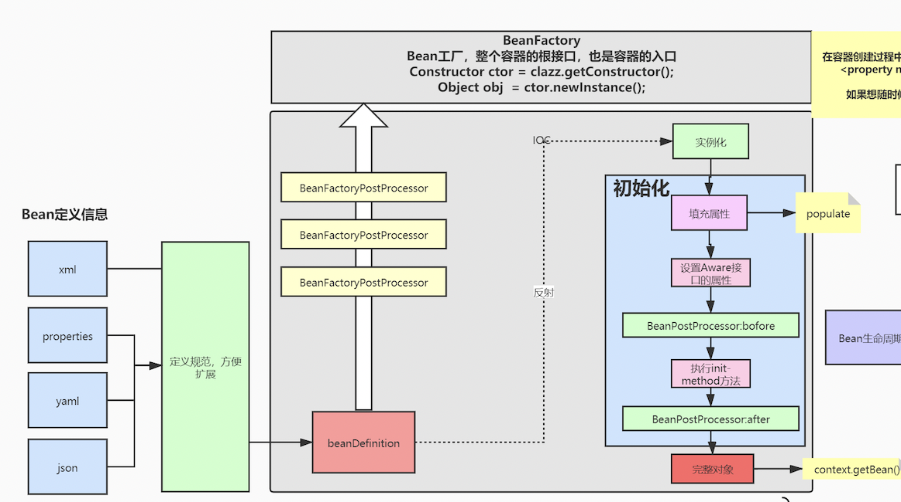 


配合同名图片学习。

重点需要记住一些接口的作用：

1. BeanFactory

   用于访问Springbean容器的根接口。这是bean容器的基本客户端视图；其他接口，如ListableBeanFactory和ConfigurableBeanFactory 可配置BeanFactory可用于特定用途。

   - ListableBeanFactory

     BeanFactory接口的扩展将由可以枚举其所有bean实例的bean工厂实现，而不是按照客户机的请求逐个尝试按名称查找bean。

   - ConfigurableBeanFactory

     配置接口将由大多数bean工厂实现。除了BeanFactory接口中的bean工厂客户端方法之外，还提供了配置bean工厂的工具。

2. Aware 感知

   是很多的的父接口，例如 ApplicationContextAware、EnvironmentAware 

   作用是，对应的普通Bean对象实现了ApplicationContextAware的话，那么bean能getApplicationContext()信息

3. BeanDefinition

4. BeanDefinitionReader - 读取配置信息？

5. BeanFactoryPostProcessor - 增强beanDefinition信息

6. BeanPostProcessor - 增强bean信息 （有 before，after）

7. Environment - StandardEnviroment - 1. System.getEnv(); 2. System.getProperties();

8. FactoryBean

9. DefaultListableBeanFactory 看他类图


## 二、Debug Spring流程概述

先准备一个简单类

1. 开始debug，F7

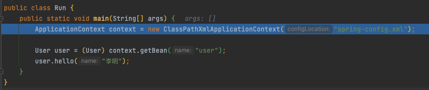

2. 为WebLogic的小问题，忽略 F7

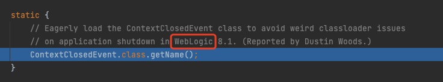

3. 回到最开始，F7

   

4.  F7进入构造方法

   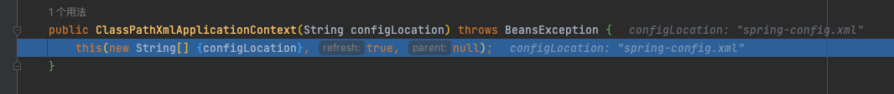

5. F7到重构去

   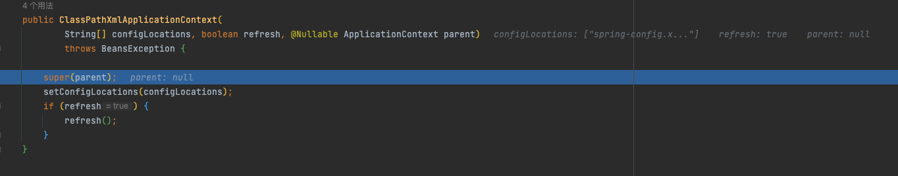

   这里分为3路了

### super(parent)

   调用父类构造，做准备工作，创建集合对象，做一些初始化

   

### setConfigLocations(configLocations)

   设置配置路径

6. F8过super ，可读到配置文件路径所在位置
    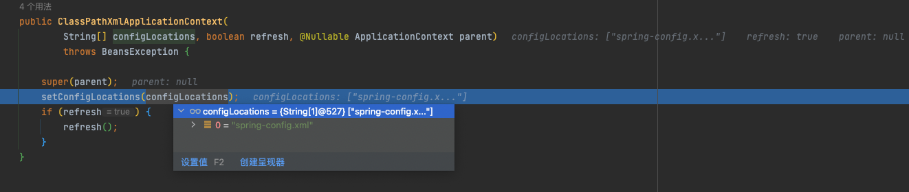

   

### refresh()


   	弄懂这里面的十几个方法，就能知道总体流程了

7. F8跳过设置配置路径 到 `refresh()`F7进入方法核心步骤流程

   

   ```java
   	@Override
   	public void refresh() throws BeansException, IllegalStateException {
   		synchronized (this.startupShutdownMonitor) {
   			// 准备刷新，做一些最基本的准备工作
   			prepareRefresh();  
         --------------------------👇
         		protected void prepareRefresh() {
   							this.startupDate = System.currentTimeMillis();// 设置开始时间
   							this.closed.set(false);		// 设置关闭位	
   							this.active.set(true);		// 设置活跃标志位
   
   							if (logger.isDebugEnabled()) {
   									if (logger.isTraceEnabled()) {
   											logger.trace("Refreshing " + this);
   									}
   									else {
   											logger.debug("Refreshing " + getDisplayName());
   									}
   							}
   							// 里面是空，目的是为了做些扩展
   							initPropertySources();		
           					// 获取环境对象；验证环境属性    知识点：创建子类，父类也会跟着创建
   							getEnvironment().validateRequiredProperties();		
   
           					// 设置一些监听器和事件集合对象
   							if (this.earlyApplicationListeners == null) {
   									this.earlyApplicationListeners 
                       = new LinkedHashSet<>(this.applicationListeners);
   							}
   							else {
   							// Reset local application listeners to pre-refresh state.
   									this.applicationListeners.clear();
   									this.applicationListeners.addAll(this.earlyApplicationListeners);
   							}
   
   							// Allow for the collection of early ApplicationEvents,
   							// to be published once the multicaster is available...
   							this.earlyApplicationEvents = new LinkedHashSet<>();
   					}
         --------------------------
        
   
   ```


#### obtainFreshBeanFactory

7. F8跳过`prepareRefresh() ` 到 `obtainFreshBeanFactory()`

   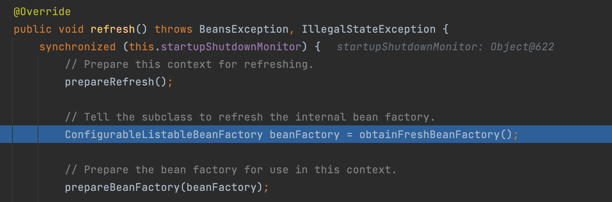

8. F7步入方法`obtainFreshBeanFactory()`


   ```java
   // 告诉子类刷新内部bean工厂。最后创建容器对象：DefaultListableBeanFactory，并加载xml配置文件的属性值到当前工厂中，其中最重要的就是beanDefinition
   ConfigurableListableBeanFactory beanFactory = obtainFreshBeanFactory();
   --------------------------                        👇
       	protected ConfigurableListableBeanFactory obtainFreshBeanFactory() {
   				refreshBeanFactory();
   ---------------------------------------👇------------- 
       			// 只要进入到这方法里面，就是创建一个新的工厂
   				protected final void refreshBeanFactory() throws BeansException {
       					// 判断是否存在工厂并销毁
   						if (hasBeanFactory()) {
   							destroyBeans();
   							closeBeanFactory();
   						}
   						try {
                   			// 最终实例创建
   							DefaultListableBeanFactory beanFactory = createBeanFactory();
   							beanFactory.setSerializationId(getId());	// 设置序列化Id
   							customizeBeanFactory(beanFactory);			// 自定义BeanFactory一些权限
   							loadBeanDefinitions(beanFactory);			// 加载bean的定义属性值
   							synchronized (this.beanFactoryMonitor) {
   								this.beanFactory = beanFactory;
   							}
   						}
   						catch (IOException ex) {
   							throw new ApplicationContextException("I/O error parsing bean "+
                                                             "definition source for " + 
                                                             	getDisplayName(), ex);
   						}
   				}
   ---------------------------------------------------- 
       
       	return getBeanFactory();
   }
   --------------------------
   ```

10. 经过以上创建到`DefaultListableBeanFactory`，F8跳到`customizeBeanFactory(beanFactory)`F7进入方法

    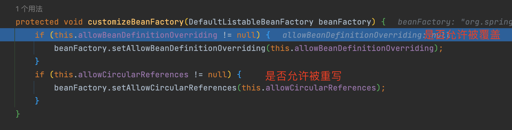 

    作用：设置一些属性值

11. 设置好后，返回到下一个方法`loadBeanDefinitions(beanFactory);`（很复杂，因为有很多个重载的方法需要被调用，但每一次重载所传入的参数是不一样的）

    目前可知，经历过这个方法后，假如配置文件配置了一个bean，那么一下图就有对应有个

    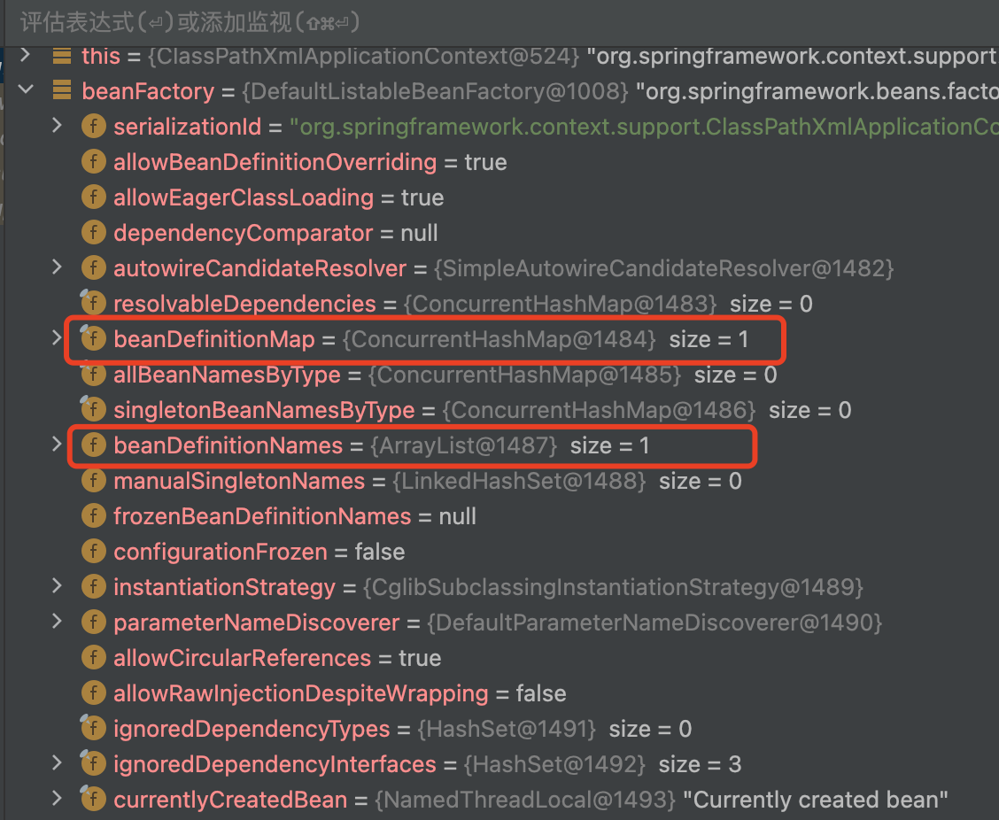 

    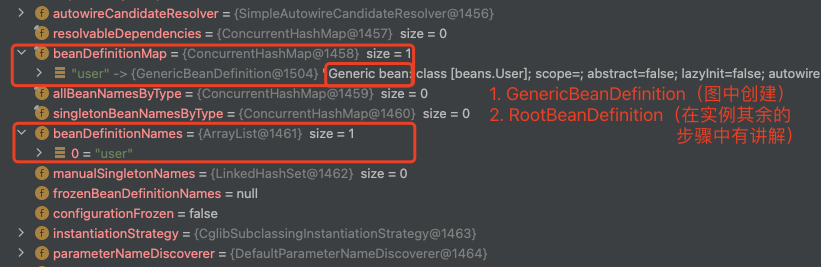  

    后期课程讲解这个复杂的方法

    

12. 执行完后回到方法`obtainFreshBeanFactory`总结：

    ```java
    // 告诉子类刷新内部bean工厂。最后创建容器对象：DefaultListableBeanFactory，并加载xml配置文件的属性值到当前工厂中，其中最重要的就是beanDefinition
    ConfigurableListableBeanFactory beanFactory = obtainFreshBeanFactory();
    ```


#### prepareBeanFactory

10. F7到下一个方法

    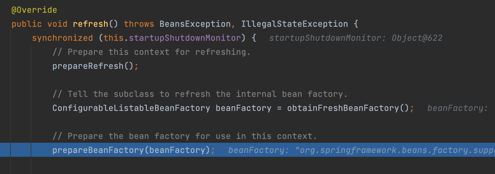 

    方法的作用是为了对beanFactory的一些初始化操作

    点进方法内可看到set、add、register等操作

11. F8到下一个方法

    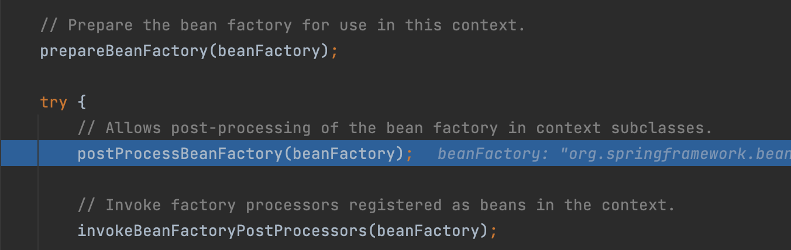 

    子类覆盖方法做额外的处理,此处我们自己一般不做任何扩展工作,但是可以查看web中的代码,是有具体实现的

    空方法，做扩展用

12. F8到下一个方法

    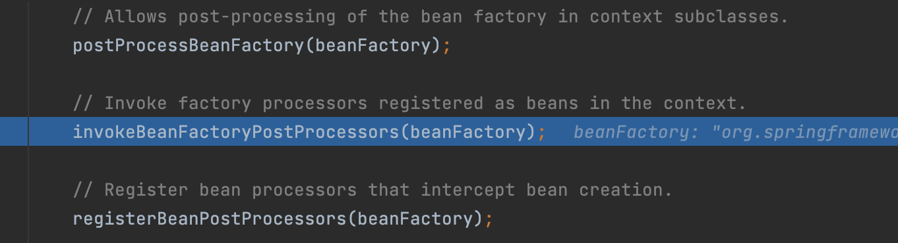 

    开始执行BFPP 这些容器对象了，进入方法

    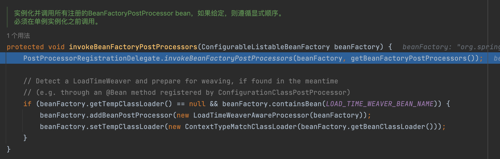 

    `PostProcessorRegistrationDelegate.invokeBeanFactoryPostProcessors(beanFactory, getBeanFactoryPostProcessors());`太复杂了，后期课程讲解

    if判断为空，则直接返回结束方法了

    以上已经将流程1、2、3 完成了

    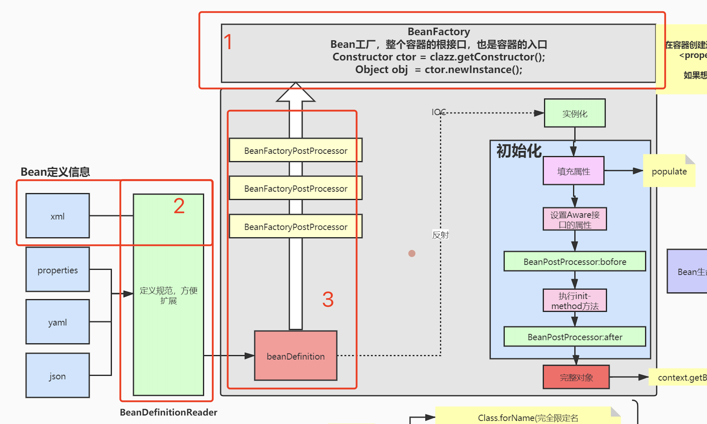

13. 到下一个方法开始准备BPP容器对象的准备工作了

    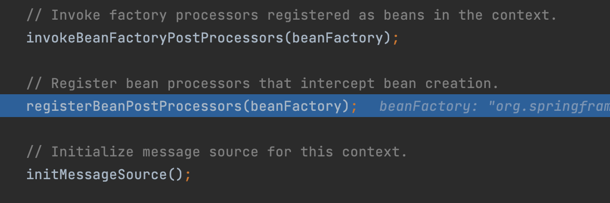 

    F7进入方法，注释：实例化并调用 

    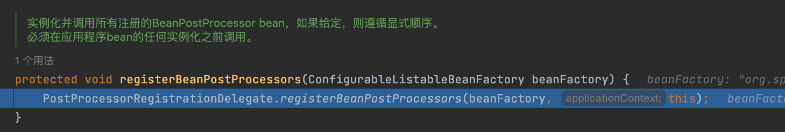 


 17. 下一步到`initMessageSource()`

     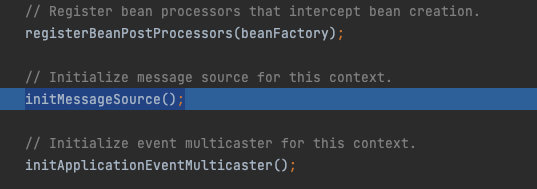 

     做国际化操作，i18n

 18. F8跳过，到`initApplicationEventMulticaster()`

     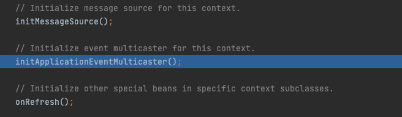 

     初始化应用程序事件的广播器

 19. F8跳过，到`onRefresh()`

     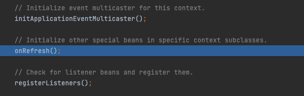 

     为空方法，做扩展用；在SpringBoot中有这个方法里有执行tomcat

 20. F8跳过，到`registerListeners()`，注册监听器

     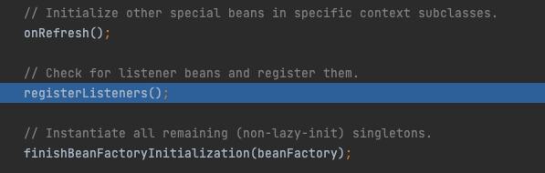 

     


#### finishBeanFactoryInitialization

17. F8跳过，到`finishBeanFactoryInitialization(beanFactory)`，实例化所有剩余的（非惰性初始化）单例

    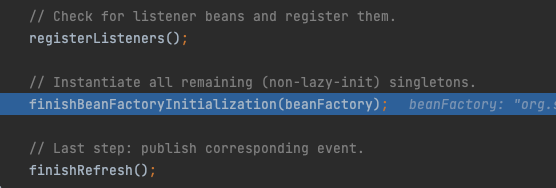 

    这里面的代码非常复杂，包含步骤4的内容

    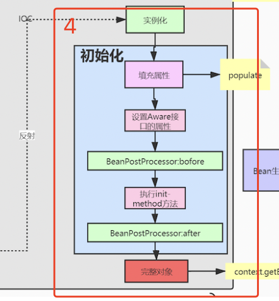  

    **详细**

    1. F7进入方法，主要看方法的关键步骤

       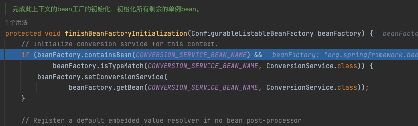 

       主要涉及类型转换的操作，`String CONVERSION_SERVICE_BEAN_NAME = "conversionService";`

       If 这块代码的判断就是将这些类型转换的操作，设置到beanFactory里

       

    2. F8跳过，到下一段代码

       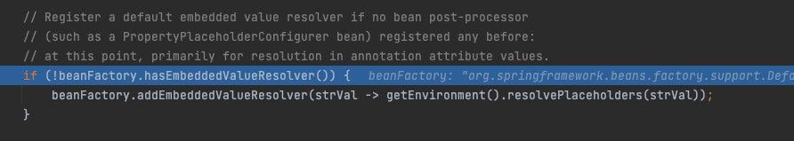

       如果之前没有任何bean后处理器（如PropertyPlaceholderConfigurer bean）注册，则注册一个默认的嵌入式值解析器：此时，主要用于解析注释属性值。PropertyPlaceholderConfigurer 容器对象 处理${}的。`spring-${username}.xml`

       根据环境对象，处理当前属性的值，然后存进beanFactory

       

    3. F8到下一个代码

       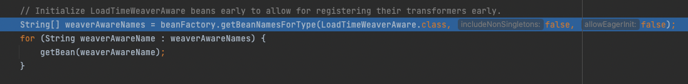

       及早初始化LoadTimeWeaverAware bean，以便及早注册其变压器。

       织入Aware的一些操作

       

    4. F8下一段

       ```java
       // Stop using the temporary ClassLoader for type matching. 停止使用临时ClassLoader进行类型匹配。
       beanFactory.setTempClassLoader(null);
       ```

    5. F8下一段

       ```java
       // Allow for caching all bean definition metadata, not expecting further changes. 一些不动的bean配置放这里
       beanFactory.freezeConfiguration();
       ```


​    

​    

##### beanFactory.preInstantiateSingletons

1. F8下一段到达核心点

   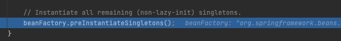 

   初始化所有剩余非懒加载的单例对象

   **详细**

   1. F7进入方法

      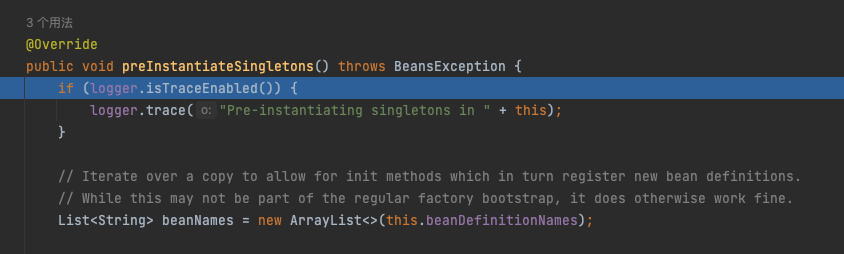 

      日志略过

   2. F8到下一段

      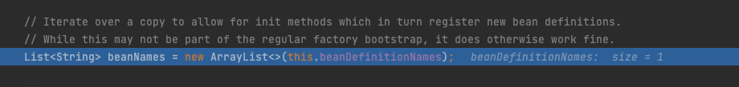

      取出来的就是上面步骤`loadBeanDefinitions(beanFactory)`的

   3. F8下一段代码，for循环    

```java
      // Trigger initialization of all non-lazy singleton beans...
      for (String beanName : beanNames) {  // size = 1 , beanName = User
          // RootBeanDefinition 出现，在loadBeanDefinition()有提到这个类
      	RootBeanDefinition bd = getMergedLocalBeanDefinition(beanName); // 图一，获取bean的描述信息 
          
          // 经过上方描述信息的整合后，这里判断这个bean是否为这些 
      	if (!bd.isAbstract() && bd.isSingleton() && !bd.isLazyInit()) { 
      		if (isFactoryBean(beanName)) {  // 看序号19课程（bean对象实现beanFactory后 加上&的获取）
      			Object bean = getBean(FACTORY_BEAN_PREFIX + beanName);
      			if (bean instanceof FactoryBean) {
      				final FactoryBean<?> factory = (FactoryBean<?>) bean;
      				boolean isEagerInit;
      				if (System.getSecurityManager() != null && factory instanceof SmartFactoryBean) {
      					isEagerInit = AccessController.doPrivileged((PrivilegedAction<Boolean>)
      									((SmartFactoryBean<?>) factory)::isEagerInit,
      							getAccessControlContext());
      				}
      				else {
      					isEagerInit = (factory instanceof SmartFactoryBean &&
      							((SmartFactoryBean<?>) factory).isEagerInit());
      				}
      				if (isEagerInit) {
      					getBean(beanName);
      				}
      			}
      		}
      		else {
      			getBean(beanName); // 本次简单距离并没有beanFactory对象，所以进入此方法
      		}
      	}
      }
```

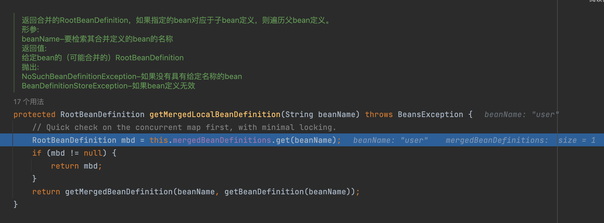 

  （图一） 这个方法的作用是把父类和子类的Bean的描述信息做一个整合，例如：Abstract、Singleton 、LazyInit等


   4. 进入`getBean(beanName)`

      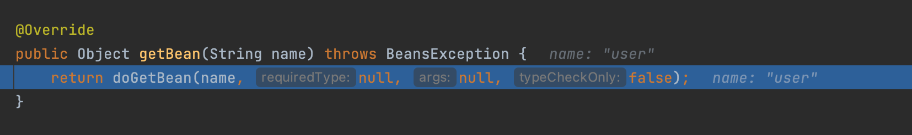

      do开头的方法代表正式开始干活

   4. 进入doGetBean()

      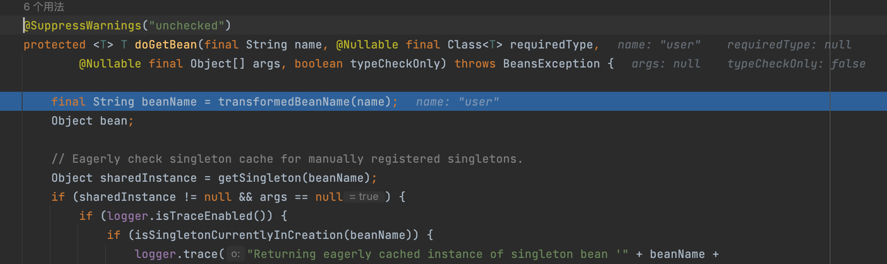 

      第一个方法先不讲，下一个

      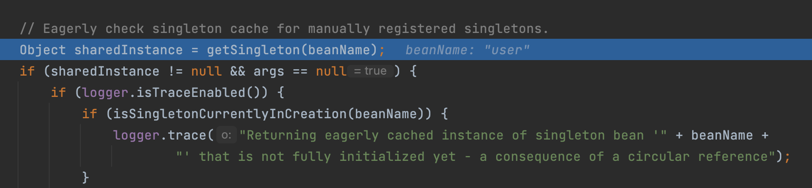 

      创建好bean对象后，放入Map容器里，Map容器在放入缓存中，所以这步是去缓存中获取bean

      进入getSingleton方法

      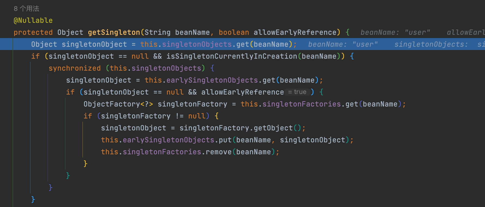

      ```java
      singletonObjects         -- 一级缓存
      earlySingletonObjects    -- 二级缓存
      singletonFactories       -- 三级缓存
      ```

      由于程序刚启动，所以没有，返回null，所以`sharedInstance`为空，if 判断为 false，进入else分支

   5. 进入else分支

      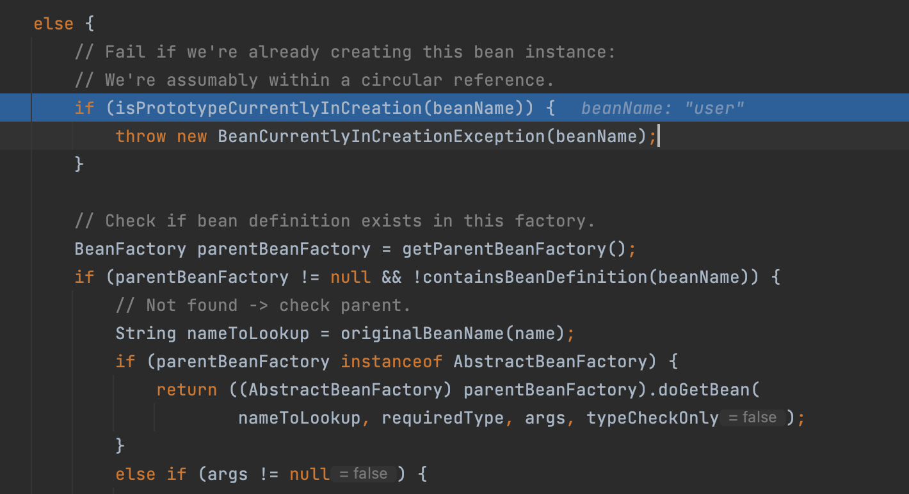 

      if 判断作用：

      - 如果对象都是单例对象的话，则之后会尝试解决循环依赖的问题
      - 如果是原型模式且存在循环依赖，那么抛出异常（这是if判断的主要意思）

   6. 往下走，获取父类容器

      ```java
      BeanFactory parentBeanFactory = getParentBeanFactory();
      if (parentBeanFactory != null && !containsBeanDefinition(beanName)) {
          ...
      }
      ```

      由于没有父类容器，过到下一个if

   7. 往下到，判断，标志位

      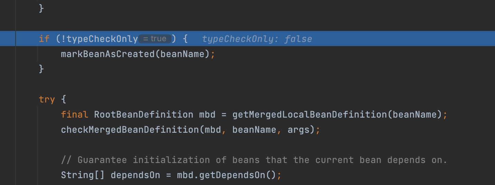 

       进入

      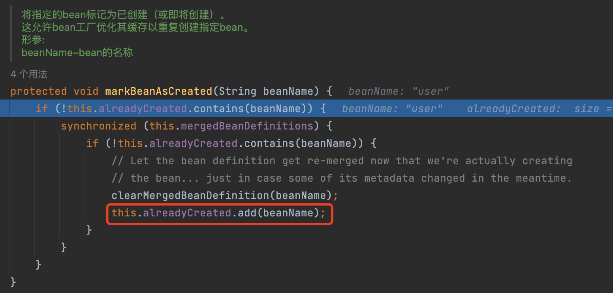 

      将指定bean标记为已创建，返回，到代码try

   8. 进入检测

      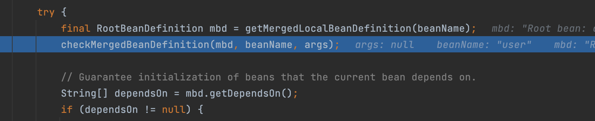 

      获取BeanDefinition 并 检测它    

   10. 下一步，判断依赖

       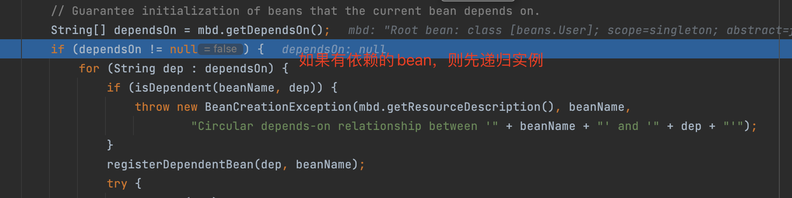 

       如果存在依赖的bean，则优先实例化依赖的bean。

       **例子**：<bean  A、B、C 三个bean标签，没依赖的话是由上往下执行，但是如果A dependsON B ，那么B先实力，再C，再A

       由于没有依赖，代码跳过
       
       

######     getSingleton(beanName, () -> {

   11. 进入核心分支

       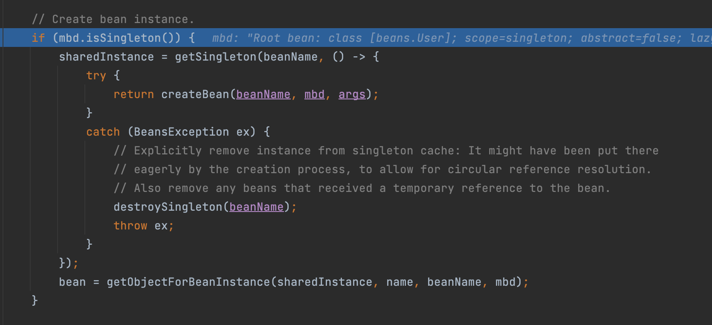 

       为单例，进入缓存方法 `getSingleton()`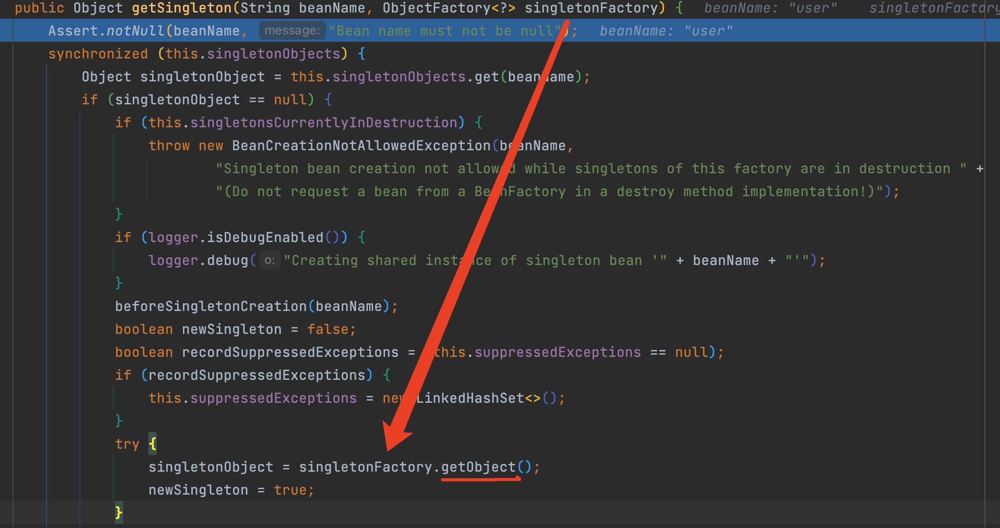 

       跳过中间的一些判断只直接到获取对象`getObject()`，回到上级的lambda中

        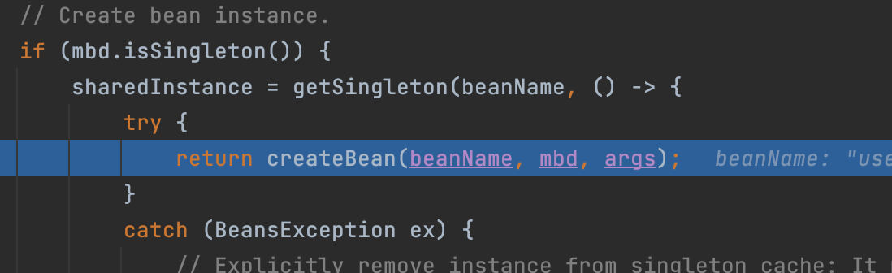 

          进入`createBean()`，并跳过前部分的逻辑判断直接找到`doCreateBean()`方法

          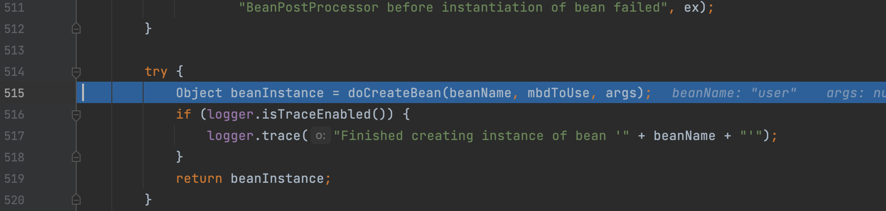 

          进入`doCreateBean()`后才是**步骤4**的开始

          跳过前面清除缓存步骤，通过第二个 if 判断

       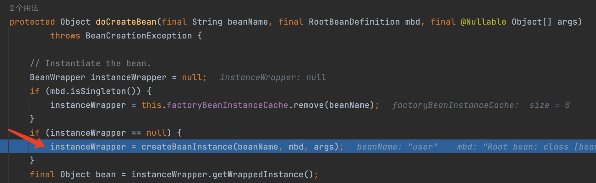

       进入`createBeanInstance()`核心实例化过程（目前只看核心代码）

       直接到方法的最后一步

       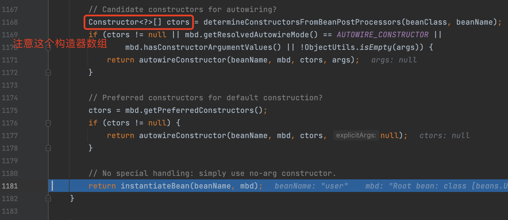 

       看到构造器就能知道可以通过newInstance获取对象

       没有特殊处理，用简单的无参构造：`instantiateBean()`

       进入instantiateBean(beanName, mad)

       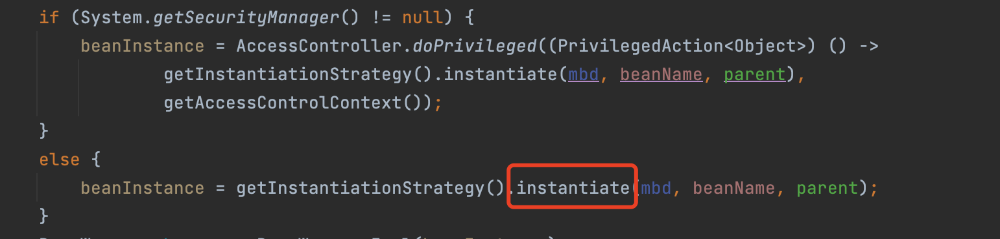 

       再进入 instantiate(mbd, beanName, parent)

       忽略上面的逻辑判断

       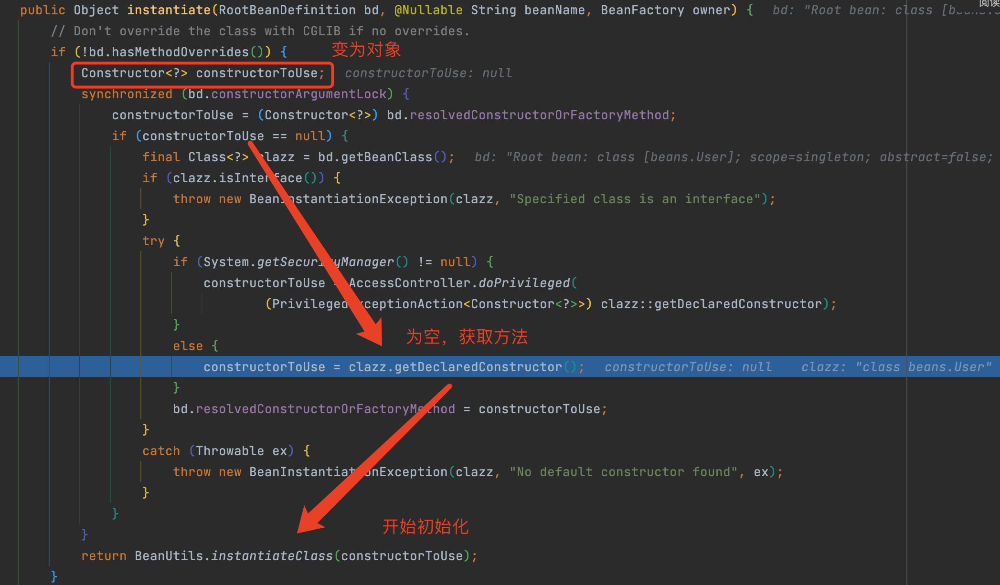  

          代码经过以上方式到达初始化`BeanUtils.instantiateClass(constructorToUse)` ，进入

          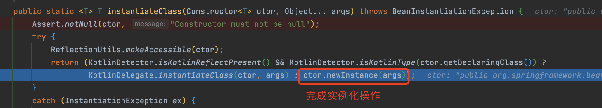 

          完成后，开始逐一返回。注意：目前只是在堆中开辟了一处空间，并没有填充属性 初始化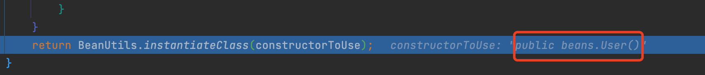

          再返回

          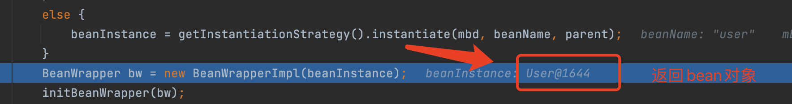 

           

           

           

          12. 然后一直往下走，可看到这段代码
       
              
       
              这部分代码是解决循环依赖的问题。解决方法为：提前暴露，暴露 实例化但并未初始化的bean对象
       
              进入方法看看
              
                  
              
                 Bean放入三级缓存， 第二参数放入lambda
              
       
          为什么要使用三级缓存？关键点是这个
       
           
       
        里面有BPP，AOP就是靠着BPP实现的
       
          下一步

    

   暴露bean赋值，下一步

​               

填充属性，经过这个方法后，bean内的属性的注入了

    

   **进入下一个方法**（开始进入步骤4中的Aware）

    

    


   这个方法是，如果bean实现了某些Aware接口的话，那么就在这个方法里面进行Aware相关的注入。本例子没有实现Aware，所以下一步。

   开始进入Before操作

    

   往下几行就能看到After方法

   

   这里执行完后就成了完整的对象


   返回上一层

    

   一直往下到

    

   - 这个的作用是，当容器关闭的时候要销毁对象步骤，看内部操作
   
      

   下一步返回对象 return

    

   下一步再 return

    

   再return

     

   到finally

    

   有after 上方必定有before

   before：记录当前对象的加载状态

   after：移除缓存中对该bean的正在加载状态的记录

   下一步，if 判断

    

   讲循环依赖的时候再讲这个部分 

   先一步，return

    

   从createBean回来后，sharedInstance是个完整对象，所以不是直接拿去用吗？为什么要多走个这个方法？

   - 答：得到的sharedInstance 有可能是FactoryBean，所以这个方法里面一定会有个getObject的方法操作（经过两个同名多态方法后进入do开头的同名，就能看到）
   
     另外：一个实例实现FactoryBean对象要注意，启动后会创建两个对象，1. FactoryBean对像 2.getObject的时候才会实现我们想要的对象
   
       

   继续往下走，退出了两层try，跳过一个if，return到上一级
           

   再return

    

由于就一个bean，当前for循环结束，进入下一个for循环

    

   由于没有符合条件，跳过，返回上一级

    

   至此，步骤4 结束，再向上返回


#### finishRefresh

 

最后一步，完成刷新，发布相应事件，进入

  

之后一直返回到

 

整个创建过程结束


## 三、Spring启动流程细节

### super(parent) - 细讲

进入，一直到这里

 

创建资源模式处理器

F8 下一步

 

 

继续挨个的创建

也就不继续截图的，看备注即可看懂这一些个参数。

创建完成后回到方法
 


#### getResourcePatternResolver

下一步F7进入方法，作用：创建一个资源模式解析器 

 

 


创建完成，返回至这里

 

进入看一眼结构

 

因为parent为空，所以不执行

继续返回（后续都是对进入super方法后执行构造）

途径，停留简单讲解，但目前用不到，就不做笔记了

 

 最后返回到入口点


### setConfigLocations(configLocations) - 细讲

 

进入

 

**记住这个类 AbstractRefreshableConfigApplicationContext**

前两句断言判断后取到configLocations，进入for

**注：configLocations参数后面还会用到**

 

解析给定的路径。-  进入resolvePath

 

先进入getEnvironment

  

进入StandardEnvironment，会发现没看见他的构造方法

 

进入父类AbstractEnvironment中的构造方法那里打断点

 

这样再走F7下一步的话就能进来到父类；到了这里可以蛮看看上方的参数。

在下一步的话，就进入子类StandardEnvironment 里重写的父类customizePropertySources 方法

 

然后方法内容将父类传过来的类赋值 （MutablePropertySources 加载对应属性资源）

走完方法

  

可看到对象已经获取到了系统的一些属性值

 

 

（课程等下要使用到电脑的名字user.name这个参数）


之后一直返回，StandardEnvironment的对象就创建好了

  

然回到这里，后面的方法作用就是替换掉$的占位符的，看到熟悉的user.name了吧，能想到要替换成什么了吧～

大概能想到这个方法一定是要先匹配这几个字符$ 、{、}

进入resolveRequiredPlaceholders

 

propertyResolver里面有上面刚获取的环境数据

进入resolveRequiredPlaceholders

 

其间的createPlaceholderHelper是创建些占位符的标识

 

进行识别的参数，返回进入到 doResolvePlaceholders 方法

 


#### replacePlaceholders

 

 

目前并没有多重，所以直接下一行

 

F7进入

 


##### getProperty

 

然后返回

 

已经取到了值

  

 之后占位符经过replace就完全被替换了

一直返回到，结束

  


### refresh() - 细讲

#### prepareRefresh()

 

往下走

##### initPropertySources() 的扩展

 为空方法，留给子类覆盖，做拓展使用，初始化属性资源 

 

然后看调用是否能输出拓展内容

```java
MyClassPathXmlApplicationContext ac = new MyClassPathXmlApplicationContext("spring-config.xml");
```

启动，发现能执行到

就算拓展成功了，


##### getEnvironment().validateRequiredProperties()

验证环境属性，可配合initPropertySources() 方法里设置的 setRequiredProperties(“user.name”)

里面就会验证，这个属性是否有值

 

对应的属性值为空的话，就会添加进ex.add…..里面，最后抛出

 

验证后开始创建监听器

 

创建好准备工作后


#### obtainFreshBeanFactory()

 

有可能在此之前就有beanFactory，随意进入这个方法前的第一步就是判断有没有，有 就干掉

  

下一步执行createBeanFactory() 创建工厂 

 

留意这两个值 


下一步 setId 没什么好说的

下一步定制


##### customizeBeanFactory(beanFactory)

 

进入后可看到刚才需要留意的两个属性判断，但出奇的是并不会进入到if里

原因：this的这两个值是为null的；如果想要有值的话，那就需要重写该方法

 

这么重写进去后就有值了，就能给beanFactory 里的这两个值重新设值

 

##### loadBeanDefinitions(beanFactory)

加载bean的定义信息

 

根据this创建实体解析器：用它读取本地的某些xsd或dtd文件，来完成解析工作。 

课程继续讨论了关于这META-INF/spring.schemas里的配置文件是否会被取出来，但对于目前阶段的我来说无关紧要；


## 四、Spring配置文件加载过程

继上继续讲解此方法

loadBeanDefinitions(beanFactory) 加载bean的定义信息，就是配置文件里的那些<bean>…</bean>


#### initBeanDefinitionReader(beanDefinitionReader)

初始化beanDefinitionReader，此处设置配置文件是否要进行验证

用到了适配器模式


#### loadBeanDefinitions(beanDefinitionReader)

接下来会进入多个同名但不同参数的方法

 

获取配置文件的路径，往下走，由于我们是String格式的，则进入到第二个if判断 

继续进入下一个

**loadBeanDefinitions(configLocations)**

**loadBeanDefinitions(location)**

**loadBeanDefinitions(location, null)**

 

**loadBeanDefinitions(resources)**

**loadBeanDefinitions(resource)**

**loadBeanDefinitions(new EncodedResource(resource))**

```
String[] -> String -> Resource[] -> resources -> 包装成EncodedResource    参数的变化
```

 

根据输入流，获取到配置文件inputStream后， 字节码，传给do处理


**doLoadBeanDefinitions(inputSource, encodedResource.getResource())**

 

- 文档对象内部的创建，getValidationModeForResource(resource)方法进行了xsd、dtd或其他文件的判断操作，方法实际返回数字。

- 可以蛮看看doc对象，里面包含的是各Node信息 

- 在解析自定义标签的时候会用到这些内容

 

**registerBeanDefinitions(doc, resource)** ⬇️

**registerBeanDefinitions(doc, createReaderContext(resource))⬇️**

**doRegisterBeanDefinitions(doc.getDocumentElement())⬇️**

### **parseBeanDefinitions(root, this.delegate)**


##### 1⃣️if 判断为**默认的命名空间**则进入

默认的命名空间：import、alias、bean、beans

**parseDefaultElement(ele, delegate)**

 

bean

 

进入 delegate.parseBeanDefinitionElement(ele);

 

 接着在进入多态同名方法进行详细的解析 parseBeanDefinitionElement(ele, beanName, containingBean);

 

解析完这两个其实就可以进行反射实例化创建对象了，有id 有class

 

方法进入后主要创建了以下，然后存入了些值

```
GenericBeanDefinition bd = new GenericBeanDefinition()
```

之后就是一些设置工作了

 

图中的解析都是在<bean></bean>标签中能用到的属性

其中 parseConstructorArgElements(ele, bd) 构造函数内部可以看看，略微复杂

开始返回到

 

这里的beanDefinition就已经是完整的解析完xml文件属性值的 

回到上级

 

delegate.decorateBeanDefinitionIfRequired(ele, bdHolder)

这一步装饰也只是为了对一些属性值的替换工作而已

下一步

  

进入

 

进入

 

方法内有很多的逻辑判断，判断完成后可看到

 

如果上面的if 进不去，就由下面的else做处理

 

Map是在这里进行存值的

这样就把bean对象注册进来了

返回上级

 

跟前面的步骤同理，经过判断然后将别名放进别名map（aliasMap）里

返回上级

 

小结：

- 从**xml文件**里解析到对应的**标签、元素**， 然后将这些**标签、元素**放进**BeanDefinition**里。再把**BeanDefinition**放进**BeanFactory**里，在这步骤中就包含了bean的定义信息。
- 完成了流程图中，xml到beanDefinition的一步；下一步就轮到该进行实例化了 


##### 2⃣️继上 if 的 Else自定义标签

**delegate.parseCustomElement(ele)**

 

进入  


## 五、Spring自定义标签解析过程

继以上分支else内容，context、tx等这些都属于自定义标签

解析xsd、dtd文件


那么代码中是如何获取到标签的？

 

在META-INF中即可找到对应的配置文件


继续源码解读

parseCustomElement()方法中

先获取对应命名空间

再获取handler


###### 其中readerContext是从哪里获取的？

且，还有那些内容？

答：在之前调用的 registerBeanDefinitions(doc, **createReaderContext(resource)**)中返回的

进入方法createReaderContext(resource)

 

在进入createDefaultNamespaceHandlerResolver()

 

查看DefaultNamespaceHandlerResolver(cl)

 

由此可以得到的信息是，会从这个路径下获取配置文件；所以，如果想自定义一个标签的话，就在这个路径下编写自己的配置文件

点击常量，再往下翻能看到 getHandlerMappings() ，这个于之前讲的

 

一样，下面也有个 getSchemaMappings()， 都会默认调用最后的toString方法

那么进行返回的时候也能看到参数内都已将配置文件读取到了

 


回到自定标签分支处

readerContext也就是由上半部分创建好的xmlReaderContext

 

.getNamespaceHandlerResolver()获取到对应的处理器

###### resolve(namespaceUri)

进入.resolve(namespaceUri)

 

根据key再Mappings里找到handler文件对象

往下走

 

假设我们现在处理的是context的自定义标签，那么根据上面所获遇到的handler，进入

 

把这些解析类全部放在`Map<String, BeanDefinitionParser> parsers`里面

返回

把结果记录在缓存中

返回，F8下一步

 

F7进入.parse

 

进入findParserForElement()

 

获取到类，返回

 

拿着获取到的类进行解析，F7进入

 

再F7进入，前边部分都是一些判断和赋值，到下面，看到doParse，正式干活方法

 

方法里面都是做一堆属性的的判断后就返回了

然后将beanDefinition返回上级

 

然后一直往下走到

 

进入

**registerBeanDefinition(holder, parserContext.getRegistry());**

**registerBeanDefinition(definition, registry);**

**registerBeanDefinition(beanName, definitionHolder.getBeanDefinition());**

 

在这里做了存储操作（Map 和 Names），注册到beanFactory里，然后开始返回

途径

 

最终返回到最开始的else

 


##### 开始自定义一个标签

 

创建个  msb:user 这么个标签 需要哪些类

 


 


 


   

handlers

 

Schemas

 

user.xsd

   

然后再配置文件上增加

 

最后运行看是否能执行

 


## 六、Spring的bean工厂准备工作

refresh() 的13方法的第三步

### prepareBeanFactory(beanFactory)

 

F7进入看看new的具体是什么

-  

  #{} 就知道这是什么了，但目前阶段只是准备工作

返回下一行

#### addPropertyEditorRegistrar(PropertyEditorRegistrar registrar)

 

这个方法有什么作用？

例子：业务中出现的情况，Adress是由省市区按道理是分成3个变量来处理的，但是如果输入只用一个Adress来处理：`省_市_区`，就可以在这个方法上进行拓展个属于这数据的方法，**属性编辑注册器**

进入**new ResourceEditorRegistrar(this, getEnvironment())**

 

如果单单看构造方法仅仅是赋值，没什么意思；向上看他的视线类

 

注册自定义的编辑器，这下清楚了些什么吧

而Spring默认的注册器，是准备在数据填充（填充属性）的时候才调用到

- 具体处理位置

  createBean -> doCreateBean -> createBeanInstance -> instantiateBean ->

   

  - 进入BeanWrapperImpl的构造函数

     

    看的眼熟吧

     

    将默认编辑器的标识为激活

  返回进入 **initBeanWrapper(bw)**

   

  - 其中ConversionService 是在最开始进入实例对象的时候设置的

     

  - 在这时候调用registerCustomEditors(bw)

    里面先获取有多少个这样的编辑器，然后遍历调用方法，就看进入到默认的编辑器

     


##### 拓展自定义属性编辑器

  

 

Address

 

Customer

 

AddressPropertyEditor

 

AddressPropertyEditorRegistrar

 


编写自定义配置类

 

 

或另一种配置方式

 

测试

 

拓展结束


#### addBeanPostProcessor(new ApplicationContextAwareProcessor(this))

添加BPP，ApplicationContextAwareProcessor - 此类用来完成某些Aware对象的注入

根据后部分的ApplicationContextAwareProcessor(this) 里的 Aware 做联想，invokeAwareMethods方法，但这个方法只会识别3种类型：BeanNameAware、BeanClassLoaderAware、BeanFactoryAware

当然，是想Aware接口的肯定不止这些，那么除了这三个的其他类会在哪里调用呢？ 

答：那么就是在 ApplicationContextAwareProcessor(this) 类里的一个方法

 

这里在匹配看你是否实现了这其中六种接口，有的话，就调用最后的 invokeAwareInterfaces(bean)

 


##### 拓展属于自己的Aware

根据以上判断最终是在ApplicationContextAwareProcessor(this) 里的 postProcessBeforeInitialization() 方法

 

MyAwareProcessor

 

最终会在这里被调用

 


#### ignoreDependencyInterface()

 

这里面需要忽略的接口是刚才上方在BPP里的那几个Aware接口 


#### registerResolvableDependency()

 

后面不讲了


 


## 七、Spring的BeanFactoryPostProcessors执行

### invokeBeanFactoryPostProcessors(beanFactory)

调用各种beanFactory处理器；BFPP可以理解为增强器，也可以理解为，后置处理器

BFPP在进行修改的时候，修改的是BF内的所有对象；而BDRPP修改的是BD的

还得注意一个BeanFactoryPostProcessor的子接口BeanDefinitionRegistryPostProcessor

beanFactory 中包含beanDefinition

 

#### 如何自定义一个BFPP

- 自定义

   

  注册方法一：

   

  注册方法二：

   

  采用任意一种即可调用到sout

  当自定义的BFPP注入到Spring后，getBeanFactoryPostProcessors()这个方法里面就能看到我们自定的BFPP（原本默认为空）


进入invokeBeanFactoryPostProcessors()

 

这里面是主要处理逻辑的地方

运行期间可以有多个BFPP

 

 

 看懂上方的图，这个方法就看的比较轻松了

 

父子类分别要实现的方法


开始步骤

上几行理解简单

 

为什么要创建两个集合？因为这个调用这个方法需要处理两个接口，看注释

 

下一步for循环将传进来的BFPP数据进行分类，registryProcessors方便执行后续实现了BDRPP接口里的PPBF

跳过for

 

这里再次创建个了同类不同名的集合，保留本次要执行的

下一步postProcessorNames只获取名字

for循环看注释理解，PriorityOrdered.class是上面er图显示的

下一步

 

如果有多个，那就对他排个优先级

下一步是添加一个集合

上下两张图看作一个整体，是处理实现了PriorityOrdered排序方式的BF

而后面两大段与这段差不多，分别处理的是实现了Orderd的接口和非排序接口的BF

为什么要重复的验证呢？因为在执行invokeBeanDefinitionRegistryPostProcessors后可能会生成新的BDPP

 


其中进入sortPostProcessors(currentRegistryProcessors, beanFactory)

 

如果比较器也为空，使用默认的比较器，进入INSTANCE

 

在进入类里

 

doCompare

 


上方都排序好后，准备开始干活

 

 

最后再把所有收到的 统一执行postProcessBeanFactory


**if else 执行完后，继续往下**

  

 

获取到3个集合对象

进入到for

 

 

 

两小节没认真听


## 八、Spring的BeanFactoryPostProcessors执行2

继上再次分析流程

 

第一节回顾上节的知识点

第二节课解释为什么需要重复获取实现不同排序接口的BDRPP，因为invokeBeanDefinitionRegistryPostProcessors方法中有可能会产生新的BDRPP，所以需要多次获取

例子：

 

配置文件直接`<bean class:”这个类的路径”></bean>`即可

自定义的BDRPP的方法postProcessBeanDefinitionRegistry里再次注册了个BD，所以会出现这情况

- 也可以使用另一种方式来注册进去

   

可以以上方式自定义两个BDRPP提供测试，了解这里面具体情况


### ConfigurationClassPostProcessor

连老师讲这个实际并不是为了让我们了解这个流程，而是想让我们了解个类`ConfigurationClassPostProcessor`后续简称CCPP

 

这些注解都是在这个类里面解析的，实现了BDRPP

可以看看执行过程

怎么开启让他在invokeBFPP中获取到这个类我忘了（补：增加ComponentScan注解即可有internal注入），似乎是在讲关于internal相关的知识点的时候提到过

流程是在invokeBFPP中的 postProcessorNames 字符串数组可以看到被获取的名字

然后再invokeBeanDefinitionRegistryPostProcessors方法中for循环轮到CCPP执行他的postProcessBeanDefinitionRegistry

 

前面都好理解，最重要的最后一个方法，来进行解析的，F7进入

 

 

可算是重点了；有使用红色注解的类进入后会筛选出来，在for循环中会

`ConfigurationClassUtils.checkConfigurationClassCandidate(beanDef, this.metadataReaderFactory)`里，进入看看

- 方法

   

  第二个if是判断是否是从注解生成的；metadata元数据——注解内的数据，如 @Import(“元数据”)

   

   

   

  if 先判断当前的类是否有@Configuration注解，没有的话进入else if里看有没有其他的候选项

  `isConfigurationCandidate`

  - 进入看看

     

     
    
    进入`candidateIndicators`
    
     
    
    返回上级
  
   
  
  其中常数`ONFIGURATION_CLASS_ATTRIBUTE`对应的值事`configurationClass`；后面的常数上下就分别是 full、lite；
  
  - 可蛮进入看看
  
     
  
  将的这些方法目的都在确定是否有这些注解，如果没有后return false了，如果哪怕只包含一个，也会return true；
  
   
  
  返回上一级

符合条件进入

 

以上动作都是为了给configCandidates添加符合条件的对象值

继续往下

 

 

 

if里判断的是 是否使用自定了命名生成器，如果没有，这用默认的

 

 

这个类开始重要

 

do第一行中 进入parse解析的步骤与上面工具类ConfigurationClassUtils.checkConfigurationClassCandidate里的差不多

- 进入parse后，在进入一个第一个if的parse

   

  进入再进入

   

  - 进入跳过解析看看那些bean符合条件进行递归调用

     

    最后的两个return都是递归调用

     

     

    返回

  下一个逻辑判断：处理Imprted的情况，当前类是否被别的类Import

   

  进不去，下一个

   

  这行看不懂就算了
  
  进入doProcessConfigurationClass
  
  - 实际干活
  
     
  
    内部类理解，类似：
  
     
  
     
  
     
  
    看出了第一段if 之外段的注解，都是明确表明是为了解析单个注解，其中最重要的是Import注解
  
     
  
    getImports方法是获取Import注解内的值
  
    - 进入看看processImports
  
       
  
       
  
      这里还有个processImports递归，因为带入的元数据里可能还有impoert
  
       
  
       
  
       
  
      


## 九、Spring的ConfigurationClassPostProcessor的讲解

实现了BDRPP接口的类

回顾上节课的内容

 

根据这个自定的类再去细讲 parse（**会先解析外面的类，其中如果递归到内部类有包含的注解，那么就会把内部类全部解析完后，再回到外面继续**）；

目的就是为了解析被注解修饰的BeanDefinition （里面的xml、Configuration）

 

 

进入

 

 

由于当前解析的类还包含个内部类，所以会在进入processConfigurationClass后进行一个递归操作


后面的部分就是invokeBean…里的流程做的消息讲解，对部分跳过的类，通过debug进入讲解。对目前的我来说用处不大，听个乐即可


## 十、注册BeanPostProcesser

补充上节课没讲完的Import注解

 

- getImports(sourceClass) 识别到对应的类

   

- collectImports

   

  返回，再返回

进入processImports

里面做了 导入一些额外的配置类，同时完成了具体类的实例化工作

