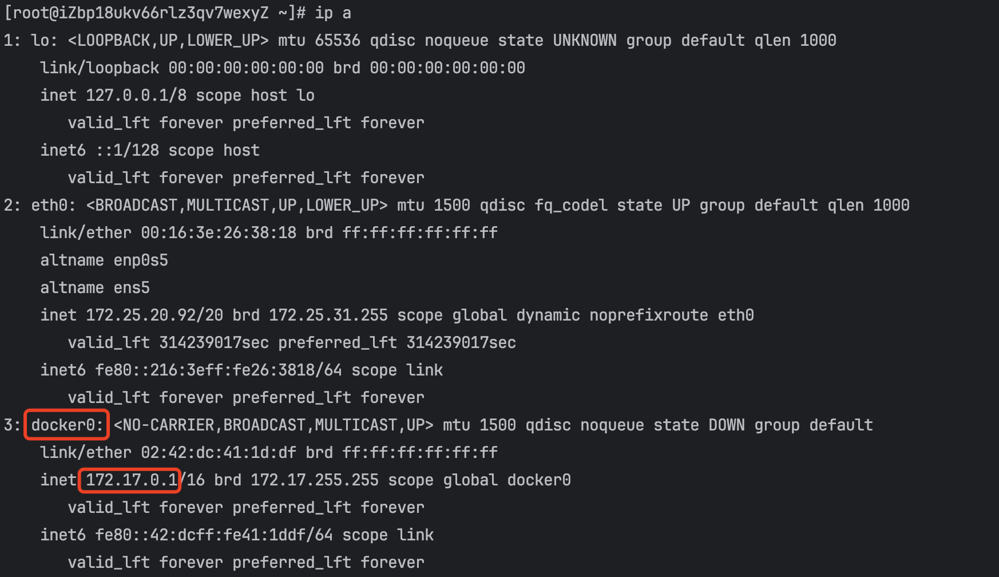
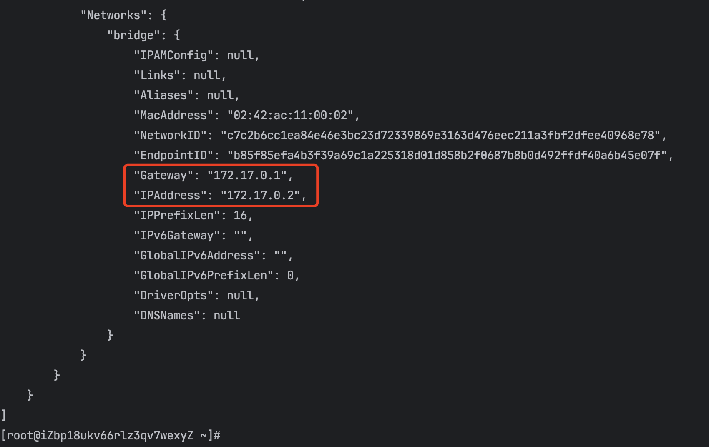
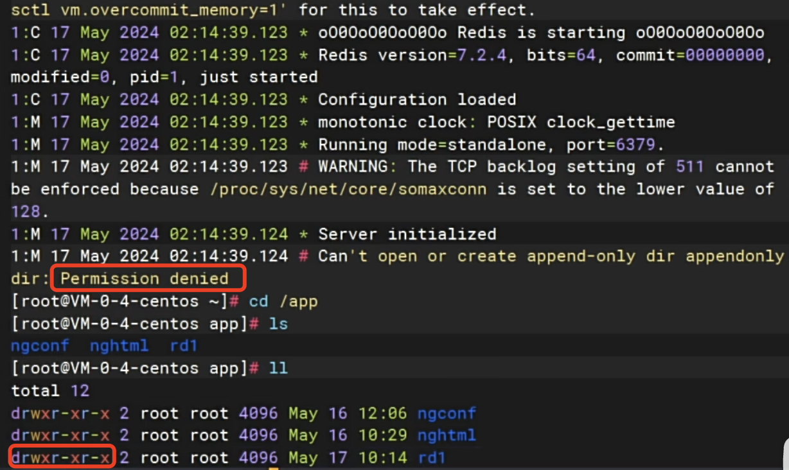
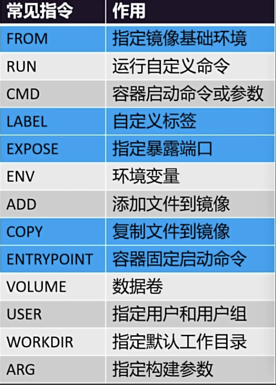
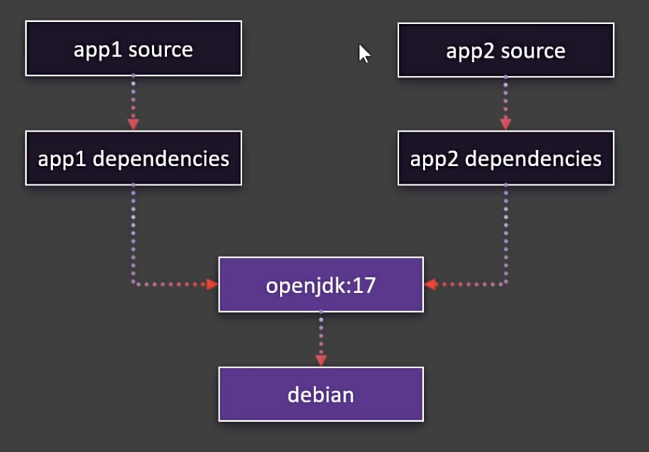
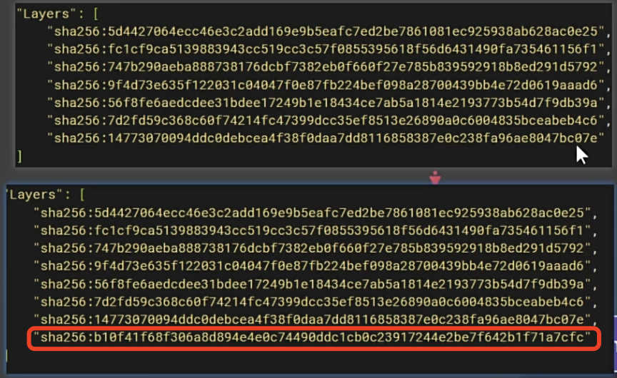

# docker命令

学会之后，以后服务器就使用docker来安装这些常用的中间件，比如mysql，nginx，rabbitmq等

要不苦苦的在网络上找各种安装教程 

又不懂的命令要带什么参数，可带上`--help`，例如 `docker ps --help`


# 2. 命令

```bash
#查看运行中的容器
#查看所有容器
#搜索镜像
#下载镜像（拉取
#下载指定版本镜像
#查看所有镜像
#删除指定id的镜像
#运行一个新容器，本地没有就直接拉取最新版本
#停止容器
#启动容器。592是容器id，但是这是id的前3位，能区分就行
#重启容器  使用了一长串命令后启动失败了，排查了原因后，再次启动
#查看容器资源占用情况
#查看容器日志
#删除指定容器
#强制删除指定容器

# 后台启动容器
# 后台启动并暴露端口 端口的映射，外部宿主机能访问到容器内的端口号，

# 进入容器内部 -it：以交互模式；用哪种方式，用/bin/bash控制台
# 将nginx默认的欢迎页，改成自己的    >直接覆盖   >>追加

# 提交容器变化打成一个新的镜像 （得理解理解，这个平日打镜像的语句）
# -m 日志信息，mynginx mynginx:v1.0 =》 将mynginx打包个新版本mynginx:v1.0 

# 保存镜像为指定文件
# 删除多个镜像
# 加载镜像
# 登录 docker hub

# 重新给镜像打标签 ， 同一个镜像，但是名称不同了
# 推送镜像

# 小技巧
# 直接批量删除容器 ；  docker ps -aq; -a 打印全部容器 -q 只打印容器id

```


```shell
#查看运行中的容器
docker ps
#查看所有容器
docker ps -a
#搜索镜像
docker search nginx
#下载镜像
docker pull nginx
#下载指定版本镜像
docker pull nginx:1.26.0
#查看所有镜像
docker images
#删除指定id的镜像
docker rmi e784f
#运行一个新容器，本地没有就直接拉取最新版本
docker run nginx
#停止容器
docker stop 容器名称
#启动容器。592是容器id，但是这是id的前3位，能区分就行
docker start 592
#重启容器  使用了一长串命令后启动失败了，排查了原因后，再次启动
docker restart 592 
#查看容器资源占用情况
docker stats 592
#查看容器日志
docker logs 592
#删除指定容器
docker rm 592
#强制删除指定容器
docker rm -f 592
# 后台启动容器
docker run -d --name mynginx nginx
# 后台启动并暴露端口 端口的映射，外部宿主机能访问到容器内的端口号，
比如： -p 88:80，代表宿主机端口号88与容器的80映射了，访问宿主机ip:88等与访问容器80
docker run -d --name mynginx -p 80:80 nginx
# 进入容器内部 -it：以交互模式；用哪种方式，用/bin/bash控制台
docker exec -it mynginx /bin/bash
# 将nginx默认的欢迎页，改成自己的    >直接覆盖   >>追加
echo "<h1>Hello, Docker</h1>" > index.html

# 提交容器变化打成一个新的镜像 （得理解理解，这个平日打镜像的语句）
# -m 日志信息，mynginx mynginx:v1.0 =》 将mynginx打包个新版本mynginx:v1.0 
docker commit -m "update index.html" mynginx mynginx:v1.0
# 保存镜像为指定文件
docker save -o mynginx.tar mynginx:v1.0
# 删除多个镜像
docker rmi bde7d154a67f 94543a6c1aef e784f4560448
# 加载镜像
docker load -i myng
# 登录 docker hub
docker login
# 重新给镜像打标签 ， 同一个镜像，但是名称不同了
docker tag mynginx:v1.0 leifengyang/mynginx:v1.0
docker tag mynginx:v1.0 leifengyang/mynginx:latest => 目的是对方pull的时候没有带版本号，可直接拉去最新的，避免报错
# 推送镜像
docker push leifengyang/mynginx:v1.0

# 小技巧
# 直接批量删除容器 ；  docker ps -aq; -a 打印全部容器 -q 只打印容器id
docker rm -f $(docker ps -aq)
```


# 3. 存储

两种方式，注意区分：

- 目录挂载： `-v /app/nghtml:/usr/share/nginx/html`，以外部为主，外部要是空，相关的容器报错大概率会是无配置问题。

  告诉容器，当前主机的/app/nghtml目录与你容器内的/usr/share/nginx/html绑上了，启动上的话再次访问，就会到/app/nghtml目录下去找欢迎页

- 卷映射：`-v ngconf:/etc/nginx` ,与容器内的配置文件一一映射 ，以内部为准，初步启动会把容器内部的配置文件映射到外部（一般使用这个）

  卷就是存储，如果想改配置文件，就要到指定的位置`var/lib/docker/volumes/<volumes-name>`

  - `docker volumes ls` 就能看到自己创建的卷映射
  - `docker volumes create ngconf` 

```shell
docker run -d -p 99:80 \
-v /app/nghtml:/usr/share/nginx/html \
-v ngconf:/etc/nginx \
--name app03 \
nginx
```

注意，删除容器，这些挂载和映射是不会被删除的，但是下次run的时候还是需要用这个方式启动才能关联上这些映射


# 4. 网络

创建自定义网络，实现主机名作为稳定域名访问。

安装docker 其实就有一个docker内部的网络， 用`ip a`  可以看到一个叫 docker0 的网卡

|                           执行结果                           |
| :----------------------------------------------------------: |
|  |

然后里面的容器，以docker0作为gateway，在172.17.0.1的基础上分配ip给运行的容器，如下

`docker run -d --name mynginx -p 88:80 nginx`

| 运行容器后，执行命令 docker inspect mynginx                  |
| ------------------------------------------------------------ |
|  |

然后可以通过这种方式直接去访问另一个容器 `curl http://172.17.0.3:99`


Docker 会为每个容器分配唯一ip，使用 `容器IP + 容器端口`可以互相访问

但是还是有风险的，因为一旦删除了容器，ip就会变动，需要重新分配，有什么方式能长期稳定呢？

**创建自定义网络**，例如： 创建一个网络mynet，将创建的容器加入到自定义的网络mynet中，容器之间就可以通过域名进行访问。

默认加入的是docker0的网络中，因为默认网络不支持域名，所以需要单独设置。


1. 创建自定义网络`docker network create mynet`

2. 查看网络 `docker network ls`

3. 那么启动的容器，需要多加一个参数 `--network mynet`

   `docker run -d --name mynginx -p 88:80 --network mynet nginx`

   就会加入到自定义的网络中

4. 那么最后就可以通过域名进行访问另一个容器了，例如另一个容器的名称是app2

   `curl http://app2:80`

   

## 4.1. Redis主从同步集群

```bash
#自定义网络
docker network create mynet
#主节点
docker run -d -p 6379:6379 \
-v /app/rd1:/bitnami/redis/data \		挂载
-e REDIS_REPLICATION_MODE=master \		主机
-e REDIS_PASSWORD=123456 \
--network mynet --name redis01 \
bitnami/redis

#从节点
docker run -d -p 6380:6379 \
-v /app/rd2:/bitnami/redis/data \		挂载
-e REDIS_REPLICATION_MODE=slave \		从机		
-e REDIS_MASTER_HOST=redis01 \ 			域名
-e REDIS_MASTER_PORT_NUMBER=6379 \
-e REDIS_MASTER_PASSWORD=123456 \
-e REDIS_PASSWORD=123456 \
--network mynet --name redis02 \
bitnami/redis
```

> 以上 \ 代表换行继续输出，-e 代表环境变量，拉取的镜像非官方的，是bitnami

其中，运行的镜像redis01时可能会报错，因为挂载的rd1可能没有权限，查看步骤

| docker logs 容器id                                           |
| ------------------------------------------------------------ |
|  |

> 可看到对应的文件只有root有读写权限，其他只有执行和读的权限

放开权限`chmod -R 777 rd1`： 所有人可读可写可执行


按照上面启动的命令执行成功后，外部数据库连接上redis这两个主从后，在master上更新的数据会同步到salve上。


## 4.2. 启动MySQL

```bash
docker run -d -p 3306:3306 \
-v /app/myconf:/etc/mysql/conf.d \
-v /app/mydata:/var/lib/mysql \
-e MYSQL_ROOT_PASSWORD=123456 \
mysql:8.0.37-debian
```


# 5. Docker Compose

## 5.1. 命令式安装

```bash
#创建网络
docker network create blog

#启动mysql
docker run -d -p 3306:3306 \
-e MYSQL_ROOT_PASSWORD=123456 \
-e MYSQL_DATABASE=wordpress \
-v mysql-data:/var/lib/mysql \
-v /app/myconf:/etc/mysql/conf.d \
--restart always --name mysql \    
--network blog \
mysql:8.0

#启动wordpress  博客
docker run -d -p 8080:80 \
-e WORDPRESS_DB_HOST=mysql \
-e WORDPRESS_DB_USER=root \
-e WORDPRESS_DB_PASSWORD=123456 \
-e WORDPRESS_DB_NAME=wordpress \
-v wordpress:/var/www/html \
--restart always --name wordpress-app \
--network blog \
wordpress:latest
```


## 5.2. compose.yaml

> 执行命令`docker compose -f compose.yaml up -d`
>
> 其中，-f 是指定文件compse.yaml 的文件，但是这个文件又是默认的，所有可以直接写成`docker compose up -d`

```shell
name: myblog
services:
  mysql:
    container_name: mysql
    image: mysql:8.0
    ports:
      - "3306:3306"
    environment:
      - MYSQL_ROOT_PASSWORD=123456
      - MYSQL_DATABASE=wordpress
    volumes:
      - mysql-data:/var/lib/mysql
      - /app/myconf:/etc/mysql/conf.d
    restart: always
    networks:
      - blog

  wordpress:
    image: wordpress
    ports:
      - "8080:80"
    environment:
      WORDPRESS_DB_HOST: mysql
      WORDPRESS_DB_USER: root
      WORDPRESS_DB_PASSWORD: 123456
      WORDPRESS_DB_NAME: wordpress
    volumes:
      - wordpress:/var/www/html
    restart: always
    networks:
      - blog
    depends_on:
      - mysql

volumes:
  mysql-data:
  wordpress:

networks:
  blog:
```

> 后期假设有对某个参数做了修改，那么依旧执行`docker compose up -d`即可做更行。

看在rabbitMq那边所用的`docker-compose up -d`，连前面的docker 都省略了

## 5.3. 特性

- 增量更新
  - 修改 Docker Compose 文件。重新启动应用。只会触发修改项的重新启动。

- 数据不删
  - 默认就算down了容器，所有挂载的卷不会被移除。比较安全


# 6. Dockerfile

|                           基础命令                           |
| :----------------------------------------------------------: |
|  |

启动一个jar

```shell
FROM openjdk:17
LABEL author=leifengyang
COPY app.jar /app.jar    ==> 第一个app.jar的文件所在的位子跟Dockerfile文件是同一个目录
EXPOSE 8080
ENTRYPOINT ["java","-jar","/app.jar"]
```

> 启动命令：`docker build -f DockerFile -t myjavaapp:v1.0 .` 
>
> 其中`.` 就是`./`，这个指的是上下文目录，而命令中指的是在当前目录，因为为了指出这个`app.jar`位置在哪里


## 6.1 镜像分层机制

| 分层机制                                                     |
| ------------------------------------------------------------ |
|  |

> 一个dockerFile里面两个app公用一个系统和环境，那么打包后占用的空间不会包涵系统和环境。

可以查看官方的nginx，利用`docker image history nginx`，可以看到这个nginx的一个dockerFile命令（这个命令需要从下往上看）。

看看自己做了点修改并且打包的mynginx的history，就可以看到，里面其实只有少部份不同。

| 上官方，下自制                                               |
| ------------------------------------------------------------ |
|  |

> 只有第一句不同

还可以使用更清晰的方式查看分层

| docker image inspect nginx(mynginx)，上官方，下自制          |
| ------------------------------------------------------------ |
|  |

> 自制的只多了一层

所以可以看到，同一层的内容都是存储在同一个位置的。不额外造成内存空间。看起来有很多个镜像，但是都是共用了一个存储空间，有做修改的部份额外分出一层。

其实在查看容器的时候也能看出区别

| 查看容器 -s (size)                                           |
| ------------------------------------------------------------ |
|  |

圈起来的就是自己修改单独分层的部份所占用的大小，后面虚拟部份就是公用的

拿第一个举例：nginx启动，他的镜像容器占了188M。而容器内自己自定义的读写层只有1.09k，假设对容器做了大量修改，那么还会持续上涨。

