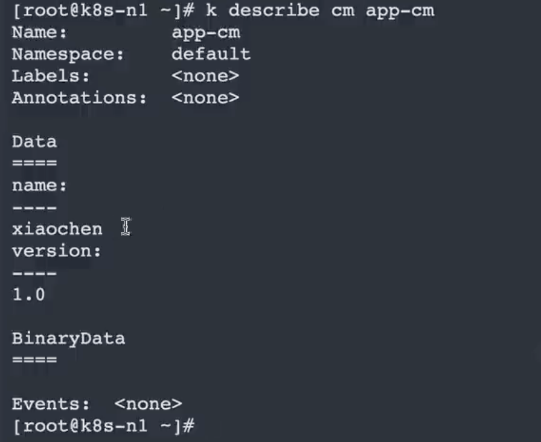

# Kubernetes

## 第四章 Controller 控制器

- 什么是 Controller 以及作用
- 常见的 Controller 控制器
- Controller 如何管理 Pod
- Deployment 基本操作与应用
- 通过控制器实现 Pod 升级回滚和弹性伸缩
- StatefulSet 基本操作与应用
- Daemonset 基本操作与应用
- Job 基本操作与应用
- Controller 无法解决问题

### 1 Controller 控制器

官网: http://kubernetes.p2hp.com/docs/concepts/architecture/controller.html

#### 1.1 什么是 Controller

`Kubernetes 通常不会直接创建 Pod， 而是通过 Controller 来管理 Pod 的。`**Controller 中定义了 Pod 的部署特性，比如有几个副本、在什么样的 Node 上运行等**。通俗的说可以认为 Controller 就是用来管理 Pod 一个对象。其核心作用可以通过一句话总结： **`通过监控集群的公共状态，并致力于将当前状态转变为期望的状态。`**

**通俗定义:  controller 可以管理 pod 让 pod 更具有运维能力**

#### 1.2 常见的 Controller 控制器

-  `Deployment` 是最常用的 Controller。Deployment 可以管理 Pod 的多个副本，并确保 Pod 按照期望的状态运行。
   -  ReplicaSet 实现了 Pod 的多副本管理。使用 Deployment 时会自动创建 ReplicaSet,也就是说 Deployment 是通过 ReplicaSet 来管理 Pod 的多个副本的，我们通常不需要直接使用 ReplicaSet。

-  `Daemonset` 用于每个Node 最多只运行一个 Pod 副本的场景。正如其名称所揭示的，DaemonSet 通常用于运行 daemon。
-  `Statefuleset` 能够保证 Pod 的每个副本在整个生命周期中名称是不变的，而其他Controller 不提供这个功能。当某个 Pod 发生故障需要删除并重新启动时，Pod 的名称会发生变化，同时 StatefuleSet 会保证副本按照固定的顺序启动、更新或者删除。
-  `Job`  用于运行结束就删除的应用，而其他 Controller 中的 Pod 通常是长期持续运行。

#### 1.3 Controller 如何管理 Pod

**`注意: Controller 通过 label 关联起来 Pods`**


### 2 Deployment

官方地址: http://kubernetes.p2hp.com/docs/concepts/workloads/controllers/deployment.html

一个 Deployment 为 Pod 和 ReplicaSet提供声明式的更新能力。

你负责描述 Deployment 中的 **目标状态**，而 Deployment 控制器（Controller）以受控速率更改实际状态， 使其变为期望状态。你可以定义 Deployment 以创建新的 ReplicaSet，或删除现有 Deployment， 并通过新的 Deployment 收养其资源。

#### 2.1 创建 deployment

```yml
apiVersion: apps/v1
kind: Deployment
metadata:
  name: nginx-deployment
  labels:
    app: nginx
spec:
  replicas: 3
  selector:
    matchLabels:
      app: nginx-z
  template:
    metadata:
      labels:
        app: nginx-z
    spec:
      containers:
        - name: nginx
          image: nginx:1.19
          ports:
            - containerPort: 80
```

主要是selector内填写的标签要与template内的labels对应上就行，deployment的labels主要是给deploy打标签的。

#### 2.2 查看 deployment 

```shell
# 部署应用
$ kubectl apply -f app.yaml
# 查看 deployment
$ kubectl get deployment
# 查看 pod
$ kubectl get pod -o wide
# 查看 pod 详情
$ kubectl describe pod pod-name
# 查看 deployment 详细
$ kubectl describe deployment 名称
# 查看 log
$ kubectl logs pod-name
# 进入 Pod 容器终端， -c container-name 可以指定进入哪个容器。
$ kubectl exec -it pod-name -- bash
# 输出到文件
$ kubectl get deployment nginx-deployment -o yaml >> test.yaml
```

- `NAME` 列出了名字空间中 Deployment 的名称。
- `READY` 显示应用程序的可用的“副本”数。显示的模式是“就绪个数/期望个数”。
- `UP-TO-DATE` 显示为了达到期望状态已经更新的副本数。
- `AVAILABLE` 显示应用可供用户使用的副本数。
- `AGE` 显示应用程序运行的时间。

> 请注意期望副本数是根据 `.spec.replicas` 字段设置 3。

#### 2.3 扩缩 deployment

```shell
# 查询副本
$ kubectl get rs|replicaset
# 伸缩扩展副本
$ kubectl scale deployment nginx --replicas=5
```

#### 2.4 回滚 deployment

> **说明：**
>
> 仅当 Deployment Pod 模板（即 `.spec.template`）发生改变时，例如模板的标签或容器镜像被更新，才会触发 Deployment 上线。其他更新（如对 Deployment 执行扩缩容的操作）不会触发上线动作。

```shell
# 查看上线状态
$ kubectl rollout status [deployment nginx-deployment | deployment/nginx]
# 查看历史
$ kubectl rollout history deployment nginx-deployment
# 查看某次历史的详细信息
$ kubectl rollout history deployment/nginx-deployment --revision=2
# 回到上个版本
$ kubectl rollout undo deployment nginx-deployment
# 回到指定版本
$ kubectl rollout undo deployment nginx-deployment --to-revision=2
# 重新部署
$ kubectl rollout restart deployment nginx-deployment
# 暂停运行，暂停后，对 deployment 的修改不会立刻生效，恢复后才应用设置
$ kubectl rollout pause deployment ngixn-deployment
# 恢复
$ kubectl rollout resume deployment nginx-deployment
```

#### 2.5 删除 deployment 

```shell
# 删除 Deployment
$ kubectl delete deployment nginx-deployment
$ kubectl delete -f nginx-deployment.yml
# 删除默认命名空间下全部资源
$ kubectl delete all --all
# 删除指定命名空间的资源
$ kubectl delete all --all -n 命名空间的名称
```

### 3 StatefulSet

#### 3.1 什么是 StatefulSet

官方地址： https://kubernetes.io/zh-cn/docs/concepts/workloads/controllers/statefulset/

**StatefulSet 是用来管理`有状态应用`的工作负载 API 对象。**

**无状态应用: 应用本身不存储任何数据的应用称之为无状态应用。**

**有状态应用: 应用本身需要存储相关数据应用称之为有状态应用。**

博客: 前端vue  后端 java   mysql redis es ....

数据采集:  采集程序 有状态应用

StatefulSet 用来管理某 Pod 集合的部署和扩缩， **并为这些 Pod 提供持久存储和持久标识符。**

和 Deployment 类似， StatefulSet 管理基于相同容器规约的一组 Pod。但和 Deployment 不同的是， **StatefulSet 为它们的每个 Pod 维护了一个有粘性的 ID。这些 Pod 是基于相同的规约来创建的， 但是不能相互替换：==无论怎么调度，每个 Pod 都有一个永久不变的 ID。==**

如果希望使用存储卷为工作负载提供持久存储，可以使用 StatefulSet 作为解决方案的一部分。 尽管 StatefulSet 中的单个 Pod 仍可能出现故障， 但持久的 Pod 标识符使得将现有卷与替换已失败 Pod 的新 Pod 相匹配变得更加容易。

#### 3.2 StatefulSet 特点

StatefulSet 对于需要满足以下一个或多个需求的应用程序很有价值：

- 稳定的、唯一的网络标识符。
- 稳定的、持久的存储。
- 有序的、优雅的部署和扩缩。
- 有序的、自动的滚动更新。

在上面描述中，“稳定的”意味着 Pod 调度或重调度的整个过程是有持久性的。 如果应用程序不需要任何稳定的标识符或有序的部署、删除或扩缩， 则应该使用由一组无状态的副本控制器提供的工作负载来部署应用程序，比如 Deployment或者 ReplicaSet 可能更适用于你的无状态应用部署需要。

#### 3.3 限制

- 给定 Pod 的存储必须由 PersistentVolume Provisioner 基于所请求的 `storage class` 来制备，或者由管理员预先制备。
- 删除或者扩缩 StatefulSet 并**不会**删除它关联的存储卷。 这样做是为了保证数据安全，它通常比自动清除 StatefulSet 所有相关的资源更有价值。
- StatefulSet 当前需要[无头服务](https://kubernetes.io/zh-cn/docs/concepts/services-networking/service/#headless-services)来负责 Pod 的网络标识。你需要负责创建此服务。
- 当删除一个 StatefulSet 时，该 StatefulSet 不提供任何终止 Pod 的保证。`为了实现 StatefulSet 中的 Pod 可以有序且体面地终止，可以在删除之前将 StatefulSet 缩容到 0`。
- 在默认 Pod 管理策略(`OrderedReady`) 时使用滚动更新， 可能进入需要人工干预才能修复的损坏状态。

#### 3.4 使用 StatefulSet

##### 1 搭建 NFS 服务

```shell
#安装nfs-utils
$ yum install -y rpcbind nfs-utils
#创建nfs目录
mkdir -p /root/nfs/data
#编辑/etc/exports输入如下内容 
# insecure:通过 1024 以上端口发送 rw: 读写 sync:请求时写入共享 no_root_squash:root用户有完全根目录访问权限
echo  "/root/nfs/data *(insecure,rw,sync,no_root_squash)" >> /etc/exports
#启动相关服务并配置开机自启动
systemctl start rpcbind
systemctl start nfs-server
systemctl enable rpcbind
systemctl enable nfs-server
#重新挂载 使 /etc/exports生效
exportfs -r
#查看共享情况
exportfs
```

##### 2 客户端测试

```shell
# 1.安装客户端 所有节点安装
$ yum install -y nfs-utils
# 2.创建本地目录
$ mkdir -p /root/nfs
# 3.挂载远程nfs目录到本地
$ mount -t nfs 10.15.0.9:/root/nfs /root/nfs
# 4.写入一个测试文件
$ echo "hello nfs server" > /root/nfs/test.txt
# 5.去远程 nfs 目录查看
$ cat /root/nfs/test.txt

# 挂取消载
$ umount -f -l nfs目录
```

##### 3 使用 statefulset

- class.yml

```yml
apiVersion: storage.k8s.io/v1
kind: StorageClass
metadata:
  name: nfs-client
provisioner: k8s-sigs.io/nfs-subdir-external-provisioner # or choose another name, must match deployment's env PROVISIONER_NAME'
parameters:
  archiveOnDelete: "false"
```

- nfs-client-provider

```yaml
apiVersion: apps/v1
kind: Deployment
metadata:
  name: nfs-client-provisioner
  labels:
    app: nfs-client-provisioner
  # replace with namespace where provisioner is deployed
  namespace: kube-system
spec:
  replicas: 1
  strategy:
    type: Recreate
  selector:
    matchLabels:
      app: nfs-client-provisioner
  template:
    metadata:
      labels:
        app: nfs-client-provisioner
    spec:
      serviceAccountName: nfs-client-provisioner
      containers:
        - name: nfs-client-provisioner
          image: chronolaw/nfs-subdir-external-provisioner:v4.0.2
          volumeMounts:
            - name: nfs-client-root
              mountPath: /persistentvolumes
          env:
            - name: PROVISIONER_NAME
              value: k8s-sigs.io/nfs-subdir-external-provisioner
            - name: NFS_SERVER
              value: 10.15.0.10
            - name: NFS_PATH
              value: /root/nfs/data
      volumes:
        - name: nfs-client-root
          nfs:
            server: 10.15.0.10
            path: /root/nfs/data
```

- rbac.yml

```yml
apiVersion: v1
kind: ServiceAccount
metadata:
  name: nfs-client-provisioner
  # replace with namespace where provisioner is deployed
  namespace: kube-system
---
kind: ClusterRole
apiVersion: rbac.authorization.k8s.io/v1
metadata:
  name: nfs-client-provisioner-runner
rules:
  - apiGroups: [""]
    resources: ["nodes"]
    verbs: ["get", "list", "watch"]
  - apiGroups: [""]
    resources: ["persistentvolumes"]
    verbs: ["get", "list", "watch", "create", "delete"]
  - apiGroups: [""]
    resources: ["persistentvolumeclaims"]
    verbs: ["get", "list", "watch", "update"]
  - apiGroups: ["storage.k8s.io"]
    resources: ["storageclasses"]
    verbs: ["get", "list", "watch"]
  - apiGroups: [""]
    resources: ["events"]
    verbs: ["create", "update", "patch"]
---
kind: ClusterRoleBinding
apiVersion: rbac.authorization.k8s.io/v1
metadata:
  name: run-nfs-client-provisioner
subjects:
  - kind: ServiceAccount
    name: nfs-client-provisioner
    # replace with namespace where provisioner is deployed
    namespace: kube-system
roleRef:
  kind: ClusterRole
  name: nfs-client-provisioner-runner
  apiGroup: rbac.authorization.k8s.io
---
kind: Role
apiVersion: rbac.authorization.k8s.io/v1
metadata:
  name: leader-locking-nfs-client-provisioner
  # replace with namespace where provisioner is deployed
  namespace: kube-system
rules:
  - apiGroups: [""]
    resources: ["endpoints"]
    verbs: ["get", "list", "watch", "create", "update", "patch"]
---
kind: RoleBinding
apiVersion: rbac.authorization.k8s.io/v1
metadata:
  name: leader-locking-nfs-client-provisioner
  # replace with namespace where provisioner is deployed
  namespace: kube-system
subjects:
  - kind: ServiceAccount
    name: nfs-client-provisioner
    # replace with namespace where provisioner is deployed
    namespace: kube-system
roleRef:
  kind: Role
  name: leader-locking-nfs-client-provisioner
  apiGroup: rbac.authorization.k8s.io
```

- mysql.yml

```YAML
apiVersion: v1
kind: Namespace
metadata:
  name: ems
---
apiVersion: storage.k8s.io/v1
kind: StorageClass
metadata:
  name: mysql-nfs-sc
  namespace: ems
provisioner: k8s-sigs.io/nfs-subdir-external-provisioner
parameters:
  onDelete: "remain"
---
apiVersion: apps/v1
kind: StatefulSet
metadata:
  name: mysql
  labels:
    app: mysql
  namespace: ems
spec:
  serviceName: mysql #headless 无头服务  保证网络标识符唯一  必须存在
  replicas: 1
  template:
    metadata:
      name: mysql
      labels:
        app: mysql
    spec:
      containers:
        - name: mysql
          image: mysql/mysql-server:8.0
          imagePullPolicy: IfNotPresent
          env:
            - name: MYSQL_ROOT_PASSWORD
              value: root
          volumeMounts:
            - mountPath: /var/lib/mysql #自己容器写入数据目录
              name: data    #保存到指定一个变量中 变量名字就是 data
          ports:
            - containerPort: 3306
      restartPolicy: Always
  volumeClaimTemplates:  #声明动态创建数据卷模板
    - metadata:
        name: data      # 数据卷变量名称
        namespace: ems  # 在哪个命名空间创建数据卷
      spec:
        accessModes:    # 访问数据卷模式是什么  
          - ReadWriteMany
        storageClassName: mysql-nfs-sc # 使用哪个 storage class 模板存储数据
        resources:
          requests:
            storage: 2G
  selector:
    matchLabels:
      app: mysql
---
```

### 4 DaemonSet

#### 4.1 什么是 DaemonSet

https://kubernetes.io/zh-cn/docs/concepts/workloads/controllers/daemonset/

**DaemonSet** 确保全部（或者某些）节点上运行一个 Pod 的副本。`当有节点加入集群时，也会为他们新增一个 Pod。 当有节点从集群移除时，这些 Pod 也会被回收`（可参考calico）。删除 DaemonSet 将会删除它创建的所有 Pod。

DaemonSet 的一些典型用法：

- 在每个节点上运行 集群    守护进程
- 在每个节点上运行 日志收集 守护进程
- 在每个节点上运行 监控    守护进程

一种简单的用法是为每种类型的守护进程在所有的节点上都启动一个 DaemonSet。 一个稍微复杂的用法是为同一种守护进程部署多个 DaemonSet；每个具有不同的标志， 并且对不同硬件类型具有不同的内存、CPU 要求。

#### 4.2 使用 DaemonSet

```yml
apiVersion: apps/v1
kind: DaemonSet
metadata:
  labels:
    app: nginx
  name: nginx
spec:
  selector:
    matchLabels:
      app: nginx
  template:
    metadata:
      labels:
        app: nginx
    spec:
      containers:
      - image: nginx:1.19
        imagePullPolicy: IfNotPresent
        name: nginx
        resources: {}
      restartPolicy: Always
```

### 5 Job

#### 5.1 什么是 Job

https://kubernetes.io/zh-cn/docs/concepts/workloads/controllers/job/

Job 会创建一个或者多个 Pod，并将继续重试 Pod 的执行，直到指定数量的 Pod 成功终止。 随着 Pod 成功结束，Job 跟踪记录成功完成的 Pod 个数。 当数量达到指定的成功个数阈值时，任务（即 Job）结束。 删除 Job 的操作会清除所创建的全部 Pod。 挂起 Job 的操作会删除 Job 的所有活跃 Pod，直到 Job 被再次恢复执行。

一种简单的使用场景下，你会创建一个 Job 对象以便以一种可靠的方式运行某 Pod 直到完成。 当第一个 Pod 失败或者被删除（比如因为节点硬件失效或者重启）时，Job 对象会启动一个新的 Pod。

你也可以使用 Job 以并行的方式运行多个 Pod。

#### 5.2 使用 Job

```yaml
apiVersion: batch/v1
kind: Job
metadata:
  name: pi
spec:
  template:
    spec:
      containers:
      - name: pi
        image: perl:5.34.0
        command: ["perl",  "-Mbignum=bpi", "-wle", "print bpi(2000)"]
      restartPolicy: Never
  # 当前任务出现失败 最大的重试次数
  backoffLimit: 4
```

#### 5.3 自动清理完成的 Job

完成的 Job 通常**不需要留存**在系统中。在系统中一直保留它们会给 API 服务器带来额外的压力。 如果 Job 由某种更高级别的控制器来管理，例如 [CronJob](https://kubernetes.io/zh-cn/docs/concepts/workloads/controllers/cron-jobs/)， 则 Job 可以被 CronJob 基于特定的根据容量裁定的清理策略清理掉。

- **已完成 Job 的 TTL 机制**
  - 自动清理已完成 Job （状态为 `Complete` 或 `Failed`）的另一种方式是使用由 TTL 控制器所提供的 TTL 机制。 通过设置 Job 的 `.spec.ttlSecondsAfterFinished` 字段，可以让该控制器清理掉已结束的资源。TTL 控制器清理 Job 时，会级联式地删除 Job 对象。 换言之，它会删除所有依赖的对象，包括 Pod 及 Job 本身。 注意，当 Job 被删除时，系统会考虑其生命周期保障，例如其 Finalizers。

```yaml
apiVersion: batch/v1
kind: Job
metadata:
  name: pi-with-ttl
spec:
  ttlSecondsAfterFinished: 100
  template:
    spec:
      containers:
      - name: pi
        image: perl:5.34.0
        command: ["perl",  "-Mbignum=bpi", "-wle", "print bpi(2000)"]
      restartPolicy: Never
```

Job `pi-with-ttl` 在结束 100 秒之后，可以成为被自动删除的对象。如果该字段设置为 `0`，Job 在结束之后立即成为可被自动删除的对象。 如果该字段没有设置，Job 不会在结束之后被 TTL 控制器自动清除。

### 6 控制器无法解决问题

- 如何为 Pod 提供网络服务
- 如何实现多个 Pod 间负载均衡

## 第五章 Service

- 什么是 Service 
- 为什么需要 Service
- Service 特性 
- Service 与 Pod 关联
- Service type 类型
- 如何使用 Service
- 多端口配置

### 1 什么是 Service

#### 1.1 定义

官网地址: https://kubernetes.io/zh-cn/docs/concepts/services-networking/service/

将运行在一个或一组 Pod 上的网络应用程序公开为网络服务的方法。

**通俗定义: Service 用来为 pod 提供网络服务的一种方式。**

#### 1.2 为什么需要 Service

问题:  如果一组 Pod（称为“后端”）为集群内的其他 Pod（称为“前端”）提供功能， 那么前端如何找出并跟踪要连接的 IP 地址，以便前端可以使用提供工作负载的后端部分？


如果这是一个图片处理后端，它运行了 3 个副本。这些副本是可互换的 —— 前端不需要关心它们调用了哪个后端副本。 然而组成这一组后端程序的 Pod 实际上可能会发生变化， 前端客户端不应该也没必要知道，而且也不需要跟踪这一组后端的状态。**Service 定义的抽象能够解耦这种关联**。


### 2 特性

- Service 通过 label 关联对应的 Pod
- Servcie 生命周期不跟 Pod 绑定，不会因为 Pod 重新创建而改变 IP
- 提供了负载均衡功能，自动转发流量到不同 Pod
- 可对集群外部提供访问端口
- 集群内部可通过服务名字访问

### 3 Service 和 Pod 关系


kubectl → aip-service → service → endpoint → kubeproxy → pod

### 4 使用 Service

```yml
apiVersion: apps/v1
kind: Deployment
metadata:
  name: nginx-1
  labels:
    app: nginxl
spec:
  replicas: 1
  template:
    metadata:
      name: nginx
      labels:
        app: nginx-l
    spec:
      containers:
        - name: nginx
          image: nginx:1.19
          imagePullPolicy: IfNotPresent
          ports:
            - containerPort: 80
      restartPolicy: Always
  selector:
    matchLabels:
      app: nginx
---
apiVersion: v1
kind: Service
metadata:
  name: nginx
spec:
  selector:
    app: nginx-l
  ports:
    - port: 8080      # service 端口 pod 之间访问的端口
      targetPort: 80  # 容器端口
      nodePort: 31001 # node 节点端口 固定在 30000-32767 之间， 外部可访问的端口
  type: NodePort
```

**`注意:节点端口固定在 30000-32767 之间`**

### 5 多端口

```yml
apiVersion: apps/v1
kind: Deployment
metadata:
  name: nginx
  labels:
    app: nginx
spec:
  replicas: 1
  template:
    metadata:
      name: nginx
      labels:
        app: nginx
    spec:
      containers:
        - name: nginx
          image: nginx:1.19
          imagePullPolicy: IfNotPresent
          ports:
            - containerPort: 80
      restartPolicy: Always
  selector:
    matchLabels:
      app: nginx
---
apiVersion: v1
kind: Service
metadata:
  name: nginx
spec:
  selector:
    app: nginx
  ports:
    - port: 8080 #service 端口
      name: write
      targetPort: 80 #容器端口
      nodePort: 31001 #node 节点端口 固定在 30000-32767 之间
    - port: 8081
      name: read
      targetPort: 80
      nodePort: 31002

  type: NodePort
```

### 6 类型 type

https://kubernetes.io/zh-cn/docs/concepts/services-networking/service/

对一些应用的某些部分（如前端），可能希望将其暴露给 Kubernetes 集群外部的 IP 地址。

Kubernetes `ServiceTypes` 允许指定你所需要的 Service 类型。

- `ClusterIP`：在集群内部暴露 Service，只能被集群内部的其他对象访问，通常用于内部服务发现，不会向集群外部暴露。
- `NodePort`：将 Service 暴露在 Node 的某个端口上，从而可以通过 Node 的 IP 地址和端口号来访问 Service，通常用于开发和测试环境。
- `LoadBalancer`：通过云服务商提供的负载均衡器来将 Service 暴露到公网上，使得外部用户可以访问 Service。
  - `ExternalName`：将 Service 映射到一个 DNS 名称上，从而可以通过 DNS 名称来访问 Service，通常用于访问外部服务。


#### 6.1 ClusterIP 类型

- `这是最常用的 Service 类型之一`。在集群内部**创建一个虚拟 IP 地址**，它可以被其他在同一集群内的 Pod 访问，但不能被集群外部的请求所访问。这种类型的服务通常用于内部服务的暴露，例如数据库或者缓存服务。比如在一个 Web 应用中，你可能需要连接到一个数据库，但是这个数据库并不需要在应用之外暴露。这时候，你可以使用 ClusterIP 类型的 Service，让应用可以访问到数据库。

#### 6.2 NodePort 类型

- 这种类型的 Service 将会创建一个端口，并绑定到每个集群节点上，从而允许外部流量访问 Service。这个类型通常用于公共服务的暴露，例如 Web 应用或者 API。比如你需要在集群外部访问到一个运行在集群中的 Web 应用，你就可以创建一个 NodePort 类型的 Service，通过指定 Service 的 `nodePort` 字段，来将 Service 暴露给集群外部。

- 如果你将 `type` 字段设置为 `NodePort`，则 Kubernetes 控制平面将在 `--service-node-port-range` 标志指定的范围内分配端口（默认值：30000-32767）。 

#### 6.3 LoadBalancer 类型

- 这种类型的 Service 类似于 NodePort，但是会在云厂商中创建一个负载均衡器。这个类型通常用于在云平台上部署应用。云平台的负载均衡器将流量分发到集群中的节点。这个类型的 Service 只能在云平台上使用，并且需要云厂商提供支持。


#### 6.4 ExternalName 类型

- 这种类型的 Service 允许 Service 到任何需要访问的 CNAME DNS 条目的转发。与其它类型的 Service 不同，它并不会代理请求到任何 Pod。相反，它将请求转发到配置的外部地址。这种类型的 Service 通常用于将服务代理到集群外部的其他服务。比如你有一个运行在外部网络上的服务，你希望在 Kubernetes 集群中使用该服务，这时候你可以创建一个 ExternalName 类型的 Service，将服务的 DNS 解析到 Kubernetes 集群中。

### 7 内部通信

#### 7.1 创建 pod

```yml
apiVersion: apps/v1
kind: Deployment
metadata:
  name: mysql
  labels:
    app: mysql
spec:
  selector:
    matchLabels:
      app: mysql
  replicas: 1
  template:
    metadata:
      labels:
        app: mysql
    spec:
      containers:
      - name: mysql
        image: mysql/mysql-server:8.0
        env:
        - name: MYSQmL_ROOT_PASSWORD
          value: root
        ports:
        - name: mysql
          containerPort: 3306
---
apiVersion: v1
kind: Service
metadata:
  name: mysql
spec:
  selector:
    app: mysql
  ports:
  - name: mysql
    port: 3306
    targetPort: 3306
	type: ClusterIP
```

```yml
apiVersion: apps/v1
kind: Deployment
metadata:
  name: nginx
  labels:
    app: nginx
spec:
  selector:
    matchLabels:
      app: nginx
  replicas: 1
  template:
    metadata:
      labels:
        app: nginx
    spec:
      hostNetwork: true
      containers:
      - name: nginx
        image: nginx:latest
        #command: ["/bin/sh", "-c"]
        #args:
        #- apt-get update && apt-get install -y mysql-client && nginx -g 'daemon off;'
        ports:
        - name: http
          containerPort: 80
---
apiVersion: v1
kind: Service
metadata:
  name: nginx
spec:
  selector:
    app: nginx
  ports:
  - name: http
    port: 8081
    targetPort: 80
	type: ClusterIP
```

#### 7.2 相互访问

```shell
# 进入 nginx 访问mysql
$ mysql -h mysql -uroot -ppassword
# 注意：这里的 mysql 是 MySQL Service 的名称，而不是 Pod 的名称。
```

## 第六章 存储

- 什么是卷 Volume
- 常用卷的类型
- 使用方式
- Persistent Volume 和 Persistent Volume Claim
- 静态供给
- 动态供给

### 1 卷 Volume

官网地址: https://kubernetes.io/zh-cn/docs/concepts/storage/volumes/

Container 中的文件在磁盘上是临时存放的，这给 Container 中运行的较重要的应用程序带来一些问题。 问题之一是当容器崩溃时文件丢失。 kubelet 会重新启动容器，但容器会以干净的状态重启。 第二个问题会在同一 `Pod` 中运行多个容器并共享文件时出现。 **`Kubernetes Volume 这一抽象概念能够解决这两个问题。`**

### 2 卷的类型

Kubernetes 支持很多类型的卷。 Pod 可以同时使用任意数目的卷类型。 临时卷类型的生命周期与 Pod 相同，但持久卷可以比 Pod 的存活期长。 当 Pod 不再存在时，Kubernetes 也会销毁临时卷；不过 Kubernetes 不会销毁持久卷。 对于给定 Pod 中任何类型的卷，在容器重启期间数据都不会丢失。

卷的核心是一个目录，其中可能存有数据，Pod 中的容器可以访问该目录中的数据。 所采用的不同卷的类型将决定该目录如何形成的、使用何种介质保存数据以及目录中存放的内容。常用的卷类型有 **configMap、emptyDir、local、nfs、secret** 等。

- ConfigMap：可以将配置文件以键值对的形式保存到 ConfigMap 中，并且可以在 Pod 中以文件或环境变量的形式使用。ConfigMap 可以用来存储不敏感的配置信息，如应用程序的配置文件。
- EmptyDir：是一个空目录，可以在 Pod 中用来存储临时数据，当 Pod 被删除时，该目录也会被删除。
- Local：将本地文件系统的目录或文件映射到 Pod 中的一个 Volume 中，可以用来在 Pod 中共享文件或数据。
- NFS：将网络上的一个或多个 NFS 共享目录挂载到 Pod 中的 Volume 中，可以用来在多个 Pod 之间共享数据。
- Secret：将敏感信息以密文的形式保存到 Secret 中，并且可以在 Pod 中以文件或环境变量的形式使用。Secret 可以用来存储敏感信息，如用户名密码、证书等。

### 3 使用方式

使用卷时, 在 `.spec.volumes` 字段中设置为 Pod 提供的卷，并在 `.spec.containers[*].volumeMounts` 字段中声明卷在容器中的挂载位置。 容器中的进程看到的文件系统视图是由它们的容器镜像的初始内容以及挂载在容器中的卷（如果定义了的话）所组成的。 其中根文件系统同容器镜像的内容相吻合。 任何在该文件系统下的写入操作，如果被允许的话，都会影响接下来容器中进程访问文件系统时所看到的内容。

```yml
apiVersion: v1
kind: Pod
metadata:
  name: configmap-pod
spec:
  containers:
    - name: test
      image: busybox:1.28
      volumeMounts:
     		..........
  volumes:
  	............
```

### 4 常见类型

#### 4.1 emptyDir

```yaml
apiVersion: v1
kind: Pod
metadata:
  name: emptydir-example
spec:
  containers:
    - name: writer
      image: busybox
      command: ["/bin/sh", "-c", "echo 'Hello World!' > /data/hello.txt ; sleep 3600"]
      volumeMounts:
        - name: shared-data
          mountPath: /data
    - name: reader
      image: busybox
      command: ["/bin/sh", "-c", "cat /data/hello.txt ; sleep 3600"]
      volumeMounts:
        - name: shared-data
          mountPath: /data   # pod 内的路径
  volumes:
    - name: shared-data
      emptyDir: {}
```

`总结: emptyDir 是 Host 上创建的临时目录，其优点是能够方便地为 Pod 中的容器提供共享存储，不需要额外的配置。它不具备持久性，如果Pod 不存在了，emptyDir 也就没有了。根据这个特性，emptyDir 特别适合 Pod 中的容器需要临时共享存储空间的场景，比如前面的生产者消费者用例。`

#### 4.2 hostPath

```yaml
apiVersion: v1
kind: Pod
metadata:
  name: busybox-hostpath
spec:
  containers:
  - name: busybox
    image: busybox
    command: ["/bin/sh", "-c", "echo 'hello' > /data/data.txt && sleep 3600"]
    volumeMounts:
    - name: data
      mountPath: /data   # pod 内的路径
  volumes:
  - name: data
    hostPath:
      path: /data/hostpath # 节点的路径
```

- 在容器的`volumeMounts`部分，Pod将名为`data`的卷挂载到容器中的`/data`路径上。这样，容器中的`/data`目录就会映射到宿主机上的`/data/hostpath`路径。

- 在容器运行时，任何写入`/data`目录的操作（比如在命令中使用`echo 'hello' > /data/data.txt`），都会影响宿主机节点的`/data/hostpath`路径。

`总结: 如果 Pod 被销毀了，hostPath 对应的目录还是会被保留。不过一旦Host 崩溃，hostPath 也就无法访问了。但是这种方式增加了 pod 与节点的耦合。`

#### 4.3 nfs

nfs: network filesystem : 网络文件存储系统

```yaml
apiVersion: v1
kind: Pod
metadata:
  name: nfs-test
spec:
  containers:
  - name: busybox
    image: busybox
    command: [ "/bin/sh", "-c", "while true; do sleep 3600; done" ]
    volumeMounts:
    - name: nfs-volume
      mountPath: /mnt/nfs
  volumes:
  - name: nfs-volume
    nfs:
      server: <NFS_SERVER_IP>
      path: /path/to/nfs/share
```

`总结: 相对于 emptyDir 和 hostPath，这种 volume 类型的最大特点就是不依赖 Kuberees Volume 的底层基础设施由独立的存储系统管理，与 Kubernetes 集群是分离的。数据被持久化后，即使整个 Kubernetes 崩溃也不会受损。当然，运维这样的存储系统通常不是一项简单的工作，特别是对可靠性、可用性和扩展性 有较高要求的时候。`


还有一种类型

```yaml
  - name: nfs-volume
    persistentVolumeClaim:
      claimName: glusterfs-enginepackagebin-claim
```


### 5 PV &  PVC

#### 5.1 问题

Volume 提供了非常好的数据持久化方案，不过在可管理性上还有不足。前面 nfs 例子来说，要使用 Volume， Pod 必须事先知道以下信息：

- 当前的 Volume 类型并明确 Volume 已经创建好。
- 必须知道 Volume 的具体地址信息。

但是 Pod 通常是由应用的开发人员维护，而 Volume 则通常是由存储系统的管理员维护。开发人员要获得上面的信息，要么询问管理员，要么自己就是管理员。这样就带来一个管理上的问题：应用开发人员和系统管理员的职责耦合在一起了。如果系统规模较小或者对于开发环境，这样的情况还可以接受，当集群规模变大，特别是对于生产环境，考虑到效率和安全性，这就成了必须要解决的问题。

#### 5.2 PV &  PVC

Kubernetes 给出的解决方案是 `Persistent Volume 和 Persistent Volume Claim`。

PersistentVolume(PV）是外部存储系统中的一块存储空间，由管理员创建和维护。与 Volume 一样，PV 具有持久性，生命周期独立于 Pod。

Persistent Volume Claim (PVC)是对 PV 的申请 (Claim）。PVC 通常由普通用户创建和维护。需要为 Pod 分配存储资源时，用户可以创建一个PVC，指明存储资源的容量大小和访问模式 （比如只读）等信息，Kubernetes 会查找并提供满足条件的 PV。有了 PersistentVolumeClaim，用户只需要告诉 Kubernetes 需要什么样的存储资源，而不必关心真正的空间从哪里分配、如何访问等底层细节信息。这些 Storage Provider 的底层信息交给管理员来处理，只有管理员才应该关心创建 PersistentVolume 的细节信息。

#### 5.3 基本使用

- 创建 PV

```yaml
apiVersion: v1
kind: PersistentVolume
metadata:
  name: nfs-pv
spec:
  capacity:
    storage: 1Gi #指定容量大小
  accessModes: # 访问模式 
    - ReadWriteMany
  persistentVolumeReclaimPolicy: Retain
  storageClassName: nfs
  nfs:
    path: /{nfs-server目录名称}
    server: {nfs-server IP 地址}
```

- **accessModes: ** 支持的访问模式有3种：

  - ReadWriteOnce 表示 PV 能以 readwrite 模式 mount 到单个节点
    - 这个PV只能被某个节点以读写方式挂载，意味着这个PV只能被一个Pod挂载到某个节点上，并且这个Pod可以对这个PV进行读写操作。如果尝试在其他节点上挂载这个PV，就会失败。
  - ReadOnlyMany  表示 PV 能以 read-only 模式 mount 到多个节点，
    - 这个PV能被多个节点以只读方式挂载，意味着这个PV可以被多个Pod挂载到多个节点上。
  - ReadWriteMany 表示 PV 能以 read-write 模式 mount 到多个节点。
    - 这个PV能被多个节点以读写方式挂载，意味着这个PV可以被多个Pod挂载到多个节点上。

- **persistentVolumeReclaimPolicy:** 指定当 PV 的回收策略支持的策略有3种：

  - Retain：在 PVC 被删除后，保留 PV 和其数据，手动清理 PV 中的数据。

  - Delete：在 PVC 被删除后，自动删除 PV 和其数据。

  - Recycle：在 PVC 被删除后，通过删除 PV 中的数据来准备 PV 以供重新使用。

    `值得注意的是，`persistentVolumeReclaimPolicy` 只适用于一些类型的 PV，如 NFS、HostPath、iSCSI 等。对于一些云平台提供的存储，如 AWS EBS 和 Azure Disk，由于底层提供商会自动处理 PV 的回收问题，因此该属性不适用。`

- **storageClassName:** 指定 PV 的class 为 nfs。相当于为 PV 设置了一个分类，PVC可以指定 class 申请相应 class 的 PV。

- 创建 PVC

```yaml
apiVersion: v1
kind: PersistentVolumeClaim
metadata:
  name: nfs-pvc
spec:
  accessModes:
    - ReadWriteMany
  resources:
    requests:
      storage: 1Gi
  storageClassName: nfs # 通过名字进行选择
  #selector:  通过标签形式
  #  matchLabels:
  #    pv-name: nfs-pv
```

- 使用 PVC

```yml
apiVersion: v1
kind: Pod
metadata:
  name: busybox-nfs
spec:
  containers:
  - name: busybox
    image: busybox
    command: ["/bin/sh"]
    args: ["-c", "while true; do echo 'Hello NFS!' >> /data/index.html; sleep 1; done"]
    volumeMounts:
    - name: nfs-volume
      mountPath: /data
  volumes:
  - name: nfs-volume
    persistentVolumeClaim:
      claimName: nfs-pvc
```


#### 5.4 动态供给

在前面的例子中，我们提前创建了PV，然后通过 PVC 申请 PV 并在Pod 中使用，这种方式叫作静态供给 ( Static Provision)与之对应的是动态供给 (Dynamical Provision），即如果没有满足PVC 条件的PV，会动态创建 PV。相比静态供给，动态供给有明显的优势：不需要提前创建 PV，减少了管理员
的工作量，效率高。动态供给是通过 StorageClass 实现的，StorageClass 定义了如何创建 PV，但需要注意的是每个 StorageClass 都有一个制备器（Provisioner），用来决定使用哪个卷插件制备 PV。 该字段必须指定。(https://kubernetes.io/zh-cn/docs/concepts/storage/storage-classes/) 才能实现动态创建，下面我们以 NFS 为例：

- 定义 NFS Provider

  ```yaml
  apiVersion: apps/v1
  kind: Deployment
  metadata:
    name: nfs-client-provisioner
    labels:
      app: nfs-client-provisioner
    # replace with namespace where provisioner is deployed
    namespace: kube-system
  spec:
    replicas: 1
    strategy:
      type: Recreate
    selector:
      matchLabels:
        app: nfs-client-provisioner
    template:
      metadata:
        labels:
          app: nfs-client-provisioner
      spec:
        serviceAccountName: nfs-client-provisioner
        containers:
          - name: nfs-client-provisioner
            image: chronolaw/nfs-subdir-external-provisioner:v4.0.2
            volumeMounts:
              - name: nfs-client-root
                mountPath: /persistentvolumes
            env:
              - name: PROVISIONER_NAME
                value: k8s-sigs.io/nfs-subdir-external-provisioner
              - name: NFS_SERVER
                value: 10.15.0.25
              - name: NFS_PATH
                value: /root/nfs/data
        volumes:
          - name: nfs-client-root
            nfs:
              server: 10.15.0.25
              path: /root/nfs/data
  ```

  ```yaml
  apiVersion: v1
  kind: ServiceAccount
  metadata:
    name: nfs-client-provisioner
    # replace with namespace where provisioner is deployed
    namespace: kube-system
  ---
  kind: ClusterRole
  apiVersion: rbac.authorization.k8s.io/v1
  metadata:
    name: nfs-client-provisioner-runner
  rules:
    - apiGroups: [""]
      resources: ["nodes"]
      verbs: ["get", "list", "watch"]
    - apiGroups: [""]
      resources: ["persistentvolumes"]
      verbs: ["get", "list", "watch", "create", "delete"]
    - apiGroups: [""]
      resources: ["persistentvolumeclaims"]
      verbs: ["get", "list", "watch", "update"]
    - apiGroups: ["storage.k8s.io"]
      resources: ["storageclasses"]
      verbs: ["get", "list", "watch"]
    - apiGroups: [""]
      resources: ["events"]
      verbs: ["create", "update", "patch"]
  ---
  kind: ClusterRoleBinding
  apiVersion: rbac.authorization.k8s.io/v1
  metadata:
    name: run-nfs-client-provisioner
  subjects:
    - kind: ServiceAccount
      name: nfs-client-provisioner
      # replace with namespace where provisioner is deployed
      namespace: kube-system
  roleRef:
    kind: ClusterRole
    name: nfs-client-provisioner-runner
    apiGroup: rbac.authorization.k8s.io
  ---
  kind: Role
  apiVersion: rbac.authorization.k8s.io/v1
  metadata:
    name: leader-locking-nfs-client-provisioner
    # replace with namespace where provisioner is deployed
    namespace: kube-system
  rules:
    - apiGroups: [""]
      resources: ["endpoints"]
      verbs: ["get", "list", "watch", "create", "update", "patch"]
  ---
  kind: RoleBinding
  apiVersion: rbac.authorization.k8s.io/v1
  metadata:
    name: leader-locking-nfs-client-provisioner
    # replace with namespace where provisioner is deployed
    namespace: kube-system
  subjects:
    - kind: ServiceAccount
      name: nfs-client-provisioner
      # replace with namespace where provisioner is deployed
      namespace: kube-system
  roleRef:
    kind: Role
    name: leader-locking-nfs-client-provisioner
    apiGroup: rbac.authorization.k8s.io
  ```

- 定义 StorageClass

  ```yaml
  apiVersion: storage.k8s.io/v1
  kind: StorageClass
  metadata:
    name: mysql-nfs-sc
  provisioner: k8s-sigs.io/nfs-subdir-external-provisioner
  parameters:
    onDelete: "remain"
  ```

- 使用 StorageClass 动态创建

  ```yaml
  apiVersion: apps/v1
  kind: StatefulSet
  metadata:
    name: mysql
    labels:
      app: mysql
  spec:
    serviceName: mysql #headless 无头服务  保证网络标识符唯一  必须存在
    replicas: 1
    template:
      metadata:
        name: mysql
        labels:
          app: mysql
      spec:
        containers:
          - name: mysql
            image: mysql/mysql-server:8.0
            imagePullPolicy: IfNotPresent
            env:
              - name: MYSQL_ROOT_PASSWORD
                value: root
            volumeMounts:
              - mountPath: /var/lib/mysql #自己容器写入数据目录
                name: data    #保存到指定一个变量中 变量名字就是 data
            ports:
              - containerPort: 3306
        restartPolicy: Always
    volumeClaimTemplates:  #声明动态创建数据卷模板
      - metadata:
          name: data      # 数据卷变量名称
        spec:
          accessModes:    # 访问模式
            - ReadWriteMany
          storageClassName: mysql-nfs-sc # 使用哪个 storage class 模板存储数据
          resources:
            requests:
              storage: 2G
    selector:
      matchLabels:
        app: mysql
  ```


#### 5.5 公司实际案例

我想查找执行引擎内的挂在哪个地方

容器云执行引擎片段

`kubectl get po enginemgr-76c44bd7c6-9gmtf -n manage -o yaml`

```yaml
 - name: packagebin
   persistentVolumeClaim:
      claimName: glusterfs-enginepackagebin-claim
```

查看具体pvc

`kubectl get pvc -n manage`

`kubectl get pvc glusterfs-enginepackagebin-claim -n manage -o yaml`

```yaml
apiVersion: v1
kind: PersistentVolumeClaim
metadata:
  annotations:
    kubectl.kubernetes.io/last-applied-configuration: |
      {"apiVersion":"v1","kind":"PersistentVolumeClaim","metadata":{"annotations":{},"labels":{"app.kubernetes.io/managed-by":"Helm"},"name":"glusterfs-enginepackagebin-claim","namespace":"manage"},"spec":{"accessModes":["ReadWriteMany"],"resources":{"requests":{"storage":"10Gi"}},"selector":{"matchLabels":{"type":"enginepackagebin"}},"volumeMode":"Filesystem","volumeName":"glusterfs-enginepackagebin"}}
    pv.kubernetes.io/bind-completed: "yes"
  creationTimestamp: "2024-12-14T04:49:01Z"
  finalizers:
  - kubernetes.io/pvc-protection
  labels:
    app.kubernetes.io/managed-by: Helm
  name: glusterfs-enginepackagebin-claim
  namespace: manage
  resourceVersion: "277653"
  uid: b6e119bb-e4d1-4a29-b953-95dd6e03c34c
spec:
  accessModes:
  - ReadWriteMany
  resources:
    requests:
      storage: 10Gi
  selector:
    matchLabels:
      type: enginepackagebin
  volumeMode: Filesystem
  volumeName: glusterfs-enginepackagebin
status:
  accessModes:
  - ReadWriteMany
  capacity:
    storage: 10Gi
  phase: Bound
```

在这里面依旧没有看到对应的位置

最后说在endpoint.yaml内有记录

```yaml
apiVersion: v1
kind: Endpoints
metadata:
  name: glusterfs-cluster
  namespace: manage
subsets:
  - addresses:
      - ip: 10.1.12.218
    ports:
      - port: 49152
        protocol: TCP
```

所以，这个endpoint的作用是什么？是跟gfs配合使用的？为什么卷路径会在/home/enginePakegebin/...？

#### 


## 第七章 ConfigMap & Secret

- ConfigMap 
- Secret

### 1 ConfigMap

#### 1.1 简介

在 Kubernetes 中，**ConfigMap 是一种用于存储非敏感信息的 Kubernetes 对象**。它用于存储配置数据，如键值对、整个配置文件或 JSON 数据等。ConfigMap 通常用于容器镜像中的配置文件、命令行参数和环境变量等。

ConfigMap 可以通过三种方式进行配置数据的注入：

1. 环境变量注入：将配置数据注入到 Pod 中的容器环境变量中。
2. 配置文件注入：将配置数据注入到 Pod 中的容器文件系统中，容器可以读取这些文件。
3. 命令行参数注入：将配置数据注入到容器的命令行参数中。

#### 1.2 优点

1. 避免了硬编码，将配置数据与应用代码分离。
2. 便于维护和更新，可以单独修改 ConfigMap 而不需要重新构建镜像。
3. 可以通过多种方式注入配置数据，更加灵活。
4. 可以通过 Kubernetes 的自动化机制对 ConfigMap 进行版本控制和回滚。
5. ConfigMap 可以被多个 Pod 共享，减少了配置数据的重复存储。

#### 1.3 定义 ConfigMap

- **基本操作**

  ```shell
  # 查看 configmap
  $ kubectl get configmap/cm  
  # 查看详细
  $ kubectl describe configmap/cm my-config
  # 删除 cm
  $ kubectl delete cm my-config
  ```
  
- **命令行创建**：

  - 可以使用`kubectl create configmap`命令来创建configmap，具体命令如下：

  - ```shell
    $ kubectl create configmap my-config --from-literal=key1=value1 --from-literal=key2=value2
    ```

- **通过配置文件创建**：**推荐**

  - 可以通过创建YAML文件的方式来定义configmap的内容。例如，创建一个名为`my-config`的configmap，内容如下：

  - ```yaml
    apiVersion: v1
    kind: ConfigMap
    metadata:
      name: my-config
    data:
      key1: value1
      key2: value2
    ```

  - ```yaml
    apiVersion: v1
    kind: ConfigMap
    metadata:
      name: my-config
    data:
      application.yml: |
        name: xiaochen
    ```

  - 然后使用`kubectl apply -f`命令来创建configmap。

- **通过文件创建:**

  - ```shell
    $ echo -n admin >./username
    $ echo -n 123456 > ./password
    $ kubectl create configmap myconfigmap --from-file=./username --from-file=./password
    ```

- **通过文件夹创建**：

  - 可以将多个配置文件放在同一个文件夹下，然后使用`kubectl create configmap`命令来创建configmap，例如：

  - ```shell
    $ kubectl create configmap my-config --from-file=config-files/
    ```

  - 这将创建一个名为`my-config`的configmap，其中包含`config-files/`文件夹下所有的文件内容作为键值对。

- **通过环境变量创建**：

  - 可以将环境变量的值转换为configmap。例如，使用以下命令将当前环境变量的值转换为configmap：

  - ```shell
    $ kubectl create configmap my-config --from-env-file=<(env)
    ```

#### 1.4 使用

- 环境变量中使用

```yml
apiVersion: v1
kind: Pod
metadata:
  name: my-pod
spec:
  containers:
  - name: my-container
    image: busybox
    command: ["/bin/sh", "-c", "echo $BUSY_NAME ; sleep 3600;"]
    env:
    # name: 是容器内需要的环境变量的名称
    - name: BUSY_NAME
    # valueForm: value 来源与什么
      valueFrom:
        configMapKeyRef:  # 值来源与 configmap  来源与哪个 configmap 来源与哪个 configmap 中 key
          name: my-config
          key: name
    # 一次性注入这个 configmap ，就不依赖key ，直接用配置就行，比如：$name, $version
    envFrom:
    - configMapRef:
        name: my-config
```

 

`注意: env 是指定 configmap 中某个 key 进行注入  envForm 将 configmap 中内容全部注入`

- 通过 Volume 使用配置

```yaml
apiVersion: v1
kind: Pod
metadata:
  name: myapp-pod
spec:
  containers:
    - name: myapp-container
      image: busybox
      command: ["/bin/sh","-c","sleep 3600"]
      volumeMounts:
        - name: data-volume
          mountPath: /data
  volumes:
    - name: data-volume
      configMap:
        name: application-cm
```

`/data`是要进入到pod内部的/data才能看到

### 2 Secret

#### 2.1 简介

在 Kubernetes 中，Secret 是一种用于存储和管理敏感信息的对象类型，如密码、API密钥、证书等等。它们与 ConfigMap 相似，但在处理敏感信息时，Secret 会提供更高的安全性和保密性。

Secret 可以用于将这些敏感信息注入到容器中，并确保这些信息在运行时不会被意外泄漏或暴露给其他人。Secret 可以通过多种方式定义和使用，例如直接定义、从文件中加载、从环境变量中加载等。

在 Kubernetes 中，Secrets 通常被用于以下场景：

- 作为卷挂载到 Pod 中，用于存储证书、密钥等敏感文件
- 在 Pod 中使用环境变量，用于存储用户名和密码等敏感信息
- 用于存储 Docker 镜像仓库的登录信息
- 用于存储外部服务的 API 密钥

Secrets 可以在 Pod 的 spec 中通过 volume 和环境变量的方式引用。当容器使用 volume 来引用 Secret 时，Secret 会以文件的形式挂载到容器中。当容器使用环境变量来引用 Secret 时，Secret 中的数据会以 base64 编码后，以键值对的形式注入到容器的环境变量中。

`需要注意的是，Secret 并不提供强大的安全保证，只是简单地将数据存储在 base64 编码的形式下，并不提供加密或其他安全措施，因此不要将高度敏感的信息存储在 Secret 中。在处理高度敏感的信息时，需要使用更高级别的保护机制，如使用加密数据的 Volume 类型，或者使用第三方加密解决方案等。`

#### 2.1 定义 Secret

- **使用命令行创建**：

  - 可以使用 kubectl create secret 命令来创建 secret，例如：

  - ```shell
    $ kubectl create secret generic my-secret --from-literal=username=admin --from-literal=password=admin123
    ```

- **使用 YAML 文件定义**：

  - 可以创建一个 YAML 文件来定义 Secret 对象，例如：

  - ```yaml
    apiVersion: v1
    kind: Secret
    metadata:
      name: my-secret
    type: Opaque
    data:
      username: YWRtaW4= 			# base64 编码后的用户名 admin
      password: MWYyZDFlMmU2N2Rm 	# base64 编码后的密码 1f2d1e2e67df
    ```

  - `注意: 这个 YAML 文件定义了一个名为 my-secret 的 Secret 对象，其中包含了两个 base64 编码后的 key-value 对：username 和 password。`

- **使用文件创建:**

  - ```shell
    $ echo -n admin >./username
    $ echo -n 123456 > ./password
    $ kubectl create secret generic mysecret --from-file=./username --from-file=./password
    ```

- **通过环境变量创建**：

  - 可以将环境变量的值转换为secret。例如，使用以下命令将当前环境变量的值转换为secret：

  - ```shell
    $ kubectl create secret generic  my-config --from-env-file=<(env)
    ```

#### 2.2 使用

-  环境变量,命令行参数使用 Secret

```yaml
apiVersion: v1
kind: Pod
metadata:
  name: my-pod
spec:
  containers:
    - name: myapp-container
      image: busybox
      command: ["/bin/sh","-c","sleep 3600"]
      env:
        - name: USERNAME
          valueFrom:
            secretKeyRef:
              name: my-secret
              key: username
        - name: PASSWORD
          valueFrom:
            secretKeyRef:
              name: my-secret
              key: password
      # 一次性注入这个 secret
      envFrom:
        - secretRef:
        	  name: my-secret
  restartPolicy: Never
```

- volume 使用

```yaml
apiVersion: v1
kind: Pod
metadata:
  name: myapp-pod
spec:
  containers:
    - name: myapp-container
      image: busybox
      command: ["/bin/sh","-c","sleep 3600"]
      volumeMounts:
        - name: secret-volume
          mountPath: /data
  volumes:
    - name: secret-volume
      secret:
        secretName: aaa
```

## 第八章 Ingress 

- 什么是 Ingress
- Ingress 和 Service 区别
- Ingress 控制器 Traefik 使用
- Ingress Route的定义

### 1 简介

https://kubernetes.io/zh-cn/docs/concepts/services-networking/ingress/

**Ingress 是一种 Kubernetes 资源类型，它允许在 Kubernetes 集群中暴露 HTTP 和 HTTPS 服务**。通过 Ingress，您可以将流量路由到不同的服务和端点，而无需使用不同的负载均衡器。Ingress 通常使用 Ingress Controller 实现，它是一个运行在 Kubernetes 集群中的负载均衡器，它根据Ingress 规则配置路由规则并将流量转发到相应的服务。


在 Kubernetes 中，一个 Ingress 资源定义了一组规则，这些规则用于指定外部流量如何到达集群中的服务。Ingress 资源定义包括域名、服务、路径和其他信息，通过这些信息，Ingress Controller 就能够将请求路由到正确的服务。同时，Ingress 还提供了 TLS 选项，可以使用 SSL/TLS 来加密传输数据。

总之，Ingress 是一种强大的 Kubernetes 资源类型，可以帮助您在 Kubernetes 集群中轻松地管理 HTTP 和 HTTPS 服务，并提供灵活的路由和负载均衡选项。

Ingress 简单示例：


### 2 Ingress 和 Service 区别

Ingress 和 Service都是 Kubernetes 中用于将流量路由到应用程序的机制，但它们在路由层面上有所不同：

- Service 是 Kubernetes 中抽象的应用程序服务，它公开了一个单一的IP地址和端口，可以用于在 Kubernetes 集群内部的 Pod 之间进行流量路由。
- Ingress 是一个 Kubernetes 资源对象，它提供了对集群外部流量路由的规则。Ingress 通过一个公共IP地址和端口将流量路由到一个或多个Service。

### 3 Ingress Controller

Ingress Controller 是 Kubernetes 中的一种资源，它负责将外部请求转发到集群内部的 Service 中，并提供负载均衡、SSL 终止等功能。Ingress Controller 通常会运行在 Kubernetes 集群中，作为一组 Deployment 和 Service 的形式部署。

常见的 Ingress Controller 包括：

1. Nginx Ingress Controller 是由 Kubernetes 社区维护的另一个 Ingress Controller，它也是使用 Nginx 作为反向代理实现的，可以支持 HTTP 和 HTTPS 等协议，支持负载均衡、路由、HTTPS证书管理等功能。（社区维护）
2. Ingress Nginx Controller 是Nginx官方维护的一个 Ingress Controller，它是使用 Nginx 作为反向代理实现的，可以支持 HTTP 和 HTTPS 等协议，支持负载均衡、路由、HTTPS证书管理等功能。（Nginx官方维护）
3. Traefik Ingress Controller：基于 Go 语言开发的 Ingress Controller，支持多种路由匹配方式和多种后端服务发现方式。
   - **Traefik Ingress Controller: 标准实现 支持 官方 Ingress 路由规则 注意: 这种方式使用繁琐!**
   - **Traefik Route CRD(customer resuource definition)自定义资源  注意: 使用这种方式简单,自定义资源方式定义路由规则。**
4. Istio Ingress Controller：基于 Istio Service Mesh 实现的 Ingress Controller，提供了更丰富的负载均衡、流量控制和安全功能。
5. Kong Ingress Controller：使用 Kong 作为反向代理实现 Ingress 功能，支持 API 管理和 Gateway 功能。

### 4 使用 Traefik Ingress CRD 方式

官方网站: https://doc.traefik.io/traefik/

具体参考: https://doc.traefik.io/traefik/user-guides/crd-acme/

#### 1 pod 无法访问 Service 解决方案

```shell
$ kubectl edit cm kube-proxy -n kube-system
ipvs:
excludeCIDRs: null
minSyncPeriod: 0s
scheduler: ""
strictARP: false
syncPeriod: 0s
tcpFinTimeout: 0s
tcpTimeout: 0s
udpTimeout: 0s
kind: KubeProxyConfiguration
metricsBindAddress: ""
mode: "ipvs" #这里默认为空，填写ipvs保存

$ cat > /etc/sysconfig/modules/ipvs.modules << EOF
#!/bin/bash
modprobe -- ip_vs
modprobe -- ip_vs_rr
modprobe -- ip_vs_wrr
modprobe -- ip_vs_sh
modprobe -- nf_conntrack
modprobe -- br_netfilter
EOF

$ chmod 755 /etc/sysconfig/modules/ipvs.modules && bash /etc/sysconfig/modules/ipvs.modules && lsmod | grep -e ip_vs -e nf_conntrack_ipv4

$ kubectl get pod -n kube-system | grep kube-proxy |awk '{system("kubectl delete pod "$1" -n kube-system")}'
```


https： curl -k 参数不校验证书，应为域名也是假的，申请不到证书，-k就是不校验

## 第九章 命名空间

- 命名空间 以及 作用
- 命名空间基本操作
- 跨命名空间说明

### 1 命名空间

Kubernetes 中命名空间（Namespace）是用来隔离 Kubernetes 集群内的不同资源对象的一种方式。每个 Kubernetes 对象都必须被分配到一个命名空间中，而且默认情况下，一个对象只能被同一命名空间内的其他对象访问。Kubernetes 可以帮助用户在同一集群内部部署多个独立的应用程序，每个应用程序都在自己的命名空间内运行。

### 2 基本操作

```shell
# 创建命名空间
$ kubectl create namespace|ns testapp
# 部署应用到指定的命名空间
$ kubectl apply -f app.yml --namespace testapp
# 查询
$ kubectl get pod --namespace kube-system
```

- 使用 yml 形式创建

```yaml
apiVersion: v1
kind: Namespace
metadata:
  name: ems
```

可以用 [kubens](https://github.com/ahmetb/kubectx) 快速切换 namespace

```shell
# 列出所有命名空间
$ kubens
# 切换命名空间
$ kubens kube-system
# 回到上个命名空间
$ kubens -
```

### 3 命名空间说明

下面是一些常见的可以跨命名空间的资源对象：

- `Node`
- `Namespace`
- `ClusterRole`
- `ClusterRoleBinding`
- `CustomResourceDefinition`

下面是一些不能跨命名空间的资源对象：

- `Pod`
- `ReplicaSet`
- `Deployment`
- `Service`
- `ConfigMap`
- `Secret`
- `Ingress`
- `PersistentVolume`
- `PersistentVolumeClaim`
- `Role`
- `RoleBinding`
- `ServiceAccount`

## 第十章 Helm

- 什么是 Helm
- 安装 Helm
- 重要概念
- 使用 Helm

### 1 简介

​	官网地址: https://helm.sh/zh/

​	Helm是一个Kubernetes应用程序包管理工具，它允许你轻松管理和部署Kubernetes应用程序。Helm通过使用称为Charts的预定义模板来简化Kubernetes应用程序的部署和管理。Chart包含了一组Kubernetes对象定义，可以描述一个应用程序的完整部署和资源需求，包括Deployment、Service、ConfigMap、Secret等。使用Helm，你可以轻松地安装、升级、卸载和回滚Kubernetes应用程序。

同时，Helm还提供了一些便捷的功能，如依赖管理、全局变量、条件渲染等，可以帮助你更好地管理应用程序的部署。Helm有两个主要的组件：Helm客户端（helm）和Helm服务器（Tiller）。Helm客户端可以在本地运行，而Tiller则运行在Kubernetes集群中，并负责将Charts转换为Kubernetes对象。

### 2 安装

下载地址: https://github.com/helm/helm/releases

> 每个Helm [版本](https://github.com/helm/helm/releases)都提供了各种操作系统的二进制版本，这些版本可以手动下载和安装。

1. 下载 [需要的版本](https://github.com/helm/helm/releases)
2. 解压(`tar -zxvf helm-v3.0.0-linux-amd64.tar.gz`)
3. 在解压目录中找到`helm`程序，移动到需要的目录中(`mv linux-amd64/helm /usr/local/bin/helm`)
4. 添加仓库: helm repo add bitnami https://charts.bitnami.com/bitnami

5. 验证安装: `helm help`.

### 3 重要概念

- ***Chart*** 代表着 Helm 包。它包含在 Kubernetes 集群内部运行应用程序，工具或服务所需的所有资源定义。你可以把它看作是 Homebrew formula，Apt dpkg，或 Yum RPM 在Kubernetes 中的等价物。

- ***Repository**（仓库）* 是用来存放和共享 charts 的地方。它就像 Perl 的 [CPAN 档案库网络](https://www.cpan.org/) 或是 Fedora 的 [软件包仓库](https://src.fedoraproject.org/)，只不过它是供 Kubernetes 包所使用的。

- ***Release*** 是运行在 Kubernetes 集群中的 chart 的实例。一个 chart 通常可以在同一个集群中安装多次。每一次安装都会创建一个新的 *release*。以 MySQL chart为例，如果你想在你的集群中运行两个数据库，你可以安装该chart两次。每一个数据库都会拥有它自己的 *release* 和 *release name*。

### 4 使用 

#### 4.1 搜索 charts

Helm 自带一个强大的搜索命令，可以用来从两种来源中进行搜索：

- `helm search hub` 从 [Artifact Hub](https://artifacthub.io/) 中查找并列出 helm charts。 Artifact Hub中存放了大量不同的仓库。
- `helm search repo` 从你添加（使用 `helm repo add`）到本地 helm 客户端中的仓库中进行查找。该命令基于本地数据进行搜索，无需连接互联网。

#### 4.2 安装

使用 `helm install` 命令来安装一个新的 helm 包。最简单的使用方法只需要传入两个参数：你命名的release名字和你想安装的chart的名称。

```shell
[root@k8s-node1 ~]# helm install nginx bitnami/nginx
NAME: nginx
LAST DEPLOYED: Wed Apr  5 07:18:04 2023
NAMESPACE: kube-system
STATUS: deployed
REVISION: 1
TEST SUITE: None
NOTES:
CHART NAME: nginx
CHART VERSION: 13.2.34
APP VERSION: 1.23.4

** Please be patient while the chart is being deployed **
NGINX can be accessed through the following DNS name from within your cluster:

    nginx.kube-system.svc.cluster.local (port 80)

To access NGINX from outside the cluster, follow the steps below:

1. Get the NGINX URL by running these commands:

  NOTE: It may take a few minutes for the LoadBalancer IP to be available.
        Watch the status with: 'kubectl get svc --namespace kube-system -w nginx'

    export SERVICE_PORT=$(kubectl get --namespace kube-system -o jsonpath="{.spec.ports[0].port}" services nginx)
    export SERVICE_IP=$(kubectl get svc --namespace kube-system nginx -o jsonpath='{.status.loadBalancer.ingress[0].ip}')
    echo "http://${SERVICE_IP}:${SERVICE_PORT}"
```

>  注意: 安装chart时创建了一个新的 *release* 对象。上述发布被命名为nginx`。 （如果想让Helm生成一个名称，删除发布名称并使用`--generate-name`。）

helm 安装顺序: https://helm.sh/zh/docs/intro/using_helm/

---

#### 4.3 查看列表

你可以通过 `helm list` 命令看到当前部署的所有 release：

```shell
[root@k8s-node1 ~]# helm list
NAME    NAMESPACE       REVISION        UPDATED                                 STATUS          CHART           APP VERSION
nginx   kube-system     1               2023-04-05 07:34:48.421708425 -0400 EDT deployed        nginx-13.2.34   1.23.4 
```

#### 4.3 查看状态

你可以使用 `helm status` 来追踪 release 的状态，或是重新读取配置信息：

```shell
[root@k8s-node1 ~]# helm status nginx
NAME: nginx
LAST DEPLOYED: Wed Apr  5 07:18:04 2023
NAMESPACE: kube-system
STATUS: deployed
REVISION: 1
TEST SUITE: None
NOTES:
CHART NAME: nginx
CHART VERSION: 13.2.34
APP VERSION: 1.23.4

** Please be patient while the chart is being deployed **
NGINX can be accessed through the following DNS name from within your cluster:

    nginx.kube-system.svc.cluster.local (port 80)

To access NGINX from outside the cluster, follow the steps below:

1. Get the NGINX URL by running these commands:

  NOTE: It may take a few minutes for the LoadBalancer IP to be available.
        Watch the status with: 'kubectl get svc --namespace kube-system -w nginx'

    export SERVICE_PORT=$(kubectl get --namespace kube-system -o jsonpath="{.spec.ports[0].port}" services nginx)
    export SERVICE_IP=$(kubectl get svc --namespace kube-system nginx -o jsonpath='{.status.loadBalancer.ingress[0].ip}')
    echo "http://${SERVICE_IP}:${SERVICE_PORT}"
```

#### 4.4 卸载

```shell
[root@k8s-node1 ~]# helm uninstall nginx
release "nginx" uninstalled
```

### 5 安装自定义 Chart

上述安装方式只会使用 chart 的默认配置选项。很多时候，我们需要自定义 chart 来指定我们想要的配置。

#### 5.1 拉取自定义的 chart

```shell
[root@k8s-node1 ~]# helm create app
```

> `注意: 当前目录中会出现一个 nginx-xxx.tgz 文件 这个文件就是 charts 的包。`

#### 5.2 查看 chart 目录结构

```shell
app/
  Chart.yaml
  values.yaml
  charts/
  templates/
  ...
```

- `templates/` 目录包括了模板文件。当Helm评估chart时，会通过模板渲染引擎将所有文件发送到`templates/`目录中。 然后收集模板的结果并发送给Kubernetes。

- `values.yaml` 文件也导入到了模板。这个文件包含了chart的 *默认值* 。这些值会在用户执行`helm install` 或 `helm upgrade`时被覆盖。

- `Chart.yaml` 文件包含了该chart的描述。你可以从模板中访问它。`charts/`目录 *可以* 包含其他的chart(称之为 *子chart*)。 

#### 5.3 自定义模板

```shell
$ rm -rf mychart/templates/*
```

- 编写 namespace.yaml

```yaml
apiVersion: v1
kind: Namespace
metadata:
  name: {{ .Chart.Name }}
  namespace: {{ .Values.namespace }}
```

- 编写 deployment.yml

```yaml
apiVersion: apps/v1
kind: Deployment
metadata:
  name: {{ .Chart.Name}}
  namespace: {{.Values.namespace}}
  labels:
    app: {{ .Chart.Name}}
spec:
  replicas: {{ .Values.replicas }}
  template:
    metadata:
      name: {{ .Chart.Name}}
      labels:
        app: {{ .Chart.Name}}
    spec:
      containers:
        - name: {{ .Chart.Name}}
          image: {{ .Values.image}}
          imagePullPolicy: {{.Values.imagePullPolicy}}
          ports:
            - containerPort: {{.Values.containerPort}}
      restartPolicy: {{ .Values.restartPolicy }}
  selector:
    matchLabels:
      app: {{ .Chart.Name}}
```

- 编写 service.yml

```yaml
apiVersion: v1
kind: Service
metadata:
  name: {{.Chart.Name}}
  namespace: {{.Values.namespace}}
spec:
  selector:
    app: {{.Chart.Name}}
  ports:
    - port: {{.Values.service.port}}
      targetPort: {{.Values.containerPort}}
  type: {{ .Values.service.type }}
```

- 编写 Chart.yml

```yaml
apiVersion: v2
name: app
description: A Helm chart for Kubernetes
# A chart can be either an 'application' or a 'library' chart.
#
# Application charts are a collection of templates that can be packaged into versioned archives
# to be deployed.
#
# Library charts provide useful utilities or functions for the chart developer. They're included as
# a dependency of application charts to inject those utilities and functions into the rendering
# pipeline. Library charts do not define any templates and therefore cannot be deployed.
type: application

# This is the chart version. This version number should be incremented each time you make changes
# to the chart and its templates, including the app version.
# Versions are expected to follow Semantic Versioning (https://semver.org/)
version: 0.1.0

# This is the version number of the application being deployed. This version number should be
# incremented each time you make changes to the application. Versions are not expected to
# follow Semantic Versioning. They should reflect the version the application is using.
# It is recommended to use it with quotes.
appVersion: "1.16.0"
```

- 编写 values.yaml

```yml
replicas: 1
namespace: app
image: nginx:1.19
imagePullPolicy: IfNotPresent
restartPolicy: Always
containerPort: 80

service:
  port: 80
  type: ClusterIP
```

#### 5.4 验证是否存在错误

```shell
$ helm lint app
```

#### 5.5 打包自定义 chart

```shell
$ helm package app
```

#### 5.6 安装 chart

```shell
$ helm install app myapp-1.tgz
```


