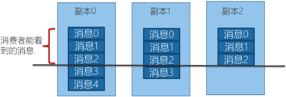
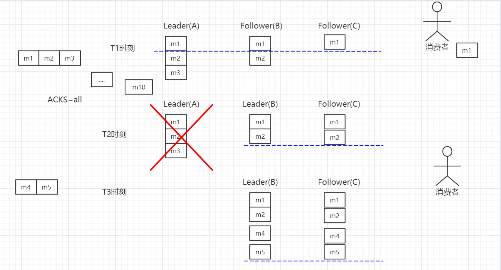

# Kafka集群与可靠性

## Kafka集群的目标

1. 高并发

1. 高可用（防数据丢失）：通过副本机制实现
   - Leader-Follower模型：每个分区有1个Leader（处理读写）和N个Follower（异步/同步复制）
   - ISR动态维护：通过 `replica.lag.time.max.ms`（默认10秒）判断副本同步状态
   - Controller故障转移：通过Zookeeper的临时节点选举新控制器
2. 动态伸缩：
   - Broker热扩展：新增节点自动触发分区重平衡（通过`kafka-reassign-partitions.sh`工具）
   - Consumer Group自动重平衡：新消费者加入时触发分区重新分配

```mermaid
graph TD
    Controller-->|监控|Zookeeper
    Controller-->|Leader选举|Broker1
    Controller-->|分区重分配|Broker2
    Broker1-->|副本同步|Broker2
    Broker2-->|心跳检测|Controller
```

## Kafka集群规模如何预估

**吞吐量：**

集群可以提高处理请求的能力。单个Broker的性能不足，可以通过扩展broker来解决。

**磁盘空间：**

比如，如果一个集群有10TB的数据需要保留，而每个broker可以存储2TB，那么至少需要5个broker。如果启用了数据复制，则还需要一倍的空间，那么这个集群需要10个broker。

- 副本因子：`replication.factor=N`时，总存储需求=原始数据量*N
- 保留策略：log.retention.hours=168（7天）配合log.segment.bytes=1GB（分段策略）
- 预留空间：建议保留20%的磁盘空间用于OS操作和副本同步


## Kafka集群搭建实战

使用两台Linux服务器：一台192.68.10.7  一台192.168.10.8

192.68.10.7 的配置信息修改

 

 

 

192.168.10.8的配置信息修改

 

 

 


## Kafka集群原理

### 一、**成员关系与控制器**

控制器其实就是一个broker，只不过它除了具有一般 broker 的功能之外，还负责分区首领的选举。

当控制器发现一个broker加入集群时，它会使用 broker ID来检査新加入的 broker是否包含现有分区的副本。 如果有，控制器就把变更通知发送给新加入的 broker和其他 broker，新 broker上的副本开始从首领那里复制消息。

简而言之，Kafka使用 Zookeeper的临时节点来选举控制器，并在节点加入集群或退出集群时通知控制器。 控制器负责在节点加入或离开集群时进行分区首领选举。

从下面的两台启动日志中可以明显看出，192.168.10.7 这台服务器是控制器。


```mermaid
graph TD
    ZK[/Zookeeper/] -->|临时节点| Controller
    Controller -->|1. 监听节点变化| Broker加入事件
    Controller -->|2. 检查副本分布| Partition分配
    Controller -->|3. 发送同步指令| 新Broker
    Controller -->|4. 广播元数据更新| 所有Broker
    Broker加入事件 -->|触发| 分区重分配
```


### 二、**集群工作机制**

复制功能是 Kafka 架构的**核心**。在 Kafka 的文档里，Kafka 把自己描述成“一个分布式的、可分区的、可复制的提交日志服务”。

复制之所以这么关键，是因为它可以在个别节点失效时仍能保证 Kafka 的可用性和持久性。

Kafka 使用主题来组织数据，每个主题被分为若干个分区，每个分区有多个副本。那些副本被保存在 broker 上，每个 broker 可以保存成百上千个属于不同主题和分区的副本。

#### 一、replication-factor参数

比如我们创建一个lijin的主题，复制因子是2，分区数是2

```shell
./kafka-topics.sh --bootstrap-server 192.168.10.7:9092  --create --topic lijin 
             --replication-factor 2 --partitions 2
```

replication-factor用来设置主题的副本数。每个主题可以有多个副本，这些副本分布在集群中不同的 broker 上，也就是说副本的数量不能超过 broker 的数量。


从这里可以看出，lijin分区有两个分区，partition0和partition1 ，其中

在partition0 中，broker1（broker.id =0）是Leader，broker2（broker.id =1）是跟随副本。

在partition1 中，broker2（broker.id =1）是Leader，broker1（broker.id =0）是跟随副本。

|                                                              | 也就是说副本的数量不能超过 broker 的数量。                   |
| ------------------------------------------------------------ | ------------------------------------------------------------ |
|  |  |

#### 二、首领副本

每个分区都有一个首领副本。为了保证一致性，所有生产者请求和消费者请求都会经过这个副本。

#### 三、跟随者副本

首领以外的副本都是跟随者副本。跟随者副本不处理来自客户端的请求，它们唯一一的任务就是从首领那里复制消息, 保持与首领一致的状态。 如果首领发生崩溃，其中的一个跟随者会被提升为新首领。

#### 四、auto.leader.rebalance.enable参数

是否允许定期进行 Leader 选举。设置它的值为true表示允许Kafka定期地对一些Topic 分区进行Leader重选举，当然这个重选举不是无脑进行的，它要满足一定的条件才会发生。

比如 Leader A一直表现得很好，但若 auto.leader.rebalance.enable=true，那么有可能一段时间后 Leader A就要被强行卸任换成Leader B。
换一次Leader 代价很高，原本向A发送请求的所有客户端都要切换成向B发送请求，而且这种换Leader本质上没有任何性能收益，因此`建议在生产环境中把这个参数设置成false`。


### 三、集群消息生产

**复制系数、不完全的首领选举、最少同步副本**

#### 一、**可靠系统里的生产者**

发送确认机制

3 种不同的确认模式。

acks=0 意味着如果生产者能够通过网络把消息发送出去，那么就认为消息已成功写入Kafka 。

acks=1 意味若首领在收到消息并把它写入到分区数据文件（不一定同步到磁盘上）时会返回确认或错误响应。

acks=all 意味着首领在返回确认或错误响应之前，会等待（min.insync.replicas）同步副本都收到悄息。

##### ISR



Kafka的数据复制是以 Partition 为单位的。而多个备份间的数据复制，通过Follower向Leader拉取数据完成。从一这点来讲，有点像Master-Slave方案。不同的是，Kafka既不是完全的同步复制，也不是完全的异步复制，而是`基于ISR的动态复制方案`。

ISR，也即In-Sync Replica。每个Partition的Leader都会维护这样一个列表，该列表中，包含了所有与之同步的Replica（包含Leader自己）。每次数据写入时，只有ISR中的所有Replica都复制完，Leader才会将其置为Commit，它才能被Consumer所消费。

这种方案，与同步复制非常接近。但不同的是，这个`ISR是由 Leader 动态维护`的。如果Follower不能紧“跟上”Leader，它将被Leader从ISR中移除，待它又重新“跟上”Leader后，会被Leader再次加加ISR中。每次`改变 ISR 后，Leader 都会将最新的ISR持久化到Zookeeper中`。

至于如何判断某个Follower是否“跟上”Leader，不同版本的Kafka的策略稍微有些区别。

从0.9.0.0版本开始，replica.lag.max.messages被移除，故Leader不再考虑Follower落后的消息条数。另外，`Leader不仅会判断Follower是否在replica.lag.time.max.ms时间内向其发送Fetch请求，同时还会考虑Follower是否在该时间内与之保持同步`。

##### 示例



数据丢失问题：

在第一步中，Leader A总共收到3条消息，但由于ISR中的Follower只同步了第1条消息（m1），故只有m1被Commit，也即只有m1可被Consumer消费。此时Follower B与Leader A的差距是1，而Follower C与Leader A的差距是2，虽然有消息的差距，但是满足同步副本的要求保留在ISR中。

在第二步中，由于旧的Leader A宕机，新的Leader B在replica.lag.time.max.ms时间内未收到来自A的Fetch请求，故将A从ISR中移除，此时ISR={B，C}。同时，由于此时新的Leader B中只有2条消息，并未包含m3（m3从未被任何Leader所Commit），所以m3无法被Consumer消费。

##### 使用ISR方案的原因

由于Leader可移除不能及时与之同步的Follower，故与同步复制相比可避免最慢的Follower拖慢整体速度，也即ISR提高了系统可用性。

ISR中的所有Follower都包含了所有Commit过的消息，而只有Commit过的消息才会被Consumer消费，故从Consumer的角度而言，ISR中的所有Replica都始终处于同步状态，从而与异步复制方案相比提高了数据一致性。

##### ISR相关配置说明

Broker的 min.insync.replicas 参数指定了Broker所要求的ISR最小长度，默认值为1，也就是说极限情况下ISR可以只包含Leader。但此时如果Leader宕机，则该Partition不可用，可用性得不到保证。

只有被ISR中所有 Replica 同步的消息才被 Commit，但 Producer 发布数据时，Leader并不需要ISR中的所有Replica同步该数据才确认收到数据。Producer可以通过acks参数指定最少需要多少个Replica确认收到该消息才视为该消息发送成功。acks的默认值是1，即Leader收到该消息后立即告诉Producer收到该消息，此时如果在ISR中的消息复制完该消息前Leader宕机，那该条消息会丢失。而如果将该值设置为0，则Producer发送完数据后，立即认为该数据发送成功，不作任何等待，而实际上该数据可能发送失败，并且Producer的Retry机制将不生效。

更推荐的做法是，将acks设置为all或者-1，此时只有ISR中的所有Replica都收到该数据（也即该消息被Commit），Leader才会告诉`Producer`该消息发送成功，从而保证不会有未知的数据丢失。

### 总结一下

设置acks=all，且副本数为3
极端情况1：
默认min.insync.replicas=1，极端情况下如果ISR中只有leader一个副本时满足min.insync.replicas=1这个条件，此时producer发送的数据只要leader同步成功就会返回响应，如果此时leader所在的broker crash了，就必定会丢失数据！这种情况不就和acks=1一样了！所以我们需要适当的加大min.insync.replicas的值。

极端情况2：
min.insync.replicas=3（等于副本数），这种情况下要一直保证ISR中有所有的副本，且producer发送数据要保证所有副本写入成功才能接收到响应！一旦有任何一个broker crash了，ISR里面最大就是2了，不满足min.insync.replicas=3，就不可能发送数据成功了！

根据这两个极端的情况可以看出min.insync.replicas的取值，是kafka系统可用性和数据可靠性的平衡！

减小 min.insync.replicas 的值，一定程度上增大了系统的可用性，允许kafka出现更多的副本broker crash并且服务正常运行；但是降低了数据可靠性，可能会丢数据（极端情况1）。
增大 min.insync.replicas 的值，一定程度上增大了数据的可靠性，允许一些broker crash掉，且不会丢失数据（只要再次选举的leader是从ISR中选举的就行）；但是降低了系统的可用性，会允许更少的broker crash（极端情况2）。


**存储机制**

分区是基本单位，集群划分或者是broker划分的时候的最小的粒度

不会一直保留数据，设置保留期限，或者保留数据的大小

**清理机制**

Map结构

日志片段清理会分成两个部分，一个是干净部分，另一个是污浊部分

干净部分代表这些消息被清理过，也可以说是第一次写入或没被写入的部分

污浊部分代表这些消息是上一次清理之后写入

在污浊的部分会简历一个map结构，这个map结构的每个元素都会包含一些键的散列，记录的是被清理过的偏移量


