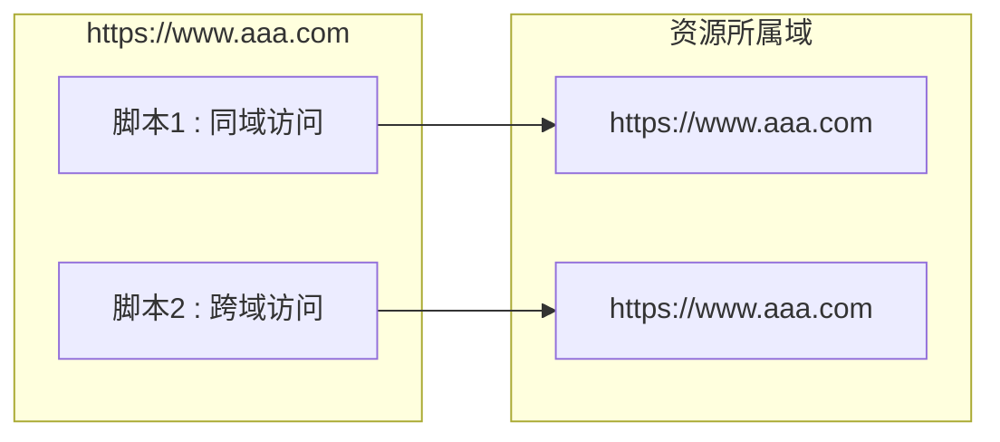

# 场景

## 33.7 常见问题分析、解答

**问：** 生产环境里某个节点里的容器里面服务挂了，但是在准生产环境无法重现，而生产环境监控里面显示 cpu、内存、堆栈都正常。而那个节点重启之后就正常，但是过段时间又出现问题。这种情况有什么 好的方法排查问题？

**答：** 这种情况首先需要排查内核版本，排查 tomcat 版本，可能自身应用存在 bug，真的没办法 可以考虑降低日志等级，打印出更为详细有价值的启动/业务日志信息。

**问**：线上排查问题 dump 或 jstack 导出文件分析经常无响应导致无法导出查看内存问题和线程问题，有什么办法吗？

**答：** 增加-F 强制，在 jmap-dump 使用，如果 pid 没有相应的回复。当然-F 也可能没办法 dump 下 来，那就只能去分析日志了。当然如果你决定手动 dump 内存时，dump 操作占据一定 CPU 时间片、 内存资源、磁盘资源等，对系统的正常的运行可能会有一些影响。


## 33.8 案例分析

某工程消费 ActiveMQ 消息，该工程整合了 Apache Camel，经过运维排查定位到 Camel 拉取到了消息， 但收到消息后打印日志时却延迟了十几分钟， Camel 配置了 MySQL 用于校验幂等，一些列初步排查下来，未找到原因，该如何排查？线上问题出错，而且只有线上环境能复现问题，在运维人员同意的情况下，将 AlibabaArthas 拷贝进容器中，启动 Arthas，开始跟踪，由于是 Springboot 工程，并且 Camel 作为消息入口，故先从配置开始跟踪，详细排查问题如下：

**33.8.1 延迟场景，首先排查有无死锁产生**

`thread -b`在 ActiveMQ 的机子上执行可查看到。仔细分析下来并不是死锁，那就从入口开始。

**33.8.2 从 Camel 配置开始跟踪**

```shell
trace --skipJDKMethod true org.apache.camel.builder.RouteBuilder configure
'#cost > 20' -n 10
```

....


## 53.19 [京东]Spring Boot 中自动装配机制的原理

最近一个粉丝说，他面试了 4 个公司，有三个公司问他：“Spring Boot 中自动装配机制的原理”

他回答了，感觉没回答错误，但是怎么就没给 offer 呢？

对于这个问题，看看高手该如何回答。

> 以下是高手的回答思路

自动装配，简单来说就是自动把第三方组件的 Bean 装载到 Spring IOC 器里面，不需要开发人员再去写 Bean 的装配配置。

在 Spring Boot 应用里面，只需要在启动类加上@SpringBootApplication 注解就可以实现自动装配。

@SpringBootApplication 是一个复合注解，真正实现自动装配的注解是

@EnableAutoConfiguration。

（如图）自动装配的实现主要依靠三个核心关键技术。

1. 引入 Starter 启动依赖组件的时候，这个组件里面必须要包含@Configuration 配置类，在这个配置类里面通过@Bean 注解声明需要装配到 IOC 容器的 Bean 对象。

2. 这个配置类是放在第三方的 jar 包里面，然后通过 SpringBoot 中的约定优于配置思想，把这个配置类的全路径放在 classpath:/META-INF/spring.factories 文件中。这样 SpringBoot 就可以知道第三方 jar 包里面的配置类的位置，这个步骤主要是用到了 Spring 里面的 SpringFactoriesLoader 来完成的。

3. SpringBoot 拿到所第三方 jar 包里面声明的配置类以后，再通过 Spring 提供的ImportSelector 接口，实现对这些配置类的动态加载。

在我看来，SpringBoot 是约定优于配置这一理念下的产物，所以在很多的地方，都会看到这类的思想。它的出现，让开发人员更加聚焦在了业务代码的编写上，而不需要去关心和业务无关的配置。

其实，自动装配的思想，在 SpringFramework3.x 版本里面的@Enable 注解，就有了实现的雏形。@Enable 注解是模块驱动的意思，我们只需要增加某个@Enable 注解，就自动打开某个功能，而不需要针对这个功能去做 Bean 的配置，@Enable 底层也是帮我们去自动完成这个模块相关 Bean 的注入。

以上，就是我对 Spring Boot 自动装配机制的理解。


## 53.131 如何理解 SpringBoot 中的 Starter？

Starter 是 SpringBoot 的四大核心功能特性之一，除此之外，SpringBoot 还有自动装配、Actuator 监控等特性。

SpringBoot 里面的这些特性，都是为了让开发者在开发基于 Spring 生态下的企业级应用时，只需要关心业务逻辑，减少对配置和外部环境的依赖。

（如图）其中，Starter 是启动依赖，它的主要作用有几个。

1. Starter 组件以功能为纬度，来维护对应的 jar 包的版本依赖，使得开发者可以不需要去关心这些版本冲突这种容易出错的细节。

2. Starter 组件会把对应功能的所有 jar 包依赖全部导入进来，避免了开发者自己去引入依赖带来的麻烦。
3. Starter 内部集成了自动装配的机制，也就说在程序中依赖对应的starter 组件以后，这个组件自动会集成到 Spring 生态下，并且对于相关 Bean 的管理，也是基于自动装配机制来完成。
4. 依赖 Starter 组件后，这个组件对应的功能所需要维护的外部化配置，会自动集成到 Spring Boot 里面，我们只需要在 application.properties 文件里面进行维护就行了，比如 Redis 这个 starter，只需要在 application.properties 文件里面添加 redis 的连接信息就可以直接使用了。

在我看来，Starter 组件几乎完美的体现了 SpringBoot 里面约定优于配置的理念。


另外，SpringBoot 官方提供了很多的 Starter 组件，比如 Redis、JPA、MongoDB 等等。

但是官方并不一定维护了所有中间件的 Starter，所以对于不存在的 Starter，第三方组件一般会自己去维护一个。

官方维护的 starter 的以 spring-boot-starter 开头的前缀。

第三方维护的 starter 是以 spring-boot-starter 结尾的后缀

这也是一种约定优于配置的体现。

例如：

官方维护的starter：  `spring-boot-starter-xxx`

第三方维护的starter：`xxx-spring-boot-starter`


## 53.259 SpringBoot 如何解决跨域问题？

跨域指的是浏览器在执行网页中的 JavaScript 代码时，由于浏览器同源策略的限制（如图）。

只能访问同源（协议、域名、端口号均相同）的资源，而不能访问其他源（协议、域名、端口号任意一个不同）的资源。

| **协议**  | **子域名** | **主域名**      | **端口** | **请求资源地址**     |
| --------- | ---------- | --------------- | -------- | -------------------- |
| `http://` | `www`      | `autofelix.com` | `8080`   | `/scripts/jquery.js` |

（如图）比如像这样一种情况就体现了跨域的问题。



而解决跨域问题的方法，就是在不破坏同源策略的情况下，能够安全地实现数据共享和交互。

**回答**

常见的解决跨域问题的方法有两种，一种是 jsonp，另一种是 CORS。其中，CORS 是一种在服务器后端解决跨域的方案，它的工作原理很简单。

如果一个网站需要访问另一个网站的资源，浏览器会先发送一个 OPTIONS 请求，根据服务器返回的 Access-Control-Allow-Origin 头信息，决定是否允许跨域访问。

所以，我们只需要在服务器端配置 `Access-Control-Allow-Origin` 属性，并配置允许哪些域名支持跨域请求即可。

在 SpringBoot 中，提供了两种配置 `Access-Control-Allow-Origin` 属性的方式来解决跨域问题

- 通过`@CrossOrigin(origins = "http://localhost:8080")`注解，指定允许哪些origins 允许跨域

- 使用 WebMvcConfigurer 接口，重写 `addCorsMappings` 方法来配置允许跨域的请求源

```java
@Configuration
publicclassCorsConfigimplementsWebMvcConfigurer {
	@Override
	publicvoidaddCorsMappings(CorsRegistryregistry) {
		registry.addMapping("/**")
			.allowedOrigins("http://localhost:8080")
			.allowedMethods("*");
	}
}
```


