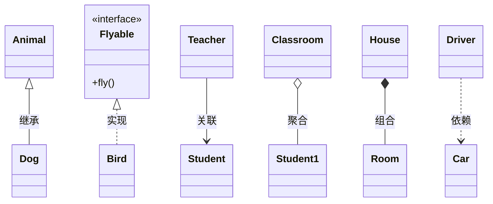
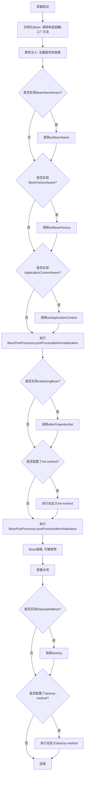
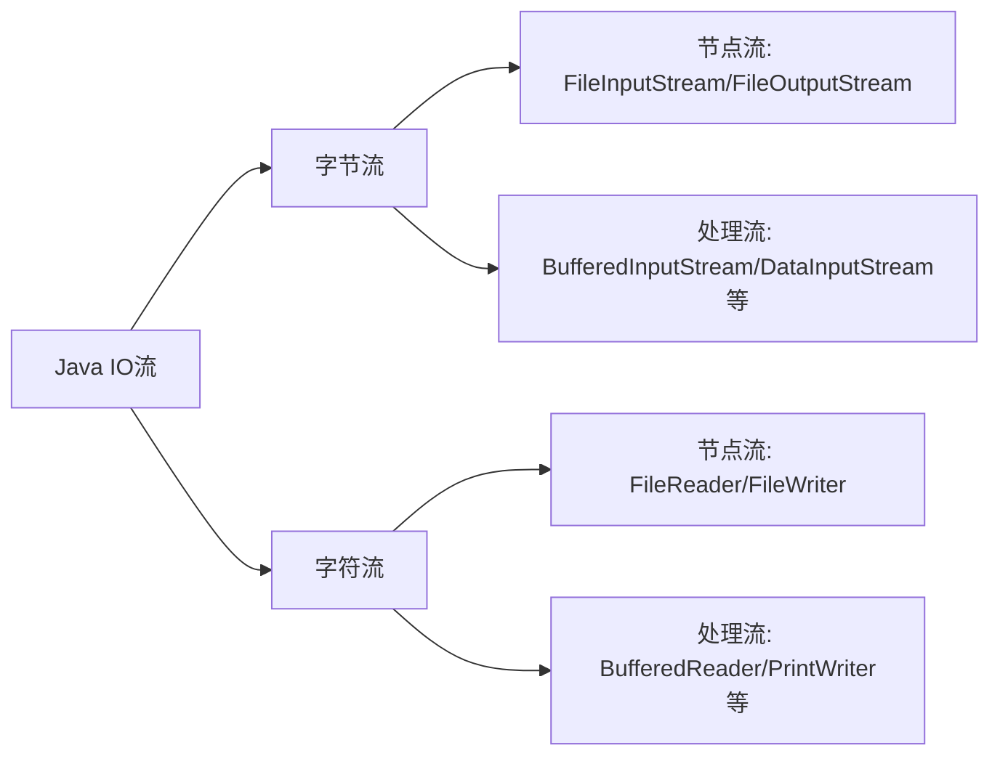

## 1.Mysql的上锁FOR UPDATE

在 MySQL 中，`FOR UPDATE` 是一种用于实现行级锁的 SQL 子句。它常见于事务处理中，尤其是在涉及多个事务并发执行时，用于保证数据的一致性和隔离性。理解 `FOR UPDATE` 上锁的作用和使用方式对于处理高并发场景中的数据一致性非常重要。

1. **作用和用途**

`FOR UPDATE` 的主要作用是在事务中对选定的行加锁，防止其他事务同时修改这些行。它通常与 `SELECT` 查询一起使用，用来在事务执行过程中锁定某些数据行，直到事务提交（`COMMIT`）或回滚（`ROLLBACK`）。

- **加锁类型**：`FOR UPDATE` 会对选定的行加 **排他锁**（exclusive lock），即使其他事务无法读取或修改这些行，直到当前事务提交或回滚。
- **事务控制**：通常在事务中使用，以确保事务期间的数据不被其他事务干扰，从而确保数据一致性。

2. **基本使用** 例子：

假设有一个名为 `accounts` 的表，包含两个字段 `account_id` 和 `balance`：

```sql
CREATE TABLE accounts (
    account_id INT PRIMARY KEY,
    balance DECIMAL(10, 2)
);
```

如果你在事务中想要对某些账户记录加锁，防止其他事务对这些记录进行修改，可以使用如下 SQL 语句：

```sql
START TRANSACTION;

-- 先查锁住，再更新
SELECT balance FROM accounts WHERE account_id = 1 FOR UPDATE;

-- 执行一些业务逻辑，比如更新账户余额
UPDATE accounts SET balance = balance - 100 WHERE account_id = 1;

COMMIT;
```

在这个例子中：

1. `START TRANSACTION;` 开始一个事务。

2. `SELECT balance FROM accounts WHERE account_id = 1 FOR UPDATE;` 语句会选中 `account_id = 1` 的记录并加排他锁，防止其他事务修改该行数据。

3. 如果该事务完成了对余额的修改，调用 `COMMIT;` 提交事务。

4. **事务隔离级别与 `FOR UPDATE`**

   `FOR UPDATE` 的行为在不同的事务隔离级别下有所不同：

   ​	（目前没人问过，当作兴趣爱好了解，问ds）

   通常，在高并发环境下，建议使用 `REPEATABLE READ` 或更高的隔离级别，以避免并发事务之间的数据冲突。


## 2.curl、tenet、wget之间的区别

1. **curl**

- **功能**：`curl` 是一个强大的命令行工具，支持通过 URL 进行数据传输，可以使用各种协议，如 HTTP、HTTPS、FTP、SFTP、SMTP 等。它不仅可以用来下载文件，还可以用来上传文件、发送 POST 请求、设置请求头等。

- **特点**：

  - 支持多种协议（HTTP、HTTPS、FTP、SMTP 等）。
  - 支持文件上传和下载。
  - 支持请求头、cookies、代理、身份验证等。
  - 可以通过编程语言（如 Python、PHP 等）调用，适用于脚本编程。
  - 通常用于 API 测试和调试。

- **例子**：

  ```bash
  # 下载文件，文件以url上的file.zip命名
  curl -O forTest.zip http://example.com/file.zip
  # 模拟Post请求
  curl -X POST -d "key=value" http://example.com/api
  # 获取响应头信息
  curl -I https://example.com
  # 用IPv6调用
  curl -g http://[2001:1000::852]:9000
  # 忽略 SSL 证书的校验 
  curl -k https://example.com
  ```
  
  -o 默认情况下，`curl` 会将下载的数据直接输出到标准输出（通常是终端），而不是保存为文件。要保存文件，必须使用 `-o` 或 `-O` 选项来指定输出文件名。`curl -o downloaded_file.txt https://example.com/file.txt`
  
  -g 选项用于禁用“通配符扩展”，避免将方括号 [] 视为通配符，并尝试匹配文件系统中的文件
  
  -k 在开发和调试阶段，域名自定义情况或者在访问自签名证书的服务器时很有用，因为在这些情况下，服务器的证书可能不被信任，或者没有有效的证书链。
     容易受到中间人攻击（MITM），因为忽略证书校验意味着你不能确认你正在连接的服务器是否是真正的目标服务器。

2. **wget** “下载专用”工具

- **功能**：`wget` 主要用于从网络上下载文件，支持 HTTP、HTTPS 和 FTP 协议。它的特点是可以下载整个网站或递归下载文件，适合批量下载。

- **特点**：

  - 主要用于下载文件。
  - 支持递归下载、镜像站点、断点续传等功能。
  - 不如 `curl` 灵活，不支持 POST 请求和上传文件。
  - 默认会下载文件，并保存为原始文件名。

- **例子**：

  ```bash
  # 下载文件
  wget http://example.com/file.zip
  # 递归下载网站
  wget -r -np http://example.com/directory/
  # 断点续传
  wget -c https://example.com/file.zip
  ```

3. **telnet 与 ssh** 

   区别：虽然 `telnet` 和 `ssh` 都是用于远程连接计算机的协议，但它们的功能和安全性有很大的区别。

- **功能**：`telnet` 是一个用来连接远程主机的命令行工具，常用于测试和调试网络连接。它基于 TCP 协议，并允许用户连接到指定的端口。使用的是明文传输协议，意味着通过 `telnet` 连接时，所有传输的用户名、密码和其他数据都是以明文方式发送的，容易受到中间人攻击（MITM）。

- **特点**：

  - 常用于网络调试，尤其是在指定的端口上测试服务。
  - 不用于文件传输或请求发送，更多的是测试端口和连接。
  
  ```bash
  # GET
  telnet example.com 80
  # POST
  tenet -X POST https://exmplease.com -d "key=value"
  ```
  
- 两者的区别：

  | 特性         | **Telnet**                               | **SSH**                                        |
  | ------------ | ---------------------------------------- | ---------------------------------------------- |
  | **协议类型** | 明文传输协议                             | 加密传输协议                                   |
  | **安全性**   | 不安全，数据以明文传输，易受到中间人攻击 | 安全，数据通过加密传输，防止数据被窃听和篡改   |
  | **常用端口** | 23                                       | 22                                             |
  | **身份验证** | 仅支持明文用户名和密码认证               | 支持基于密码或公钥的身份验证，提供更高的安全性 |
  | **使用场景** | 主要用于历史遗留系统或在受信任的网络中   | 用于现代的安全远程登录、文件传输、管理等场景   |


| 特性                   | **curl**                                       | **wget**                                   | **telnet**                                 |
| ---------------------- | ---------------------------------------------- | ------------------------------------------ | ------------------------------------------ |
| **主要功能**           | 支持多协议的文件传输，发送 HTTP 请求，API 调试 | 用于下载文件，支持递归下载、镜像功能       | 用于测试网络连接，连接远程主机的端口       |
| **支持的协议**         | HTTP, HTTPS, FTP, SFTP, SMTP 等多种协议        | HTTP, HTTPS, FTP 等基本协议                | 主要基于 TCP 协议，通常用于端口测试        |
| **是否支持 POST 请求** | 支持                                           | 不支持                                     | 不支持                                     |
| **是否支持上传文件**   | 支持                                           | 不支持                                     | 不支持                                     |
| **递归下载**           | 不支持                                         | 支持（可以下载整个网站或目录）             | 不支持                                     |
| **断点续传**           | 支持                                           | 支持                                       | 不支持                                     |
| **使用场景**           | 文件下载、上传，API 调试，测试 HTTP 请求       | 主要用于下载文件，适合批量下载或下载大文件 | 网络调试，测试端口是否开放，检查服务器响应 |
| **示例命令**           | `curl -O http://example.com/file.zip`          | `wget http://example.com/file.zip`         | `telnet example.com 80`                    |

其中：

- **断点续传**（Resume Download 或者 Resumable Download）是指在下载过程中，如果下载中途因为某种原因（如网络中断、客户端关闭等）停止了，可以从上次下载停止的地方继续下载，而不是从头开始下载整个文件。

- **`wget`**：`wget` 支持断点续传的功能，默认情况下，如果你再次下载一个已经下载过部分的文件，它会自动从下载中断的地方继续下载。

  ```bash
  wget -c http://example.com/largefile.zip
  ```

  就是失败了，再次执行相同命令，他会继续下载，不会从头开始。


## 3.什么是DNS？

DNS（**Domain Name System**）是域名系统，用于将域名（如`www.example.com`）解析为IP地址（如`192.168.1.1`）。

DNS的主要作用是让用户能够通过容易记住的域名访问互联网上的服务器，而不是直接使用IP地址。

通俗来说，**DNS（域名系统）**的作用就是“翻译”域名。

就像我们在生活中使用名字来称呼某个人，但**电脑和服务器只认识数字地址（IP 地址）**。所以，**DNS 就是一个翻译器**，它将我们输入的域名（比如 `www.baidu.com`）翻译成电脑能理解的数字地址（比如 `10.1.12.127`）。

这样，当你在浏览器输入 `www.baidu.com`，DNS 会告诉浏览器“嘿，这个网站的真实地址是 `10.1.12.127`”，然后浏览器就能找到那个服务器，开始加载网站。

总结一下，DNS 就是让人类能用容易记的名字来访问网站，而背后则通过数字地址来进行实际连接。当一个域名连DNS也找不到IP的时候，直接配置在hosts里面就行了，比如localhsot等

1. **域名解析的过程**：（假设）
   - 当你在浏览器中输入 `www.baidu.com` 时，首先你需要将这个**域名**（`www.baidu.com`）转换为对应的**IP地址**（比如：`220.181.57.216`）。
   - 这个转换过程就是通过 **DNS（域名系统）** 来完成的。
2. **如何通过DNS找到IP地址**：
   - 你的计算机**首先**会检查配置文件中设置的DNS服务器（比如：`DNS1=192.168.30.1`）。
   - 然后，它会向DNS服务器发出请求，询问 `www.baidu.com` 对应的IP地址。
   - DNS服务器会查询自己数据库中的记录，找到 `www.baidu.com` 对应的IP地址（例如：`220.181.57.216`），并将结果返回给你的计算机。最终访问的路径就是`http://192.168.30.1`
3. **访问过程**：
   - 一旦你获得了 `www.baidu.com` 的IP地址（比如：`220.181.57.216`），你的计算机会直接向这个IP地址发起连接请求（通过路由器和网关等网络设备）。
   - 然后，百度的服务器就会根据你的请求返回网页内容，最终展示在你的浏览器中。


**域名解析的详细过程：**

当你在浏览器中输入 `www.baidu.com` 并按下回车时，计算机会通过一系列步骤去找到这个域名对应的IP地址。具体过程如下：

1. **查看本地缓存**

   - 计算机会首先检查自己的本地缓存（Local DNS Cache），看看是否之前已经解析过 `www.baidu.com`，并且缓存中有没有对应的IP地址。如果有，计算机会直接使用这个IP地址来进行访问。

   - 如果没有，计算机会进入下一步。

2. **请求本地DNS服务器**

   - 如果本地没有缓存的结果，计算机会将域名解析请求**发送**到你当前网络配置中的**DNS服务器**，**通常是由你的互联网服务提供商（ISP）提供的**。也就是你路由器或网络设置中指定的DNS服务器（比如：`8.8.8.8`，`1.1.1.1`，或者本地ISP的DNS）。

   - 这个DNS服务器的作用是接收你发出的请求，并通过DNS系统继续查询。

3. **DNS递归查询**

   - 本地DNS服务器会开始进行递归查询。这意味着它会通过多级的DNS服务器逐步寻找最终的IP地址。具体过程是：

   - **查询根DNS服务器**：
     - 首先，DNS服务器会联系**根DNS服务器**。根DNS服务器并不直接存储所有域名的信息，它们知道如何指向下一级的顶级域（TLD）服务器，比如 `.com`、`.org`、`.cn` 等。
     - 例如，根DNS服务器会告诉你的本地DNS服务器，`www.baidu.com` 属于 `.com` 顶级域，因此它会指向管理 `.com` 域名的TLD DNS服务器。

   - **查询TLD DNS服务器**：
     - 接着，本地DNS服务器会向 `.com` 的TLD DNS服务器发出请求，询问 `baidu.com` 的IP地址。TLD服务器会告诉它，`baidu.com` 属于一个特定的**权威DNS服务器**（也就是负责具体域名的DNS服务器）。

   - **查询权威DNS服务器**：
     - 最后，本地DNS服务器会查询负责 `baidu.com` 的权威DNS服务器。权威DNS服务器会直接返回 `www.baidu.com` 对应的IP地址（例如：`220.181.57.216`）。

4. **缓存结果**

   - 一旦获得了 `www.baidu.com` 的IP地址，本地DNS服务器会将这个结果缓存一段时间，以便下次相同的查询可以更快速地完成。

   - 同时，计算机会将这个IP地址缓存到本地，以便以后再次访问 `www.baidu.com` 时能直接使用缓存的IP地址，而无需重新查询。

5. **访问目标网站**
   - 计算机获取到IP地址后，它会直接通过该IP地址向百度的服务器发起连接请求，并通过TCP/IP协议进行数据传输，从百度的服务器获取网页内容，最终展示在你的浏览器上。

`/ifcfg-enxx 的内容`

```shell
...
IPADDR=10.1.12.236
PREFIX=24
GATEWAY=10.1.12.254
DNS1=192.168.30.1
...
```

像这其中的DNS1，其实对应的是DNS服务器的地址，想翻译域名的时候就发送请求到这个服务器内找。1代表首选，如果有备用就是DNS2。


## 4.网络接口配置文件相关问题

#### 4.1 配置内的疑问

**RedHat/CentOS**：进入配置`cat /etc/sysconfig/network-scripts/ifcfg-ensxx` 

```shell
TYPE=Ethernet
PROXY_METHOD=none
BROWSER_ONLY=no
BOOTPROTO=none								# 仅影响 DHCPv4 地址的分配，不会阻止 DHCPv6 的使用
DEFROUTE=yes
IPV4_FAILURE_FATAL=no
IPV6INIT=yes								# 开启系统在启动时初始化 IPv6
IPV6_AUTOCONF=no							# 设备会尝试通过 IPv6 的 SLAAC 自动配置一个 IPv6 地址
IPV6_DEFROUTE=yes							# 默认启用 IPv6 默认路由
IPV6_FAILURE_FATAL=no						# 表示如果 IPv6 配置失败，不会导致网络接口完全不可用
IPV6_ADDR_GEN_MODE=stable-privacy			# 指定 IPv6 地址的生成方式，内网可不加，原因在下方
NAME=ens192
UUID=4adf0269-d712-3e19-b4c4-f35f9ea6cf4f
ONBOOT=yes
AUTOCONNECT_PRIORITY=-999
IPADDR=10.1.12.223							# 静态配置，自己手动自定ip地址
PREFIX=24									# 指子网掩码的长度，可用 IPADDR=10.1.12.236/24 将配置省略
GATEWAY=10.1.12.254
DNS1=192.168.30.1
PEERDNS=no
IPV6ADDR=10:1:12:0:2b9f:8e7d:b93e:c223/64	# 配置正确，就是包含了两个消息，ip和掩码一起配置了；静态分配后，其他自动分配就无需配置，因为静态配置会覆盖这些自动获取的设置。
```

- `IPV6_INIT=no`作用是关闭或禁用 IPv6 协议栈的初始化，意味着系统启动时不会启用 IPv6 地址和相关的配置。这通常用于**完全禁用** IPv6 网络功能。

- `IPV6_DHCP=yes`，如果希望通过 DHCPv6 来获取 IPv6 地址，并且网络中有 DHCPv6 服务器，你可以将 `IPV6PEERDNS` 等选项启用并依赖 DHCPv6 来配置 DNS 和路由等。
   需要确保在网络接口配置文件中正确指定了启用 DHCPv6（例如，`IPV6_DHCP=yes`），或者使用一个单独的 DHCPv6 配置。

- `IPV6_PEERDNS=yes` 和 `IPV6_PEERROUTES=yes`：这些配置表示，如果 DHCPv6 被启用，系统将尝试从 DHCPv6 服务器获取 DNS 和路由信息。

- `IPV6_ADDR_GEN_MODE=stable-privacy`在 IPv6 中，设备的地址可以通过不同的方式生成。这个配置项控制的是设备如何生成其 **链路本地地址**（Link-local address）以及 **全局地址**（Global address）。

  IPV6_ADDR_GEN_MODE 可以设置为以下几种模式：

  1. stable-privacy：
     - **稳定隐私地址**。
       这个模式下，IPv6 地址会根据设备的 **MAC 地址**（或其他唯一标识符）生成，但会在 **隐私性**上做处理。
       换句话说，地址中的某些部分（如后缀部分）会使用随机数进行变化，从而避免通过地址推断出设备的身份。
     - 这种方式能确保生成的 IPv6 地址具有一定的 **隐私性**（防止跟踪），同时也保持了地址的 **稳定性**（即同一设备每次重新连接时生成相同的地址）。
     - 这是 **IPv6 隐私扩展（Privacy Extensions）** 的一种实现方式。
  2. **`eui64`**：使用 **MAC 地址**（通过 EUI-64 格式）来生成 IPv6 地址。这种方式下，地址在生成时会基于硬件的 MAC 地址，因此每个设备的地址都是固定的，容易被追踪。
  3. random：随机生成 IPv6 地址后缀（64位）。这种方式最大程度上保证了隐私性，但可能会在某些情况下导致网络中地址的稳定性和可识别性较差。
  4. none：不使用任何隐私扩展，完全依赖于 **系统默认的地址生成方式**，这通常就是直接基于 MAC 地址或其他标识符生成地址。

  在内网中**隐私性**通常不是一个优先考虑的需求，不增加它也是简化配置。所以不增加这个配置采用默认的生成方式（eui64）即可。

- `PREFIX=24` 是指子网掩码的长度，它表示网络地址部分的位数。
  
  - PREFIX=24 表示子网掩码有 **24 位**，即网络部分占用 24 位。
  - 在 IPv4 中，子网掩码通常表示为 255.255.255.0 对应的二进制形式：`11111111.11111111.11111111.00000000`。
  - `24` 就是这个二进制形式中 "1" 的个数，也就是前 24 位是网络地址，剩下的 8 位是主机地址。


**那我能直接修改 IPv4 和 IPv6 的地址吗？算自定义分配吗？**

其实就是静态配置了IP，如果是这样，那么其他相关的自动分配就无需配置，因为会被静态的覆盖。


**DHCPv4 和 DHCPv6 对应的配置为何不同？** v4是 BOOTPROTO，而v6是 IPV6_DHCP 或是 IPV6_AUTOCONF。

1. `BOOTPROTO`的配置仅作用于IPv4的分配，因为早期的设计，仅有配合DHCP才能分配地址
    BOOTPROTO 是为了配置 **IPv4** 地址自动获取的选项，尤其是通过 **DHCP**，因为在早期，IPv4 地址主要依赖 DHCP 进行动态分配。因此，`BOOTPROTO` 只作用于 IPv4 配置，无法直接用于 IPv6。
2. `BOOTPROTO`不作用于IPv6的原因是IPv6有两种生成地址的方式，一种是DHCP，另一种是SLAAC，所以控制IPv6的DHCP需要单独的配置
    IPv6 有 **SLAAC** 和 **DHCPv6** 两种地址生成方式。SLAAC 是自动生成地址的机制，而 DHCPv6 是为了更复杂的网络配置需求（如获取 DNS 等）。由于这两种方式的存在，IPv6 的 DHCP 配置需要单独通过 `IPV6_DHCP` 等参数来控制，而不是通过 `BOOTPROTO` 来进行。


**SLAAC 和 DHCP 分别是什么？**

1. **SLAAC**（Stateless Address Autoconfiguration - **无状态地址自动配置**）

   无需依赖服务器的IPv6地址自动配置方法。可以`通过网络上的路由器`自动获取其IPv6地址及相关配置信息。

- 工作原理：

  - 无状态配置：SLAAC是"无状态"的，因为它不依赖于中心服务器来分配地址。设备直接通过路由器广告消息（Router Advertisement，RA）来获取配置信息。

  - **地址生成**：设备使用 **Router Advertisement** 消息中的前缀信息和自己的 **MAC 地址** 来生成唯一的IPv6地址。具体来说，设备会将该前缀和其 **接口标识符**（通常是基于MAC地址生成的）结合，形成完整的IPv6地址。

  - 路由器广告（RA）：路由器会周期性地发送 RA 消息，这些消息包含了网络前缀、默认网关等信息。

  - 无服务器依赖：SLAAC 不需要 DHCP 服务器，也不会维护状态信息。设备自行生成地址，而无需中间服务器的帮助。

- SLAAC的优点：

  - 配置简单：设备可以自动配置IPv6地址，不依赖外部服务器。

  - 高效：适用于小型网络或不需要复杂配置的场景。

- SLAAC的缺点：

  - 仅提供最基本的地址配置，**不包含**如DNS服务器等其他信息（虽然可以通过 RA 消息中带上 DNS 信息，通常是可选的）。
  - 没有集中管理，可能会导致地址分配冲突或不一致。

2. **DHCPv6**（Dynamic Host Configuration Protocol for IPv6 - **IPv6动态主机配置协议**）

   是一种与 **DHCP** 类似的协议，但它是为IPv6网络设计的。DHCPv6可以为设备分配地址以及其他网络配置信息（如DNS服务器地址、域名、时间服务器等）。

- 工作原理：
  - 有状态配置：与SLAAC不同，DHCPv6是“有状态”的，因为它依赖于DHCPv6服务器。设备向DHCPv6服务器请求配置信息，并由服务器返回分配的地址和其他配置信息。
  - 客户端请求：设备向网络中的DHCPv6服务器发送请求，获取地址以及其他相关信息（如DNS）。
  - 服务器分配：DHCPv6服务器会为设备分配IPv6地址、DNS服务器地址、域名等信息，并可以提供租约时间等状态信息。
  - 可选性：DHCPv6可以与SLAAC结合使用，提供更为丰富的配置，或者单独使用。
- DHCPv6的优点：
  - 集中管理：可以集中管理IPv6地址分配和网络配置信息，适用于大规模网络或需要精确控制的环境。
  - 提供更多配置信息：不仅可以分配IPv6地址，还可以提供DNS、时间服务器等其他配置信息。
  - 有状态管理：有状态的地址分配能够更好地控制地址池和租约管理，避免冲突。
- DHCPv6的缺点：
  - 配置复杂：需要部署和维护DHCPv6服务器。
  - 依赖服务器：如果DHCPv6服务器不可用，设备将无法获取地址。

3. **SLAAC 和 DHCPv6 的结合**

   在实际网络中，SLAAC 和 DHCPv6 可以一起使用，以提供更完整的配置功能。例如：

   - **SLAAC** 用于自动配置IPv6地址和前缀。
   - **DHCPv6** 用于提供其他配置信息，如DNS服务器地址、域名等。


**将 IPv4 和 IPv6 的 DEFROUTE 配置都开启会互相影响吗？**

不会。（最多的间接影响，就是路由优先级、网络的支持）

- 因为它们是独立的协议栈，处理自己的路由表和路由逻辑。
  在同一台机器上同时配置 IPv4 和 IPv6 的默认路由，这两者的路由配置会分别管理自己的网络流量。


:book::dango:

#### 4.2 **为什么能看到多个ipv6的地址**

若想只看ipv6的ip用`ip -6 addr show`

```shell
[root@k8s-host223 network-scripts]# ip addr show ens192
2: ens192: <BROADCAST,MULTICAST,UP,LOWER_UP> mtu 1500 qdisc mq state UP group default qlen 1000
    link/ether 00:50:56:9f:cc:83 brd ff:ff:ff:ff:ff:ff
    inet 10.1.12.223/24 brd 10.1.12.255 scope global noprefixroute ens192
       valid_lft forever preferred_lft forever
    inet6 10:1:12:0:2b9f:8e7d:b93e:c223/64 scope global noprefixroute 
       valid_lft forever preferred_lft forever
    inet6 fe80::3741:85b8:cd0d:e472/64 scope link dadfailed tentative noprefixroute 
       valid_lft forever preferred_lft forever
    inet6 fe80::1299:6678:5aaf:6399/64 scope link dadfailed tentative noprefixroute 
       valid_lft forever preferred_lft forever
    inet6 fe80::e09a:44df:36da:43c1/64 scope link dadfailed tentative noprefixroute 
       valid_lft forever preferred_lft forever
```

这种情况是正常现象，尤其是在使用Linux系统的虚机上。为什么会有这么多个IPv6地址：

1. **全球唯一IPv6地址**

```powershell
inet6 10:1:12:0:2b9f:8e7d:b93e:c223/64 scope global noprefixroute
# 或者
inet6 10:1:12:0:2b9f:8e7d:b93e:c223/64 scope global dynamic noprefixroute
```

这是一个全球唯一的IPv6地址，

- `dynamic`：通常是由DHCPv6或者自动配置（SLAAC）生成的，不是手动配置的静态地址。

- `noprefixroute`：这个标志说明系统不会自动为该地址的前缀（即 `10:1:12:0::/64`）添加路由。
  换句话说，虽然设备获取到了这个全局地址，但操作系统不会为它自动创建与其网络前缀相关的路由条目。

- 合起来就是`dynamic noprefixroute`：**动态分配的 IPv6 地址**，但操作系统避免自动为该地址的前缀添加路由。

- `前缀`就是用来定义地址的网络部分，而**前缀长度**（如 `/64`）则指明网络部分的长度。


2. **链路本地IPv6地址**

```powershell
inet6 fe80::3741:85b8:cd0d:e472/64 scope link
inet6 fe80::1299:6678:5aaf:6399/64 scope link
inet6 fe80::e09a:44df:36da:43c1/64 scope link
```

这些地址是链路本地地址（Link-Local Address），以 `fe80::/10` 为前缀。链路本地地址**用于设备之间在同一链路上（局域网或同一虚拟机环境）进行通信**。简单理解：链路本地 IPv6 地址就像**家里每台设备之间的「内部通话号码」**。这些号码只在这个「家庭网络」里有用，不能打到外面去。

- 每个**网络接口**（如物理网卡、虚拟网卡、无线网卡）在启用IPv6时都会自动生成一个链路本地地址。

- 多个链路本地地址的出现通常是由于多次尝试自动配置或系统尝试生成新的地址（例如与不同的虚拟网卡接口或虚拟机镜像相关）。

  当系统检测到链路本地地址冲突（dadfailed），它可能会：

  - **保留冲突的地址**：但标记为 dadfailed 和 tentative，表示该地址不可用或尚未完成配置。

  - **尝试生成新地址**：系统可能基于网络接口的 MAC 地址或随机数重新生成另一个链路本地地址，再次进行重复地址检测（DAD）。

  如果冲突问题反复出现，就会导致多个链路本地地址堆积。


3. **DAD失败和Tentative状态**

```powershell
dadfailed tentative
```

这些标记表示“冲突检测”过程（DAD，Duplicate Address Detection）出现了问题，或者IPv6地址处于“尝试”状态（tentative），未完全确认或被其他设备占用。通常，这种情况发生在多个网络接口（如虚拟机或多网卡环境）尝试生成相同的链路本地地址时。

dadfailed 表示**重复地址检测（DAD, Duplicate Address Detection）失败**。

- 当设备生成链路本地地址时，会在网络中广播检查，确保地址没有冲突。

- 如果检测到冲突，地址标记为 dadfailed，但仍可能暂时保留以避免丢失通信。
- 多个 dadfailed 地址可能是由于网络中其他设备使用了类似的地址，导致冲突。


##### 4.2.1 开启/禁用 IPv6 方式

1. **禁用IPv6**：如果你不需要IPv6地址，可以通过禁用IPv6来避免这些问题。

   - 在Linux上，可以通过编辑

     ```
     /etc/sysctl.conf
     ```

     文件并添加以下行来禁用IPv6：

     ```shell
     net.ipv6.conf.all.disable_ipv6 = 1      # 相反 0 就是开启
     net.ipv6.conf.default.disable_ipv6 = 1
     ```

     然后运行

     ```
     sysctl -p
     ```

     使设置生效。

2. **手动配置IPv6地址**：你也可以手动配置IPv6地址，确保没有冲突，避免自动配置过程出现问题。


#### 4.3 子网掩码

平时所说的 **掩码** 或 **网段**，实际上就是我们在 IPv4 或 IPv6 网络中提到的 **子网掩码**（Subnet Mask）。

1. **简单解释：**

- 子网掩码（Subnet Mask）用来区分一个 IP 地址中的**网络部分**和**主机部分**。
  - 在 IPv4 中，通常使用四个字节（32 位）表示，例如 `255.255.255.0`，其中 `255` 表示网络部分，`0` 表示主机部分。
  - 在 IPv6 中，我们通常使用斜杠（`/`）后面跟一个数字来表示子网前缀，例如 `2001:db8::/64`，表示前 64 位是网络部分，剩下的 64 位是主机部分。

2. **具体情况：**

   1. **IPv4 子网掩码**：例如 `192.168.1.0/24`，这里 `/24` 表示前 24 位是网络部分，剩余 8 位是主机部分。
      - 网络部分：`192.168.1`，这是该网络的标识。
      - 主机部分：`0`，在这个子网内，可以分配给不同设备的地址范围通常是 `192.168.1.1` 到 `192.168.1.254`。

   1. **IPv6 子网掩码**：例如 `2001:db8::/64`，这里 `/64` 表示前 64 位是网络部分，剩下的 64 位是主机部分。
      - 网络部分：`2001:db8::`，这是该网络的标识。
      - 主机部分：后 64 位可以用于分配设备地址（例如 `2001:db8::1`, `2001:db8::2` 等）。

额外补充：

虽然`172.20.0.0/24` 的IP地址范围是从 `172.20.0.0` 到 `172.20.0.255`，但是要注意，某些地址是保留的：

1. **网络地址 (`172.20.0.0`)**：这个地址代表整个网络，不能分配给设备。
2. **广播地址 (`172.20.0.255`)**：这个地址用于广播，发送到网络上的所有设备，同样不能分配给设备。


#### 4.4 私有地址段

**IPV4**

IPv4 私有地址包括以下三个段：

- `10.0.0.0/8`
- `172.16.0.0/12`（包括 `172.16.0.0` 到 `172.31.255.255`）
- `192.168.0.0/16`

这些地址是专门为局域网使用而设计的，不能在公共互联网中路由。


**IPV6**

ULA（**Unique Local Address**本地唯一地址）是专门用于 IPv6 的。

1. **`fc00::/7`**（包含 `fd00::/8` 和 `fc00::/8`）

   - `fc00::/7`是用于唯一本地地址（ULA）的地址范围。具体来说：
     - **`fd00::/8`** 是用于 **自定义的唯一本地地址**，可以在组织内部使用，不会在互联网中路由。
     - **`fc00::/8`** 是 **预留地址**，目前没有明确的用途，因此通常不会用于实际分配。
   - **ULA** 地址的目的是提供类似于 IPv4 私有地址（如 `10.0.0.0/8`, `172.16.0.0/12`）的功能，**但**它是为 IPv6 设计的。

   所以，`fd00::/8` 是 ULA 地址段的有效部分，而 `fc00::/8` 在目前是保留的，实际上尚未用于任何实际分配。

   

**其他 IPv6 地址类型**

IPv6 地址分为几种不同的类型，除了 ULA（`fd00::/8`）外，还有以下一些常见的地址类型：

1. **全球单播地址（Global Unicast Address）**
   - 范围：`2000::/3`（即从 `2000::` 到 `3FFF::`）
   - 这些地址用于在互联网上的全局通信，是可路由的地址，与 IPv4 中的公共地址类似。
2. **链路本地地址（Link-local Address）**
   - 范围：`fe80::/10`
   - 这些地址用于同一链路上的设备间通信，不可路由到其他网络。它们类似于 IPv4 中的 `169.254.0.0/16` 地址（APIPA）。
3. **多播地址（Multicast Address）**
   - 范围：`ff00::/8`
   - 用于多播通信，一种数据传输模式，允许数据发送到多个接收者。


## 4-1 路由相关问题

### 路由器的作用是什么？
#### 主要作用

**（1）数据包转发**

这是路由器的核心功能：

- **工作原理**：
  - 当路由器收到一个数据包时，它会检查目标地址（IP地址）。
  - 根据路由表，决定应该将数据包“送到哪条路”。

- **转发的两种情况**：
  1. **本地网络之间的转发**（如家庭网络）：
     - 连接的设备通过路由器交换数据（如手机和电脑共享网络）。
  2. **跨网络的转发**（如互联网）：
     - 数据需要经过多个路由器才能到达目标。

**（2）网络隔离**

路由器可以划分不同的网络（子网），并控制这些网络之间的数据流。

- 例子：在公司中，员工的电脑和访客的设备可能在不同的子网中，通过路由器隔离，保证安全。

**（3）动态寻路**

路由器通过路由协议动态学习路径，自动适应网络变化：

- 如果某条路断了，它会找备用的路径。

#### 其他功能
- **地址转换（NAT）**
  - 将内网设备的私有 IP 地址映射为公网地址，与外网通信。
- **防火墙和安全功能**
  - 阻止不安全的连接。
  - 根据规则限制设备访问权限。
- **无线接入点（Wi-Fi AP）**
  - 提供无线连接功能。
- **QoS（服务质量）管理**
  - 确保特定流量（如视频会议、游戏）优先获得带宽。

---

#### **为什么说路由器不是简单的“转发器”？**

虽然数据转发是路由器的核心功能，但它和普通的交换机（switch）或中继器（repeater）有很大的不同：

- **中继器（Repeater）：**
  - 功能：简单放大信号，不理解数据内容。
  - 例子：Wi-Fi信号放大器。

- **交换机（Switch）：**
  - 功能：在一个局域网内基于 MAC 地址转发数据。
  - 例子：在办公室中将多台电脑连在一起。

- **路由器（Router）：**
  - 功能：在不同网络之间基于 IP 地址进行转发，并动态选择最佳路径。

##### **现实中的路由器工作过程（例子）**

假设你家里的电脑想访问一个远程网站：

1. 电脑向路由器发送数据包，目标是网站的IP地址。
2. 路由器检查`路由表`，发现数据应该发往网络运营商的网关。
3. 路由器将数据包转发给运营商的设备。
4. 运营商的路由器通过多层网络，把数据转发到目标网站的服务器。
5. 网站的返回数据通过类似路径，经过路由器回到你的电脑。

---

### DNS 和路由表的区别是什么？

问：刚才你所提到的路由表，应该指的就是DNS服务器吧？将域名翻译成对应的ip，然后去寻找对应的地址。

答：不完全正确！**路由表**和**DNS服务器**是两个完全不同的概念，它们的作用和工作原理也不同。

**1. 路由表是什么？**

- **定义**：路由表是路由器（或者操作系统）内部的一张表，用来存储数据包从**当前设备**到其他网络的“路径信息”。

- **作用**：
  - 决定数据包应该发往哪个“下一跳”路由器或设备。
  - 根据目标IP地址选择最快或最适合的路径。

- **组成**：

  路由表通常包含以下信息：

  **目标网络地址**（目标IP范围）。

  - **子网掩码**（确定网络范围）。
  - **下一跳地址**（下一站的路由器地址）。
  - **出接口**（从哪个网口发送）。
- **工作过程（大白话）**：

假设设备 A 想访问 IP 为 `192.168.1.20` 的设备 B，路由表的流程是这样的：

1. 路由器收到数据包，检查目标 IP 地址（192.168.1.20）。
2. 在路由表中找到匹配的路径（比如 192.168.1.0/`24`）。
3. 找到路径对应的下一跳（比如网关 192.168.1.1）。
4. 根据路由表的信息，将数据包转发到下一跳。


**2. DNS服务器是什么？**

- **定义**：

DNS（Domain Name System）是一个将域名（如 www.google.com）解析为IP地址的服务。

- **作用**：
  - 将用户输入的易记域名翻译成设备能识别的IP地址。
  - 让用户无需记住复杂的IP地址，而只需记住域名。

- **工作过程（大白话）**：
  1. 你在浏览器中输入 `www.google.com`。
  2. 系统通过 DNS 查询，找到对应的 IP 地址（如 `142.250.190.78`）。
  3. 浏览器使用这个 IP 地址发送请求给目标服务器。


| 功能         | 路由表                                | DNS 服务器                         |
| ------------ | ------------------------------------- | ---------------------------------- |
| **核心作用** | 决定数据包通过哪个路径发送            | 将域名解析为对应的 IP 地址         |
| **作用层级** | 网络层（IP 地址级别）                 | 应用层（域名与 IP 地址之间的转换） |
| **存储内容** | IP 地址范围、子网掩码、下一跳信息     | 域名与 IP 地址的对应关系           |
| **参与设备** | 路由器、操作系统（如 Linux 的路由表） | DNS 服务器（如 8.8.8.8）           |
| **适用范围** | 用于数据包的转发                      | 用于域名的解析                     |

**简单类比**

- DNS 是 GPS，告诉你目的地的地址。
- 路由表是交通地图，决定你应该走哪条路去目标。


**总结**

- 路由器是网络中的“交通指挥官”，核心功能是数据包的转发和路径选择。
- 路由表是路由器工作的基础，存储了不同网络的路径信息。
- DNS 服务器负责将域名转换为 IP 地址，与路由器协作完成网络通信。
- 路由器不仅仅是转发器，还具有 NAT、防火墙、动态路由等高级功能。

---

### 路由表

在 Linux 中使用 `route -n` 命令显示的就是路由表。

```shell
Kernel IP routing table
Destination     Gateway         Genmask         Flags Metric Ref    Use Iface
0.0.0.0         10.1.12.254     0.0.0.0         UG    100    0        0 ens192
10.1.12.0       0.0.0.0         255.255.255.0   U     100    0        0 ens192
10.103.97.2     10.1.12.122     255.255.255.255 UGH   50     0        0 ens192
172.20.0.0      0.0.0.0         255.255.255.255 UH    0      0        0 cali9bbc1b0960f
172.20.0.0      0.0.0.0         255.255.255.0   U     0      0        0 *
```

- **Destination**：目标网络或主机的地址。

  - 当 **Destination 为** 0.0.0.0 时，表示：

    “凡是我不知道怎么去的目标（不在我的其他路由规则里的网络），就从这个默认的出口走。”

    换个例子：

    - 你家有很多钥匙，分别开不同的门（这是你已知的具体路由规则）。但有一把“万能钥匙”（默认路由），你用它去试开所有没明确对应的门。

    在网络里：

    - 如果目标 IP 地址不在你的局域网或已知的子网范围内，就会通过这个默认路由转发出去，通常会发到一个网关（比如你的家用路由器），由它来帮你继续寻找目标地址。

- **Gateway**：下一跳地址（网关）。`如果是 0.0.0.0，说明没有网关，直接到达目标`。

- **Genmask**：子网掩码，定义了目标地址的范围。

- **Flags**：
  - U：路由是活动的。
  - G：路由指向网关。
  - H：目标是主机。

- **Metric**：路由的优先级，值越小优先级越高。

- **Iface**：通过的网络接口（如 eth0、wlan0）。

**3. 例子解析**

**路由表的含义**

```shell
Destination     Gateway         Genmask         Flags Metric Ref    Use Iface
10.1.12.0       0.0.0.0         255.255.255.0   U     100    0        0 ens192
0.0.0.0         10.1.12.254     0.0.0.0         UG    100    0        0 ens192
10.103.97.2     10.1.12.122     255.255.255.255 UGH   50     0        0 ens192
```

- **第一条规则**：

  如果目标是 10.1.12.0/24（也就是 10.1.12.0 到 10.1.12.255 的设备），直接通过 ens192 发送出去，因为它们就在同一个局域网内。

- **第二条规则**（默认路由）：

  如果目标不在 10.1.12.0/24 范围内（比如你想访问 8.8.8.8），就把数据发给网关 10.1.12.254（通常是你的路由器），让它帮忙转发出去。

- **第三条规则**：

  想要访问`10.103.97.2`，那需要通过网关`10.1.12.122`。数据包会发向 .122，122 收到数据包后，会查看自己的路由表是否有相关的规则。假如结果如下：

  ```shell
  10.103.97.2     0.0.0.0      255.255.255.255 U    50     0        0 ens192
  ```

  就代表着网络是直连的。如果网关还有地址，就再转发出去，直到能直接连接。


---

### tunl0是什么？怎么理解？

```shell
10.1.12.113     10.1.12.234     255.255.255.255 UGH   0      0        0 tunl0
10.1.21.175     10.1.8.10       255.255.255.255 UGH   0      0        0 tunl0
```

路由表中有tunl0的网络接口，这个作用是什么？

1. **类型**

   tunl0 是 Linux 系统中的**虚拟隧道接口**，用于实现 IP 隧道（IP tunneling）。

   它的名字来源于 “TUNneL”。

2. **用途**

- 用于封装和转发 IP 数据包。

- 常用于 GRE（Generic Routing Encapsulation）、IPIP（IP-in-IP）等隧道协议，支持在不同网络之间传输数据包。

- 例如，构建 VPN 时，tunl0 就是一个常见的虚拟接口，用来将流量从本地系统封装并发送到远程地址。

3. **配置**

- 该接口通常由系统或特定的网络服务自动配置，比如当创建隧道时，系统会分配一个虚拟接口（tunl0, tun1 等）。

- 可以通过 ip addr 或 ifconfig 查看该接口的 IP 和状态。
- 

**是否是“本机网卡”**

1. **是本机的**

- tunl0 是逻辑网卡，属于本机的一部分，由 Linux 网络栈管理。

- 它在本机上接收和发送隧道封装的数据包。

2. **与物理网卡的区别**

- 物理网卡（如 eth0 或 ens192）负责实际的硬件通信。

- tunl0 是虚拟的，数据不会直接通过 tunl0 发送到物理网络，而是会被进一步封装，并通过实际的物理网卡发送出去。

  

**数据包流向示例**

- **访问目标** 10.1.12.113 **时**：
  1. 本地应用生成的数据包匹配路由规则，指定通过 tunl0 接口传输。
  2. tunl0 将数据包封装为隧道数据，并转发到网关 10.1.12.234。
  3. 封装后的数据通过物理网卡（如 eth0）发送到下一跳。
- 假设通过 `ip addr show tunl0` 看到对应的ip 是 `172.20.202.0`（通常代表源地址（可能是隧道的出口地址））
  1. 封装后的数据是通过`172.20.202.0`发给网关 10.1.12.234


## 5.Map.computeIfAbsent()

> computeIfAbsent 是 Java 8 引入的 Map 接口中的一个默认方法。
>
> 作用：如果指定的键在映射中不存在，则计算一个值并将其放入映射中；如果键已经存在，则返回该键对应的值。

“computeIfAbsent” 可以翻译为 “如果缺失则计算”。

具体来说， computeIfAbsent 方法的签名如下：

`V computeIfAbsent(K key, Function<? super K, ? extends V> mappingFunction);`

- key ：要查找的键。 

- mappingFunction ：一个函数，当键不存在时，用来计算该键的值。

>  使用 computeIfAbsent 的好处是，它可以减少代码的复杂性，避免显式地检查键是否存在，并且在计算值时是线程安全的。

```java
Map<String, List<String>> map = new HashMap<>();
// 使用 computeIfAbsent 方法
List<String> list = map.computeIfAbsent("key1", k -> new ArrayList<>());
list.add("value1");

// 此时 map 中的内容是：{"key1": ["value1"]}
```

在这个例子中，如果 "key1" 不存在，则会创建一个新的 ArrayList 并将其放入 map 中。然后，我们可以直接向这个列表中添加元素。


==**注意： 此方法获取的value是有关联关系的**==

应该是跟地址不会发生变动的所有value，都是有关系的

```java
System.out.println(map); // 输出: {"key1": []}
list.add("value1");
System.out.println(map); // 输出: {"key1": ["value1"]}
```

集合类型、对象类型的，地址都不变，内容修改会关联到maps中的内容。

而String， Integer等，修改后地址会发生变化，得要重新put。


## 6.System.identityHashCode(Object x)

**System.identityHashCode(Object x) 与 Object.hashCode() 的区别**

1. 计算方式： 

- System.identityHashCode(Object x)：返回对象的身份哈希码，实际上是返回对象在内存中的地址（或其某种形式的整数表示），与对象的内容无关。 

- bevan.hashCode()：返回对象 bevan 的哈希码，这是由类的 hashCode() 方法定义的。这个方法通常会根据对象的属性（字段）计算哈希码，具体实现取决于类的定义。

2. 用途： 

- System.identityHashCode(Object x)：常用于需要`比较对象身份（即内存地址）而非内容的场景`，例如在某些数据结构中（如哈希表）需要`确保对象的唯一性`。 

- bevan.hashCode()：通常用于`对象内容的比较和存储`，比如在集合类（如 HashSet、HashMap）中，使用 hashCode() 来`确定对象的存储位置`。 

3. 重写： 

- System.identityHashCode(Object x) 不会被重写，始终返回对象的身份哈希码。 

- bevan.hashCode() 可以被重写，以便根据对象的属性定义自定义的哈希码计算方式。 

**注意**：虽然 identityHashCode 反映了对象在内存中的身份，但它**并不等同于**实际的内存地址。**Java 不允许直接访问内存地址，这样做会破坏语言的安全性和平台独立性。**


## 7.免密登入

想要 174 和 172 之间免密登入

使用命令：`ssh-copy-id 10.1.12.172`

被提示输入远程主机 `10.1.12.172` 的用户密码。输入密码后，`ssh-copy-id` 会把本地公钥复制到远程主机的 `~/.ssh/authorized_keys` 文件中。完成后，你就可以直接通过 SSH 连接到远程主机，而无需每次都输入密码。

同样，如果是指定某个用户，那就 `ssh-copy-id paasopt@10.1.12.172`，那么过去就要`ssh paasopt@10.1.12.172`


如果没有设置过 SSH 密钥对，或者需要生成新的密钥对，可以先执行 `ssh-keygen` 来生成密钥对。

例如：

1. 执行命令：

   ```shell
   # ssh-keygen 命令
   # 删除本地的旧私钥和公钥文件
   rm -f ~/.ssh/id_rsa ~/.ssh/id_rsa.pub
   # 生成密钥
   ssh-keygen -t rsa -b 2048
   ```
   
2. 按提示选择路径（通常默认就可以按回车）：

   ```
   Enter file in which to save the key (/home/user/.ssh/id_rsa): [Press Enter]
   ```

3. 设置一个密码短语（可以按回车跳过，不设置密码）：

   ```shell
   Enter passphrase (empty for no passphrase): [Press Enter]
   ```

4. 确认密码短语（如果有设置）：

   ```shell
   Enter same passphrase again: [Press Enter]
   ```

完成后，会在 `~/.ssh/` 目录下生成两个文件：

- `id_rsa`：私钥，==**不要泄露给别人**==。
- `id_rsa.pub`：公钥，**可以共享给别人**，用来进行免密登录配置。

然后，通过使用 `ssh-copy-id` 将公钥复制到远程主机，或者手动将 `id_rsa.pub` 文件的内容添加到远程主机的 `~/.ssh/authorized_keys` 文件中。


## 8.md的多功能用法

<strong style="color:red">事件对象！！！</strong ><strong style="color:green">事件对象！！！</strong ><strong style="color:pink">事件对象！！！</strong ><strong style="font-size:30px">事件对象！！！</strong >

$4 * 2 = 9$

1. [toc] -> 生成目录

2. 绘图功能，其中不同功能

   1. 序列图

   ```mermaid
   graph LR;
       Start --> Input;
       Input --> Process;
       Process --> Output;
       Output --> End;
       End --> Start
   ```
   
   2. 甘特图
   
      ```mermaid
      gantt
          title 项目进度示例
          dateFormat  YYYY-MM-DD
          section 阶段
          需求分析 :a1, 2024-01-01, 10d
          设计阶段 :a2, after a1, 15d
          开发阶段 :a3, after a2, 20d
          测试阶段 :a4, after a3, 10d
      ```
   
   3. 流程图
   
      ```mermaid
      sequenceDiagram
      	autonumber
      	participant web as 管理端web页面
      	participant bff as 管理端BFF
      	participant db as 数据库存储
      
      	web  ->> bff : 管理端web页面提交组件增删改请求
      	bff  ->> db  : bff根据请求进行数据验证，保存到数据库
      	db  -->> bff : 返回数据入库结果
      	bff -->> web : 操作结果返回到前端
      	web  ->> web : 调用列表刷新接口，刷新组件列表展示数据
      ```
   
      
   
   4. 类图（Class Diagram）
   
      ```mermaid
      classDiagram
          class Animal {
              - name: String
              + eat(): void
          }
          class Dog {
              + bark(): void
          }
          Animal <|-- Dog
      ```
   
   5. 状态图（State Diagram）
   
      ```mermaid
      stateDiagram
          [*] --> Empty
          Empty --> Filling: Insert operation
          Filling --> Full: Queue is full
          Full --> Empty: Delete operation
          Full --> [*]: is true
      ```
   
   6. 饼图（Pie Chart）
   
      ```mermaid
      pie
          title Pie Chart Example
          "Apples" : 40
          "Bananas" : 30
          "Oranges" : 20
          "Others" : 10
      ```
   
   7. 思维导图（Mindmap）
   
      ```mermaid
      mindmap
          root((中心主题))
              分支1
                  子分支1.1
                  子分支1.2
              分支2
                  子分支2.1
      ```


## 9.Linux零碎知识点

### 9.1 增加别名等

场景：打 `kubectl` 太长繁琐，想着简化下

更改 `/etc/profile` 的内容。在最后增加 `alias k=kubectl`，然后再加载一下资源 `source /etc/profile` 

如果是比较长的命令 要用单引号括起来 比如：alias kdp='kubectl describe po'

即可使用直接使用 `k get pod -n manage`


其中一个小知识点，所用的基础命令，或者自己想使用的命令，其实都是放在`/usr/bin/`内，如果有什么需要增加或缺少的，直接复制过来即可。

`scp -r /usr/bin/sealos 10.1.12.122:/usr/bin/sealos`，即可实现远程复制。


### 9.2 VI命令

```shell
hjkl 			# 分别代表左上下右
u 				# 撤回操作	
Esc 			# 从编辑模式切换到命令模式；
ZZ 				# 命令模式下保存当前文件所做的修改后退出vi；
:行号 		   # 光标跳转到指定行的行首；
:$ 				# 光标跳转到最后一行的行首；
x, X 		    # 删除一个字符，x删除光标后的，而X删除光标前的；
D 				# 删除 从当前光标到光标所在行尾之间的全部字符；
dd 				# 删除光标整行内容；
/abc 		  	# 从光标位向下找abc
?abc 		 	# 从光标位向上找abc
:s/F/T			# 当前行替换 F->T
:a,bs/F/T 		# a行到b间替换
:%s/F/T			# 全局替换
a # 在当前字符后添加文本；
A # 在行末添加文本
i # 在当前字符前插入文本；
I # 在行首插入文本；
o # 在当前行后面插入一空行；进入i
O # 在当前行前面插入一空行；
:wq 			# 执行存盘退出操作；
:q!	 			# 执行强制退出vi操作；
:e  			# 文件名: 在命令模式下，打开并编辑指定名称的文件；
:n 				# 如果同时打开多个文件，则继续编辑下一个文件；
:f 				# 用于显示当前的文件名、光标所在行的行号以及显示比例；
:set number 	# 用于在最左端显示行号；
:set nonumber 	# 用于在最左端不显示行号；
```


### 9.3 PS

`ps -ef` 是一个在 Linux 或类 Unix 系统中用于显示当前正在运行的进程信息的命令。具体来说：

- `ps`（process status）是一个查看进程的命令。
- `-e` 选项表示显示所有用户的进程，而不仅仅是当前用户的进程。
- `-f` 选项表示显示进程的完整信息，包括进程的父进程（PPID）、启动时间、终端等。

| `UID`用户ID | `PID`进程ID | `PPID`父进程ID | `C`CPU使用率时间百分比 | `STIME`进程启动时间 | `TTY`进程所属的终端 | `TIME`进程使用的CPU时间 | `CMD`启动进程的命令及其参数 |
| ----------- | ----------- | -------------- | ---------------------- | ------------------- | ------------------- | ----------------------- | --------------------------- |
| root        | 2           | 0              | 0                      | 2月13               | ？                  | 00:00:00                | [kthreadd]                  |
| root        | 3           | 2              | 0                      | 2月13               | ？                  | 00:00:00                | [rcu_gp]                    |


### 9.4 TAR

> `tar` 是 Linux 系统中用于**归档**和**压缩文件**的核心命令。它的名字来源于 "**T**ape **Ar**chive"（磁带归档），最初用于将数据备份到磁带，现在广泛用于打包和压缩文件。以下是 `tar` 命令的详细指南：

------

#### 9.4.1 基本语法

```
tar [选项] [文件名] [文件或目录...]
```

常用选项

| 选项        | 功能                                     |
| :---------- | :--------------------------------------- |
| `-c`        | 创建新的归档文件（Create）               |
| `-x`        | 解压归档文件（eXtract）                  |
| `-t`        | 查看归档内容（List）                     |
| `-v`        | 显示操作过程的详细信息（Verbose）        |
| `-f`        | 指定归档文件名（必须紧跟文件名）         |
| `-z`        | 使用 `gzip` 压缩/解压（.tar.gz 或 .tgz） |
| `-j`        | 使用 `bzip2` 压缩/解压（.tar.bz2）       |
| `-J`        | 使用 `xz` 压缩/解压（.tar.xz）           |
| `-C`        | 解压到指定目录（Change directory）       |
| `--exclude` | 排除指定文件或目录                       |
| `-P`        | 保留绝对路径（默认会去除路径开头的 `/`） |

------

#### 9.4.2 常见用例与示例

**打包并压缩**

- **用 gzip 压缩**（生成 `.tar.gz` 或 `.tgz`）：

  ```
  tar -czvf archive.tar.gz /path/to/files/
  ```

  - `-c`: 创建归档
  - `-z`: 使用 gzip 压缩
  - `-v`: 显示过程
  - `-f`: 指定文件名

- **用 bzip2 压缩**（生成 `.tar.bz2`）：

  ```
  tar -cjvf archive.tar.bz2 /path/to/files/
  ```

- **用 xz 压缩**（生成 `.tar.xz`，压缩率高但较慢）：

  ```
  tar -cJvf archive.tar.xz /path/to/files/
  ```

------

**解压归档文件**

- **解压 `.tar.gz`**：

  ```
  tar -xzvf archive.tar.gz
  ```

- **解压到指定目录**：

  ```
  tar -xzvf archive.tar.gz -C /target/directory/
  ```

- **解压 `.tar.bz2`**：

  ```
  tar -xjvf archive.tar.bz2
  ```

- **解压 `.tar.xz`**：

  ```
  tar -xJvf archive.tar.xz
  ```

------

**查看归档内容**

```
tar -tvf archive.tar.gz  # 查看压缩包内的文件列表
```

------

**其他实用操作**

- **排除特定文件**：

  ```
  tar -czvf archive.tar.gz --exclude='*.log' /path/to/files/
  ```

- **仅解压特定文件**：

  ```
  tar -xzvf archive.tar.gz file1.txt directory/file2.txt
  ```

- **保留文件权限**（如解压系统文件时）：

  ```
  tar -xzvpf archive.tar.gz  # -p 保留权限
  ```

------

#### 9.4.3 注意事项

1. **`-f` 选项必须放在最后**，因为它后面的参数是文件名。
   - ✅ 正确：`tar -czvf archive.tar.gz files`
   - ❌ 错误：`tar -czfv archive.tar.gz files`
2. **压缩效率对比**：
   - `gzip`（`.tar.gz`）  ：速度快，压缩率中等。
   - `bzip2`（`.tar.bz2`）：速度慢，压缩率较高。
   - `xz`（`.tar.xz`）    ：速度最慢，压缩率最高。
3. **解压时注意路径**：避免解压到错误位置覆盖现有文件，建议先用 `-t` 查看内容。

------

#### 9.4.4 总结命令速查

```shell
# 压缩
tar -czvf archive.tar.gz /path/to/dir      # gzip
tar -cjvf archive.tar.bz2 /path/to/dir     # bzip2
tar -cJvf archive.tar.xz /path/to/dir      # xz

tar -czvf bin-kube.tar.gz -C bin-kube .    # 避免压缩文件夹

# 解压
tar -xzvf archive.tar.gz                   # gzip
tar -xjvf archive.tar.bz2                  # bzip2
tar -xJvf archive.tar.xz                   # xz

# 查看内容
tar -tvf archive.tar.gz
```


## 10.GitHub Actions

前置零碎知识点

若想把一个没提交过的项目做提交，其实不需要手动复制到某某已经拉下来的代码中，只需要根据创建好的仓库的步骤，就能将两者关联上。

也可以用来做编译，但是目前相关课程不多，只能直接凑合找找看


## 11.进程和线程的区别

- **进程**：进程是操作系统中资源分配的`基本单位`，它是正在执行的程序的实例。进程之间相互独立，各自有独立的内存空间和系统资源，如文件描述符、打开的文件等。

  一个进程启动后，没有再创建额外的线程，那么，这样的进程一般称为主进程或主线程。

- **线程**：线程是进程中的一个执行单元，线程是程序执行的`最小单位`。在同一个进程中，不同线程共享进程的资源（如内存、文件句柄等）。线程的开销较小，创建和销毁速度较快，因此可以实现更高效的并发执行。

后续补全


## 12.UML线条讲解



```java
class Animal { /* 父类 */ }
class Dog extends Animal { /* 子类 is a */ }

interface Flyable { void fly(); }
class Bird implements Flyable { public void fly() { ... } }  // can do

class Teacher {
    private Student student; // 关联到 Student
}

class Classroom {
    private List<Student> students; // 聚合：学生可以离开班级存在
}

class House {
    private Room room; // 组合：房间不能脱离房子存在
}

class Driver {
    public void drive(Car car) { ... } // 依赖：Car 作为参数
}
```


  


## 13.spring的生命周期

#### Spring Bean生命周期详解

1. **实例化**：通过构造函数或工厂方法创建Bean实例。

2. **属性注入**：设置Bean的属性和依赖（如通过Setter或字段注入）。

3. Aware接口回调：

   - 若实现`BeanNameAware`，调用`setBeanName`。
   - 若实现`BeanFactoryAware`，调用`setBeanFactory`。
   - 若实现`ApplicationContextAware`，调用`setApplicationContext`。

4. **BeanPostProcessor前置处理**：执行所有`BeanPostProcessor`的`postProcessBeforeInitialization`方法（包含`@PostConstruct`逻辑）。

5. 初始化：

   - 若实现`InitializingBean`，调用`afterPropertiesSet`。
   - 若配置了`init-method`，调用自定义初始化方法。

6. **BeanPostProcessor后置处理**：执行所有`BeanPostProcessor`的`postProcessAfterInitialization`方法。

7. **Bean就绪**：Bean可被应用程序使用。

8. 销毁阶段

   （容器关闭时）：

   - 若实现`DisposableBean`，调用`destroy`。
   - 若配置了`destroy-method`，调用自定义销毁方法（包含`@PreDestroy`逻辑）。

##### 流程图



##### 关键点说明

- **Aware接口**：用于获取容器信息（如Bean名称、容器引用）。
- **BeanPostProcessor**：提供扩展点，可在初始化前后修改Bean（如AOP代理）。
- **初始化顺序**：`@PostConstruct` → `afterPropertiesSet` → `init-method`。
- **销毁顺序**：`@PreDestroy` → `destroy` → `destroy-method`。


## 14.IO流

### 一、Java IO流核心框架

Java IO流分为 **字节流（Byte Streams）** 和 **字符流（Character Streams）**，底层设计围绕 **装饰器模式**（用处理流包装节点流）。



### **一、IO流基础概念**

1. 什么是IO流？

- **输入流（Input Stream）**：从数据源（文件、网络、内存等）读取数据到程序。
- **输出流（Output Stream）**：将程序中的数据写入目标（文件、网络、内存等）。

2. 为什么需要IO流？

- 处理不同数据源和目标（文件、网络、控制台等）的统一接口。
- 提供缓冲、编码转换等高级功能。

3. 字节流 vs 字符流

| 类型       | 处理单位   | 典型场景                     | 核心类                       |
| :--------- | :--------- | :--------------------------- | :--------------------------- |
| **字节流** | 字节(8位)  | 处理二进制文件（图片、视频） | `InputStream`/`OutputStream` |
| **字符流** | 字符(16位) | 处理文本文件（.txt, .csv）   | `Reader`/`Writer`            |

------

### **二、核心类与用法**

1. 字节流（Byte Streams）

- **基础类**：
  - `InputStream`：抽象基类（如 `FileInputStream`）
  - `OutputStream`：抽象基类（如 `FileOutputStream`）
- **示例代码：文件复制**

```java
try (InputStream in = new FileInputStream("source.jpg");
     OutputStream out = new FileOutputStream("target.jpg")) {
    byte[] buffer = new byte[1024];
    int bytesRead;
    while ((bytesRead = in.read(buffer)) != -1) {
        out.write(buffer, 0, bytesRead);
    }
} catch (IOException e) {
    e.printStackTrace();
}
```

2. 字符流（Character Streams）

- **基础类**：
  - `Reader`：抽象基类（如 `FileReader`）
  - `Writer`：抽象基类（如 `FileWriter`）
- **示例代码：读取文本文件**

```java
try (BufferedReader reader = new BufferedReader(new FileReader("input.txt"))) {
    String line;
    while ((line = reader.readLine()) != null) {
        System.out.println(line);
    }
} catch (IOException e) {
    e.printStackTrace();
}
```

3. 装饰器模式（Decorator Pattern）

- Java IO通过装饰器模式增强流的功能：
  - **缓冲流**：`BufferedInputStream`, `BufferedReader`（提升性能）
  - **转换流**：`InputStreamReader`（字节→字符）、`OutputStreamWriter`
  - **对象序列化**：`ObjectInputStream`/`ObjectOutputStream`

------

### **三、文件操作**

1. `File` 类（传统IO）

```java
File file = new File("test.txt");
// 检查文件是否存在
if (file.exists()) {
    // 读取文件属性
    System.out.println("文件大小: " + file.length());
    // 删除文件
    file.delete();
}
```

2. NIO.2（Java 7+）

- **`Path` 和 `Files` 类**（更现代的文件操作方式）：

```java
Path path = Paths.get("test.txt");
// 读取所有行
List<String> lines = Files.readAllLines(path, StandardCharsets.UTF_8);
// 写入文件
Files.write(path, "Hello World".getBytes());
```

------

### **四、高级主题**

1. 对象序列化

- 将对象转换为字节流（实现 `Serializable` 接口）：

```java
// 序列化
try (ObjectOutputStream oos = new ObjectOutputStream(new FileOutputStream("data.obj"))) {
    oos.writeObject(new Person("Alice", 30));
}

// 反序列化
try (ObjectInputStream ois = new ObjectInputStream(new FileInputStream("data.obj"))) {
    Person person = (Person) ois.readObject();
}
```

2. NIO（非阻塞IO）

- **核心组件**：
  - `Buffer`：数据容器（如 `ByteBuffer`）
  - `Channel`：数据传输通道（如 `FileChannel`, `SocketChannel`）
  - `Selector`：多路复用器（用于网络编程）
- **示例：使用Channel复制文件**

```java
try (FileChannel inChannel = FileChannel.open(Paths.get("source.jpg"), StandardOpenOption.READ);
     FileChannel outChannel = FileChannel.open(Paths.get("target.jpg"), StandardOpenOption.WRITE, StandardOpenOption.CREATE)) {
    inChannel.transferTo(0, inChannel.size(), outChannel);
}
```

------

### **五、常见问题与最佳实践**

1. **资源泄漏**：必须关闭流！使用 `try-with-resources`（Java 7+）自动关闭。
2. **缓冲的重要性**：总是用 `BufferedInputStream`/`BufferedReader` 包装基础流。
3. **字符编码**：明确指定编码（如 `StandardCharsets.UTF_8`），避免乱码。
4. **大文件处理**：避免一次性读取全部内容，使用缓冲区逐块处理。

------

### **六、应用场景**

1. **配置文件读取**：用 `Properties` 类 + `FileReader`。
2. **日志记录**：用 `FileWriter` 或 `FileOutputStream` 追加写入。
3. **文件上传/下载**：结合网络流（如 `Socket`）处理。
4. **数据持久化**：序列化对象到文件或数据库。

### 六、高频面试问题

1. 字节流和字符流如何选择？

- **字节流**：处理图片、视频、压缩包等二进制文件。
- **字符流**：处理文本文件（尤其是含中文等非ASCII字符时），自动处理编码。

2. 什么是装饰器模式？在IO中如何体现？

- **定义**：动态地为对象添加功能，通过包装（Wrapper）扩展能力。
- **IO应用**：如`BufferedInputStream`包装`FileInputStream`，添加缓冲功能。

3. 为什么关闭流时只需关闭最外层处理流？

- 处理流的`close()`方法会调用被包装流的`close()`，确保资源释放。

4. Java NIO和传统IO的区别？

|    对比项    |     Java IO      |       Java NIO       |
| :----------: | :--------------: | :------------------: |
|   **模型**   |  阻塞式（BIO）   |   非阻塞式（NIO）    |
| **数据操作** | 面向流（Stream） | 面向缓冲区（Buffer） |
|   **通道**   |        无        | 支持Channel双向通信  |
|  **选择器**  |        无        | 多路复用（Selector） |

------

### 七、学习建议

1. **动手实践**：从文件复制、日志读取等场景写代码。
2. **理解设计模式**：重点掌握装饰器模式、适配器模式（如`InputStreamReader`）。
3. **掌握资源关闭**：使用`try-with-resources`自动管理资源（Java 7+）。
4. **延伸学习**：了解Java NIO（如`Path`、`Files`类）和异步IO（如`CompletableFuture`）。


## 15.枚举创建对象

### 一、基础枚举对象

**最简单的枚举对象**：每个枚举常量本身就是一个实例对象

```java
public enum Season {
    SPRING,  // 相当于 new Season()
    SUMMER,  // 相当于 new Season()
    AUTUMN,  // 相当于 new Season()
    WINTER   // 相当于 new Season()
}
```

- 直接通过枚举名访问对象：`Season summer = Season.SUMMER;`，所以本质上相当于 JVM 在底层为 `Season` 类 `new` 了四次
- 枚举的实例化是**隐式自动完成**的，无法手动通过 `new Season()` 创建对象。
- 枚举的构造方法**默认且强制为 `private`**（即使不显式写 `private`，它也是私有的）

```java
public enum Season {
    SPRING, SUMMER, AUTUMN, WINTER;

    // 构造方法（默认 private）
    Season() {
        System.out.println("创建季节对象: " + this.name());
    }
}

public class Main {
    public static void main(String[] args) {
        Season spring = Season.SPRING; 				 // 触发类加载，打印构造方法中的日志
        Season anotherSpring = Season.SPRING; 		 // 不会重新创建，直接返回已有实例
        System.out.println(spring == anotherSpring); // 输出 true（同一对象）
    }
}
```

两个隐藏属性

| 属性名        | 类型     | 说明                                                         |
| :------------ | :------- | :----------------------------------------------------------- |
| **`name`**    | `String` | 枚举常量的名称（如 `SPRING`、`SUMMER`），与代码中声明的标识符完全一致 |
| **`ordinal`** | `int`    | 枚举常量的声明顺序索引（从 0 开始），例如 WINTER 的 ordinal 是 3 |

------

### 二、带属性的枚举对象

**给枚举对象添加属性和构造方法**：

```java
public enum Planet {
    // 声明时初始化对象属性
    MERCURY(3.303e+23, 2.4397e6),
    VENUS(4.869e+24, 6.0518e6),
    EARTH(5.976e+24, 6.3781e6);

    // 枚举对象的属性
    private final double mass;   // 质量（kg）
    private final double radius; // 半径（m）

    // 枚举的构造方法（必须是 private）
    Planet(double mass, double radius) {
        this.mass = mass;
        this.radius = radius;
    }

    // 可以添加方法
    public double surfaceGravity() {
        return 6.67430e-11 * mass / (radius * radius);
    }
}
```

- 使用带属性的枚举对象：

```java
Planet earth = Planet.EARTH;
// 相当于 public static final Planet EARTH = new Planet(5.976e+24, 6.3781e6);
System.out.println("地球质量：" + earth.mass); // 直接访问属性
System.out.println("表面重力：" + earth.surfaceGravity()); // 调用方法
```

------

### 三、带方法的枚举对象

**让每个枚举对象实现不同行为**：

```java
public enum Operation {
    ADD {
        public double apply(double x, double y) {
            return x + y;
        }
    },
    SUBTRACT {
        public double apply(double x, double y) {
            return x - y;
        }
    };

    // 定义抽象方法，强制每个枚举对象实现
    public abstract double apply(double x, double y);
}
```

- 使用：

```
double result = Operation.ADD.apply(5, 3); // 结果 8.0
```


上下两个知识点，很颠覆我以前的认知，枚举内的常量，就是一个个对象。而像抽象的方法和接口，必须要实现的位子，也是没见过。


### 四、枚举对象的特性

1. **单例特性**：每个枚举常量在 JVM 中是唯一的实例
2. **线程安全**：枚举实例的创建由 JVM 保证线程安全
3. **支持接口**：

```java
public interface Greetable {
    void greet();
}

public enum Person implements Greetable {
    ALICE {
        public void greet() {
            System.out.println("Hi, I'm Alice!");
        }
    },
    BOB {
        public void greet() {
            System.out.println("Hello, I'm Bob");
        }
    };
}
// 也可以这样
public enum Person implements Greetable {
    ALICE,
    BOB;
    
    @Override
    public void greet() {
        System.out.println("Hello, I'm Bob");
    }
}
```

------

### 五、创建枚举对象的典型步骤

1. 定义枚举类型：`enum 枚举名 { 常量1, 常量2... }`
2. 添加属性字段（可选）
3. 定义带参数的构造方法（只能是 private）
4. 声明枚举常量时初始化参数
5. 添加方法实现对象行为

### 六、使用场景推荐

- 状态机（订单状态、游戏角色状态）
- 错误代码定义
- 配置选项（颜色模式、单位制）
- 替代常量类，提供更好的类型安全


## 16.Spring 事务的 7 大核心难点

#### 1. 事务传播机制（Propagation）

| 事务行为                   | 说明                                                         | 回滚情况                                                     |
| :------------------------- | :----------------------------------------------------------- | ------------------------------------------------------------ |
| `PROPAGATION_REQUIRED`     | 支持当前事务，假设当前没有事务。就新建一个事务               | 外事务出错两个一起回滚                                       |
| `PROPAGATION_SUPPORTS`     | 支持当前事务，假设当前没有事务，就以非事务方式运行           |                                                              |
| PROPAGATION_MANDATORY      | 必须在一个事务中执行。仅能被一个父事务调用。否则，抛出异常   |                                                              |
| `PROPAGATION_REQUIRES_NEW` | 新建事务，假设当前存在事务。把当前事务挂起                   | 新事务与原有事务完全隔离（各自提交或回滚）                   |
| PROPAGATION_NOT_SUPPORTED  | 以非事务方式运行，假设当前存在事务，就把当前事务挂起         |                                                              |
| PROPAGATION_NEVER          | 以非事务方式运行，假设当前存在事务，则抛出异常               |                                                              |
| `PROPAGATION_NESTED`       | 如果当前存在事务，则在嵌套事务内执行。如果当前没有事务，则执行与PROPAGATION_REQUIRED类似的操作。 | 外层事务回滚会导致嵌套事务回滚，但嵌套事务回滚不会影响外层事务。 |

- **难点**：理解不同传播行为下的事务边界（如 `REQUIRED` vs `REQUIRES_NEW`），尤其是嵌套事务的交互逻辑。
- **典型问题**：
  - 为什么内层事务用 `REQUIRES_NEW` 后，外层事务回滚不影响内层？
  - `NESTED` 和 `REQUIRES_NEW` 在异常处理上的区别？

------

#### 2. 事务隔离级别（Isolation）

- **难点**：隔离级别与数据库锁机制的关联，以及如何避免脏读、不可重复读、幻读等问题。

- **关键点**：

  - Spring 的隔离级别本质是数据库隔离级别的抽象（如 `READ_COMMITTED`）。
  - **常见坑点**：
    - 高隔离级别（如 `SERIALIZABLE`）导致性能下降。
    - 跨事务方法的数据不一致（例如：事务 A 读取未提交的数据，事务 B 回滚）。

- **示例**：

  ```java
  @Transactional(isolation = Isolation.REPEATABLE_READ)
  public void updatePrice() {
      // 事务内多次读取同一数据，保证结果一致
  }
  ```

------

#### 3. 事务失效的隐蔽场景

- **高频失效原因**：
  1. **自调用问题**：同类中非代理方法调用 `@Transactional` 方法（未通过 Spring AOP 代理）。
  2. **异常被吞没**：`catch` 块未重新抛出异常（尤其是非 `RuntimeException`）。
  3. **方法非 public**：Spring 无法为私有方法生成代理。
  4. **数据库引擎不支持**：如 MyISAM 不支持事务。
  5. **多数据源未指定事务管理器**：未通过 `@Transactional(transactionManager = "xxx")` 明确指定。
- **修复方案**：
  - 通过 `AopContext.currentProxy()` 获取代理对象调用自身方法。
  - 确保异常抛出或配置 `@Transactional(rollbackFor = Exception.class)`。

------

#### 4. 事务与性能优化的平衡

- **难点**：事务范围过大导致锁竞争、连接池耗尽等问题。
- **优化策略**：
  - 缩短事务时间：避免在事务中执行 RPC 调用、文件 IO 等耗时操作。
  - 合理设置超时：`@Transactional(timeout = 5)` 避免长事务。
  - 只读事务优化：`@Transactional(readOnly = true)` 提示数据库引擎优化查询。
  - 连接池调优：根据并发量调整连接池大小（如 HikariCP 的 `maximumPoolSize`）。

------

#### 5. 声明式事务 vs 编程式事务

- **选择依据**：

  - 声明式事务（`@Transactional`）：简单易用，适合大多数场景。
  - 编程式事务（`TransactionTemplate`）：需要精细控制提交/回滚逻辑时使用。

- **编程式事务示例**：

  ```java
  @Autowired
  private TransactionTemplate transactionTemplate;
  
  public void batchProcess() {
      transactionTemplate.execute(status -> {
          try {
              operationA();
              operationB();
              return true;
          } catch (Exception e) {
              status.setRollbackOnly(); // 手动标记回滚
              return false;
          }
      });
  }
  ```

------

#### 6. 事务同步与回调

- **难点**：在事务提交后或回滚后执行特定逻辑（如发消息、清理缓存）。

- 解决方案：

  - **`TransactionSynchronizationManager`**：注册回调钩子。
  - 示例：事务提交成功后发送消息（避免消息发送但事务回滚）。

  ```java
  @Transactional
  public void updateOrder(Order order) {
      orderDao.update(order);
      // 注册事务完成后的回调
      TransactionSynchronizationManager.registerSynchronization(
          new TransactionSynchronization() {
              ...多个方法
              @Override
              public void afterCommit() {
                  // 事务提交后发消息
                  mqService.sendMessage(order);
              }
              ...
          });
  }
  ```

------

### **🔧 调试与排查工具**

1. **日志分析**：

   ```properties
   # 开启 Spring 事务日志
   logging.level.org.springframework.transaction.interceptor=TRACE
   logging.level.org.springframework.orm.jpa=DEBUG
   ```

2. **断点调试**：观察 `TransactionAspectSupport` 类中的事务状态。

3. **数据库监控**：通过 `SHOW ENGINE INNODB STATUS`（MySQL）查看锁和事务状态。


